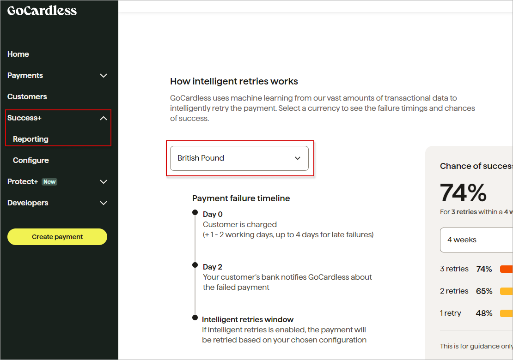
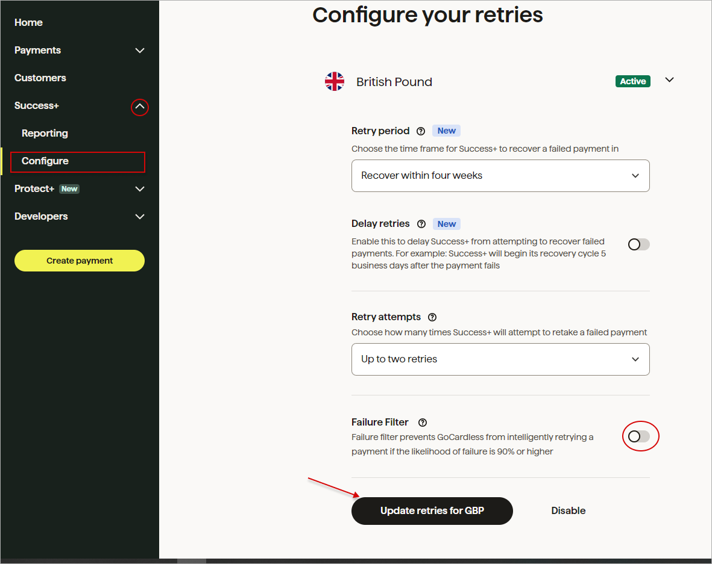

GoCardless
==========
Gocardless is a Splynx add-on which allows customers to pay for invoices via the payment gateway - https://gocardless.com/.

Customers using the *Gogardless* platform  can pay for invoices through banks, or you can charge your customers' bank accounts via debit orders.

## Installation

The add-on can be installed in two methods: via the CLI or Web UI of your Splynx server.

To install the Gocardless add-on via CLI, the following commands can be used:

```
apt-get update
apt-get install splynx-gocardless-rb
```

To install it via the Web UI, navigate to `Config → Integrations → Add-ons`:


Locate or search for the `splynx-gocardless-rb` add-on and click on the *Install* icon in the *Actions* column:


Click the `OK, confirm` button to start the installation process:


## Configuration

Once the installation process has been completed, we can proceed to configuring the add-on in `Config → Integrations → GoCardless`:


Enter your Splynx URL in the provided field and click the `Link Splynx with GoCardless` button. You will be redirected to the *GoCardless* registration page:


Enter your registration data in the registration form and click the `Connect Account` button.


_______________________

After that, the customer should enter the registration details in the provided fields, navigate to `Finance → Gocardless` and click the `Confirm and allow future charge` link.


Other *Gocardless* add-on settings are located in `Config → Integrations → Modules list`:


Locate or search for the `splynx_go_cardless_rb_addon` add-on module and click the <icon class="image-icon"></icon> (*Edit*) icon in the *Actions* column to change the necessary settings:


**Main information & API settings**


**System settings**


**Additional settings**


- **Create payments once they Confirmed** - create a payment only after it has been confirmed by the customer's bank as a successful collection from their account. Once the payment is confirmed, GoCardless will arrange for it to be paid out to your registered account;

- **Payment statement grouping** - choose how to group payment statements (`Finance → Payment Statements → History`) - monthly or daily;

- **Pay invoice payment description pattern** - description of the payment when paying the invoice. By default is used: `Splynx pay-invoice #{number}`;

- **Pay proforma payment description pattern** - description of the payment when paying the proforma invoice. By default is used: `Splynx pay-proforma #{number}`;

- **Payment description** - text that is added to the payment description field;

- **Description of payment for customer** - text that will be displayed to the customer while creating a Direct Debit mandate;

- **Language** - select the language;

- **Intelligently retry payments** - the toggle allows you to enable/disable the automatic retry of any failed payments. Payments can fail for various reasons, with the most common one being insufficient funds in the customer's account. Once you have switched it on, your failed payments will be automatically retried according to the schedule you have configured in your GoCardless dashboard. By default, the toggle is enabled.

<icon class="image-icon"></icon> **NOTE:**

To get Intelligent Retries running for payments that are created, you need to **make sure intelligent retries are enabled and configured properly in your GoCardless control panel**:

1. Click **Success+** in the left hand menu bar, and then click **Reporting** to choose which currencies to turn automatic retries on for:

  


2. Next, you will have to configure you retries for the selected currency:

  

  You can also choose to enable the **Failure Filter** which will prevent retries if the likelihood of the payment failing is very high (90% or higher). You can find more information about this feature [here](https://support.gocardless.com/hc/en-gb/articles/360014132059). Then, click the `Update retries for...` button.


## Invoice payment

Once the configuration has been completed, customers can pay their invoices on the [Customer Portal](customer_portal/customer_portal.md) using the *Gocardless* system in `Finance → Invoices`:


Or directly from *Portal Dashboard* via *Gocardless* widget (entry point):


The configuration of add-on **Entry points** can be found in `Config → Integrations → Modules list`. Near the `splynx_go_cardless_rb_addon` module item in *Actions* column, click on the <icon class="image-icon"></icon> (*Edit entry points*) icon. More information about *Modules list* can be found [here](configuration/integrations/modules_list/modules_list.md).


If everything goes well, you will see the status of the invoice marked as `Paid` (on the customer and admin portal).

After a period of time, which can be view on the following page (https://gocardless.com/direct-debit/timings/), we can see the payment in the customer and admin portal, as depicted below:


Additionally, you can charge all customers in one click. Navigate to `Finance → Invoices`, set the period, and click the `Charge` button as depicted below:


1. Submit due invoice amounts - use the “gocardless-rb-invoices” external handler.
2. Submit outstanding balance amounts - use the “gocardless-rb-oustanding-balances” external handler.


## Top up balance

Customers can also refill their balances using the following link - ```https://<splynx_domain_address>/gocardless-rb```:


## Export customers

To **sync all customers from Splynx to GoCardless**, follow the steps below:

Navigate to `Config → Integrations → GoCardless` :


Select the [Payment method](configuration/finance/payment_methods/payment_methods.md) and [Partner](administration/main/partners/partners.md). Then click the `Export` button:


You will receive your customers list as a csv-file. Then, you can open your *GoCardless* dashboard on https://gocardless.com/ and upload the CSV file, as depicted below:


All customers from the list will receive emails to authorize the action:


## Direct payments

You can add a direct payment link to your invoice (proforma invoice) template or include it in your invoice/proforma invoice email notification template, allowing your customers to pay an invoice without authorization.

**Invoice:**

<details style="font-size: 15px; margin-bottom: 5px;">
<summary><b>by invoice ID</b></summary>
<div markdown="1">

```
https://<splynx_domain_address>/gocardless/direct-pay-invoice-by-id?item_id=<Invoice_id>

```
</div>
</details>

<details style="font-size: 15px; margin-bottom: 5px;">
<summary><b>by invoice number</b></summary>
<div markdown="1">

```
https://<splynx_domain_address>/gocardless/direct-pay-invoice?item_id=<Invoice_number>

```
</div>
</details>

<br>

**Proforma Invoice:**

<details style="font-size: 15px; margin-bottom: 5px;">
<summary><b>by proforma invoice ID</b></summary>
<div markdown="1">

```
https://<splynx_domain_address>/gocardless/direct-pay-proforma-by-id?item_id=<proforma_id>

```
</div>
</details>

<details style="font-size: 15px; margin-bottom: 5px;">
<summary><b>by proforma invoice number</b></summary>
<div markdown="1">

```
https://<splynx_domain_address>/gocardless/direct-pay-proforma?item_id=<proforma_number>

```
</div>
</details>
