iCharge
==================

**iCharge** is a Splynx add-on which allows refilling of customer balances and pay invoices via the Xilo payment gateway - https://xilo.com.**

The add-on can work with different credit cards, if cards are saved on the customer profile, the addon allows you to charge all customers using *Direct debit orders*.

The add-on can be installed in two methods, via the CLI or Web UI of your Splynx server.

To install the *splynx-icharge* add-on via CLI, the following commands can be used:


```bash
apt-get update
apt-get install splynx-icharge
```
To install it via the Web UI:

Navigate to `Config → Integrations → Add-ons`:

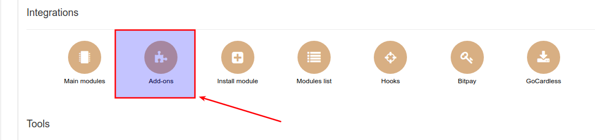

Locate or search for the "splynx-icharge" add-on and click on the install icon in the *Actions* column:

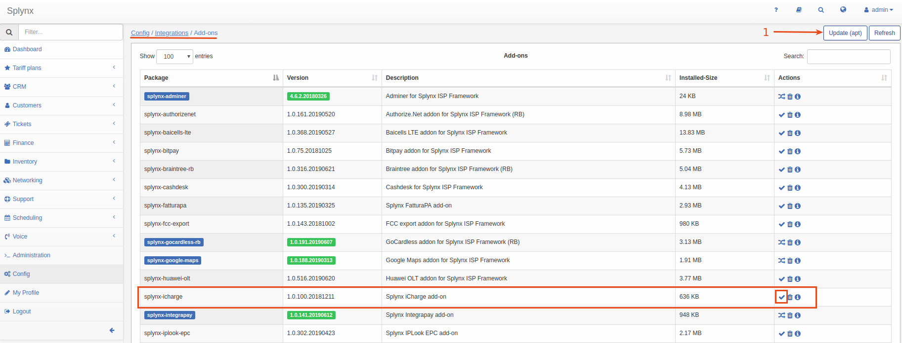

Click on the "OK, confirm" button to begin the installation process:

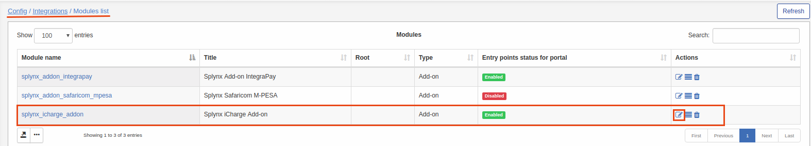

After installation process has completed, you have to configure the addon:

Navigate to *Config → Integrations → Modules list:*

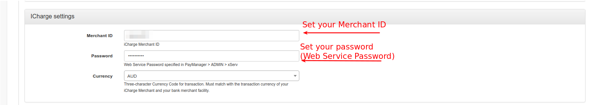

Set these parameters from the data in your https://xilo.com account and set  your server IP address on the Xilo xServ settings (IP address from where Xilo will take requests):

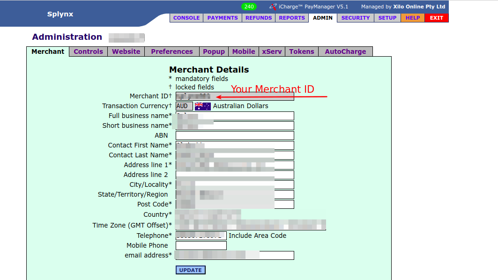

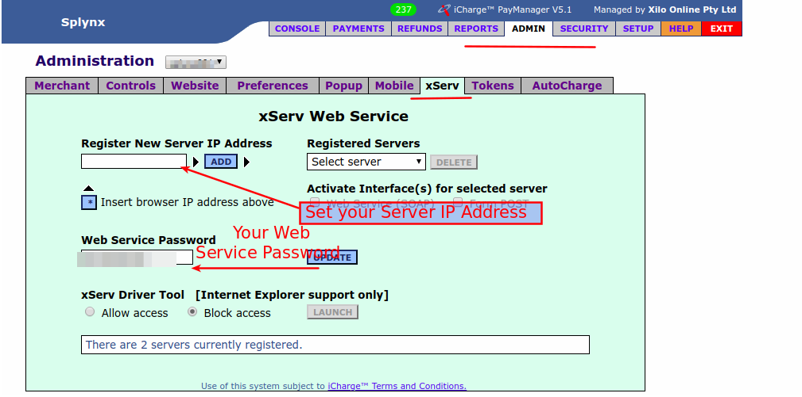

Thereafter, customers can pay for their invoices by using the iCharge system. Customers will see a new button *"Pay by iCharge"* in their customer portal as depicted below:

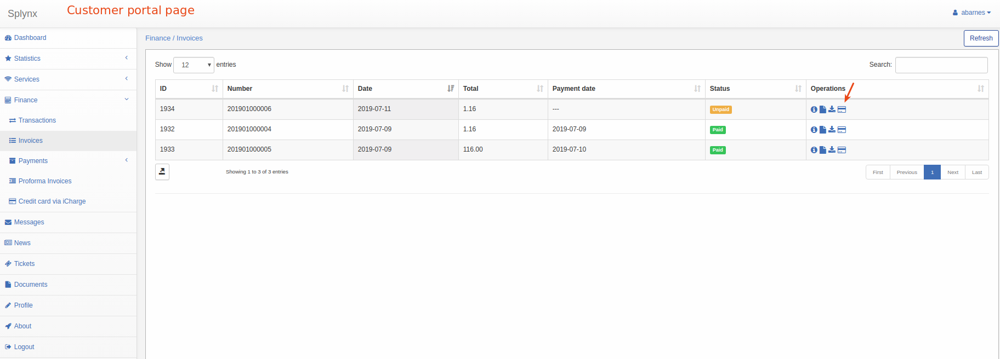

You can also enable entry points in *config -> integrations -> modules list -> Splynx iCharge Add-on* as depicted below:


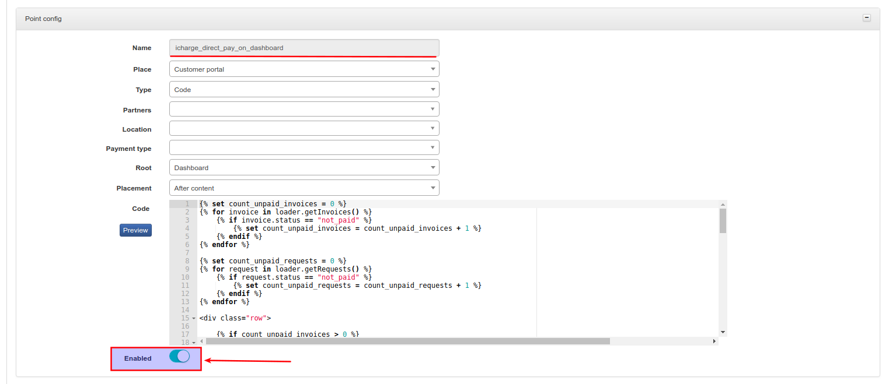

Thereafter, customers will be able to pay for their invoices from the dashboard:

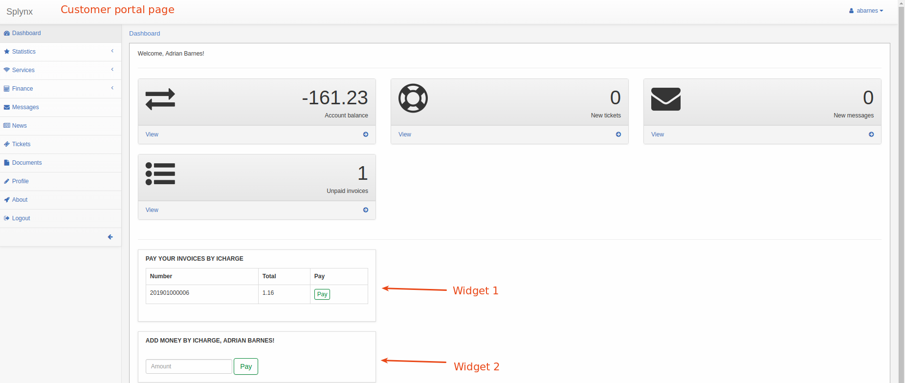

To refill balances, customers can use the following link - *“http://yoursplynxurl/icharge/”*:


Alternatively, you can enable the entry point in *config -> integrations -> modules list -> Splynx iCharge Add-on* as depicted below:


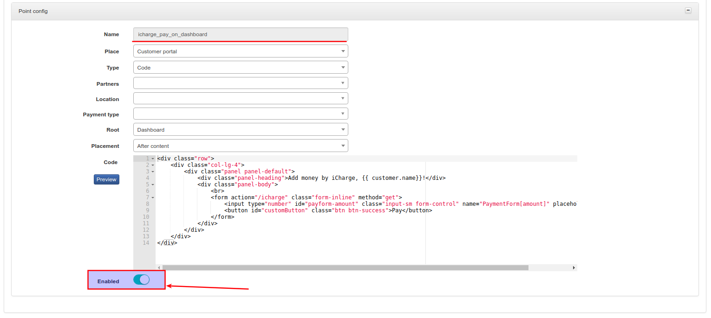

Thereafter, customers will be able to refill his balance from dashboard:

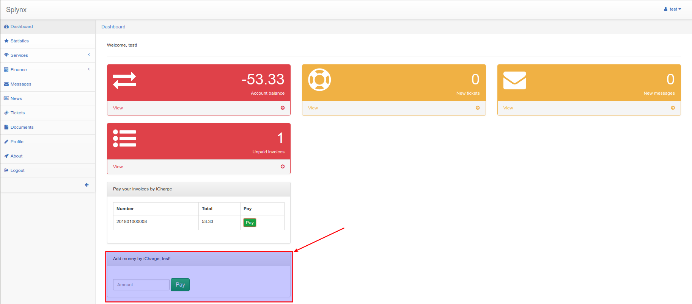

Customers can save pay-card details for future payments in the "Finance" section:

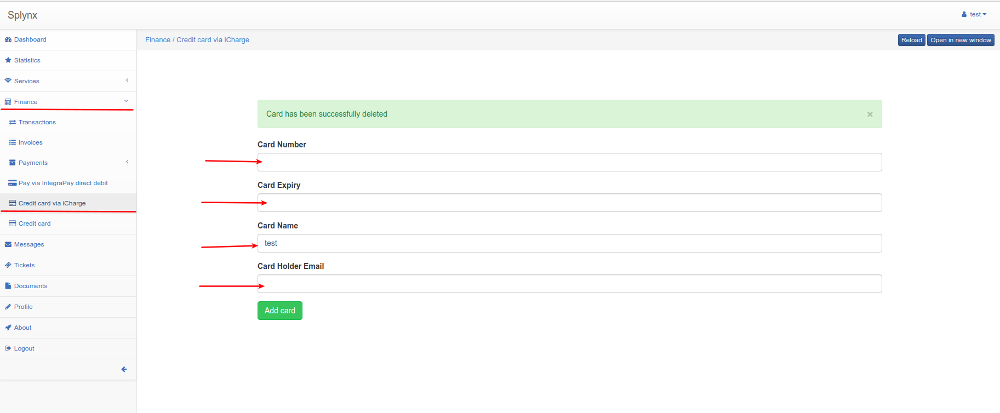

They can also add cards from the payment window as depicted below:
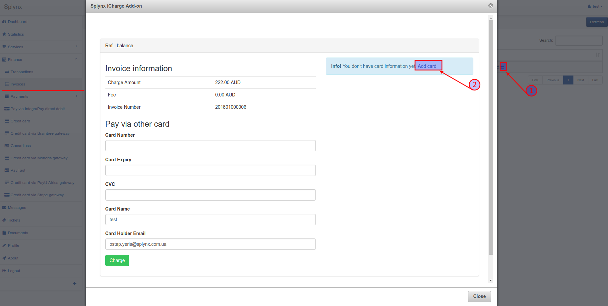

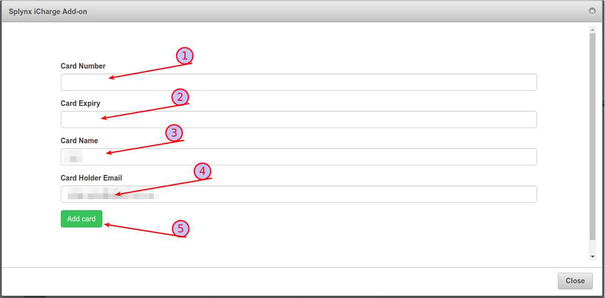

When customers saved their credit cards, you can charge all customers using one button! Navigate to *Finance → Invoices*, set the period and click "Charge" as at the screenshot:

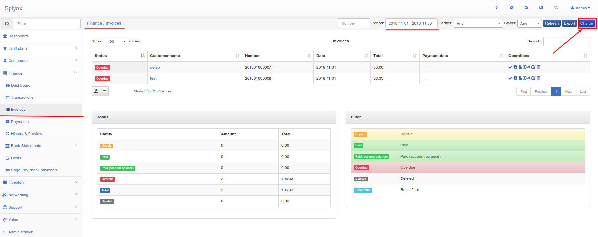


