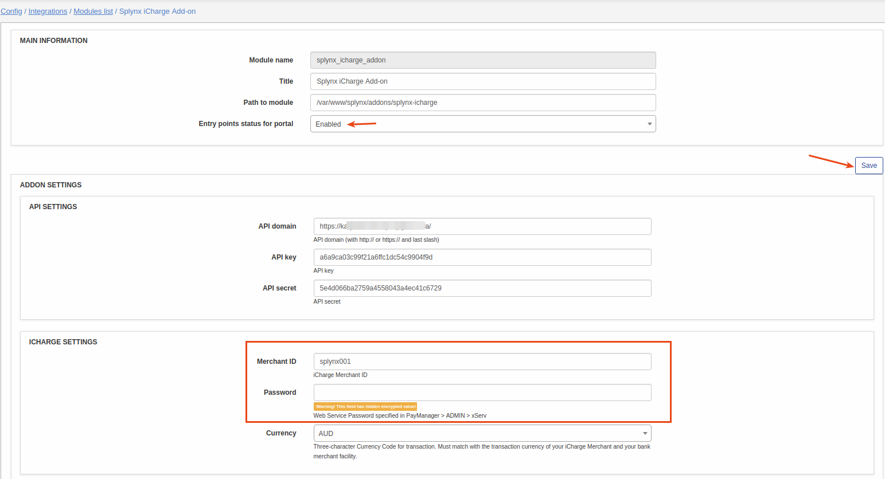
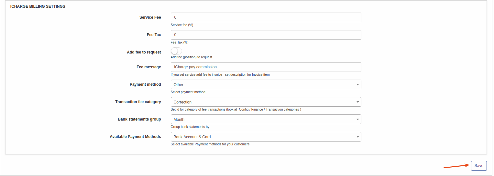
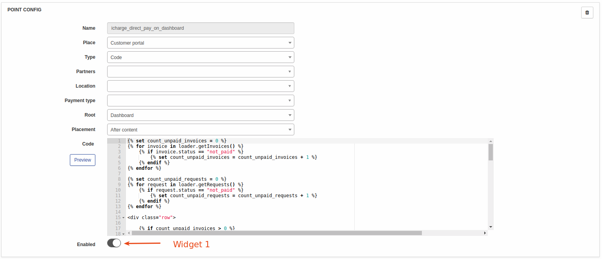
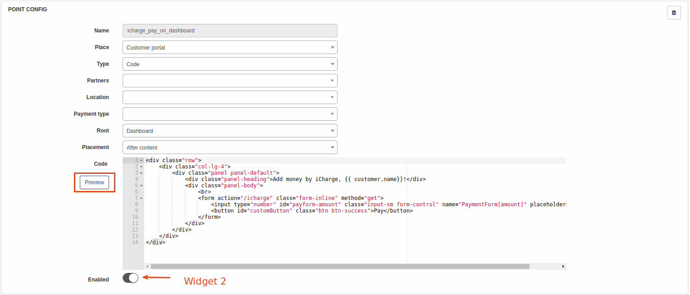

iCharge
==================

**iCharge** is a Splynx add-on. It allows to refill balance and pay invoices via Xilo payment gateway - https://xilo.com.**

Add-on can work with different credit cards, if cards are saved, then addon allows to charge all customers using *Direct debit order*.


To install *splynx-icharge* add-on, use following commands:


```bash
apt-get update
apt-get install splynx-icharge
```
or you can install it from Web UI:

*Config → Integrations → Add-ons:*


After installation you have to configure addon:

*Config → Integrations → Modules list:*


Set those parameters from your https://xilo.com account and set here your server IP address (IP address from where Xilo will take requests):





After that, customers can pay their invoices by using iCharge system. They will see a new button *"Pay by iCharge"* as on the screenshot:


also you can turn on entry points in *config -> integrations -> modules list -> Splynx iCharge Add-on* as on the screenshot:





after that customer will be able to pay his invoice from dashboard:


To refill balance customers can use the link - *“http://yoursplynxurl/icharge/”*:


Customers can save pay-card details for the next payments in "Finance" menu:


When customers saved their credit cards, you can charge all customers, using one button! Go to *Finance → Invoices*, set the period and click "Charge" as at the screenshot:


