**Integrapay**
============

**Integrapay** is a Splynx add-on used to synchronize customers, invoices and payments with the payment software - https://www.integrapay.com.au/ Customers using Integrapay can pay for their invoices through banks or you can charge your customers bank accounts by debit orders.

The add-on can be installed in two methods, via the CLI or Web UI of you server

To install the Splynx-Integrapay add-on via CLI, the following commands can be used:

```
apt-get update
apt-get install splynx-integrapay
```
To install it via the Web UI:

Navigate to `Config → Integrations → Add-ons`:


Locate or search for the "splynx-integrapay" add-on and click on the install icon in the *Actions* column, you will be presented with a window to confirm or cancel the installation, click on confirm to begin the installation process.

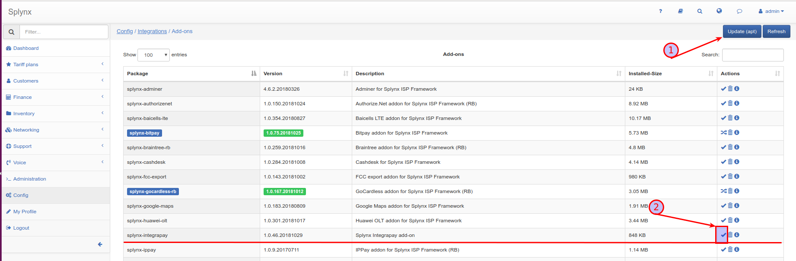

The first step is to register an account in https://www.integrapay.com.au/.  After registering, IntegraPay will send you an email with your credentials, where  _**Bussines ID** is your **Username** and  **Api User Key** is your **password**_ :

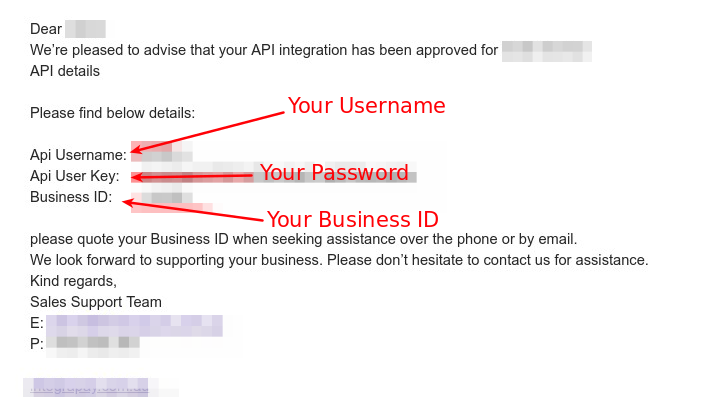

Thereafter, you need to set your Username, Business ID and Password in Splynx under *Config → integration → modules list → splynx_addon_integrapay*, as depicted below:

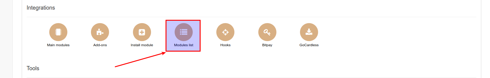

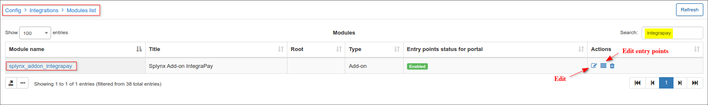

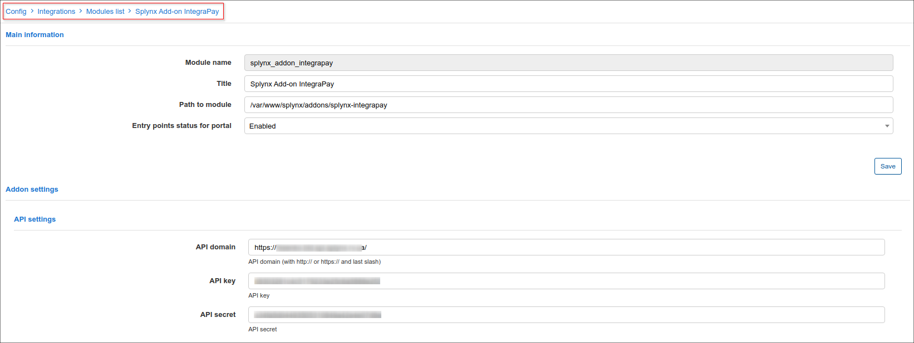
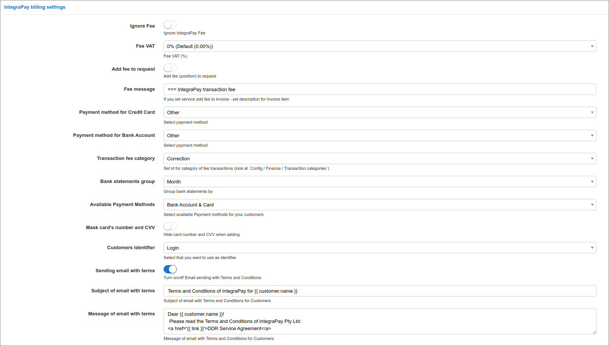

After the Add-on has been configured, customers will see a new pay button in their list of invoices and a new item in the finance section of the customer portal:

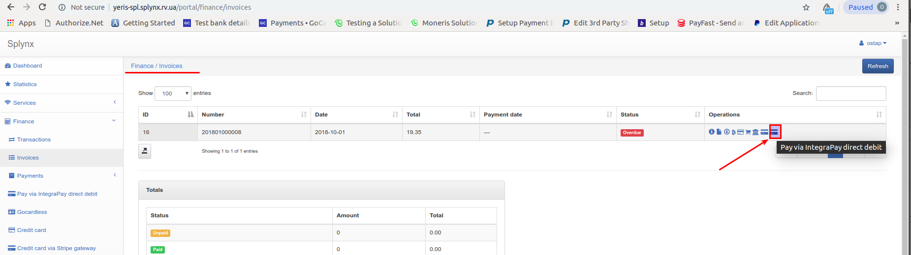

Customers then have to navigate to *Finance → Pay via IntegraPay direct debit* and set up their Bank Accounts or Credit Cards (depends on what they will use to pay for invoices) or press the button "Pay with IntegraPay" and configure the account there:

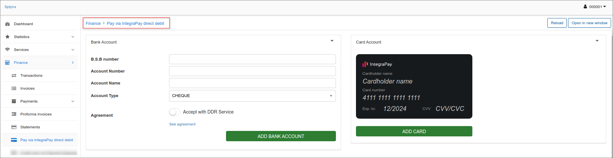

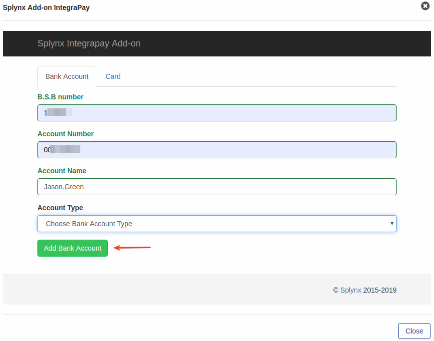

Customers can choose between the Bank account or "Card" to set up the option they would like to use to pay:

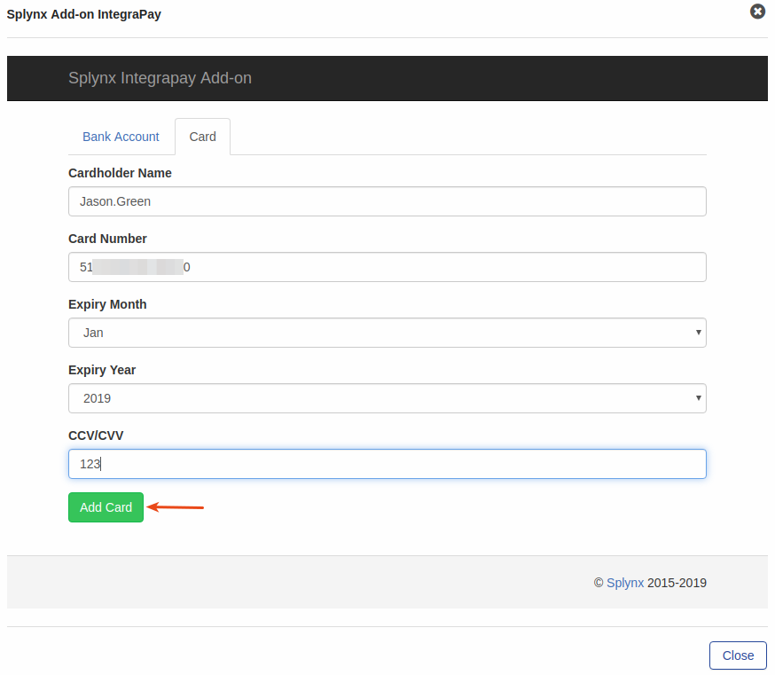

Customers can also refill their balances under *Finance → Pay via IntegraPay direct debit*:


Additionally, you can charge all customers using one button! Navigate to *Finance → Invoices*, set the period and click on "Charge" as depicted below:

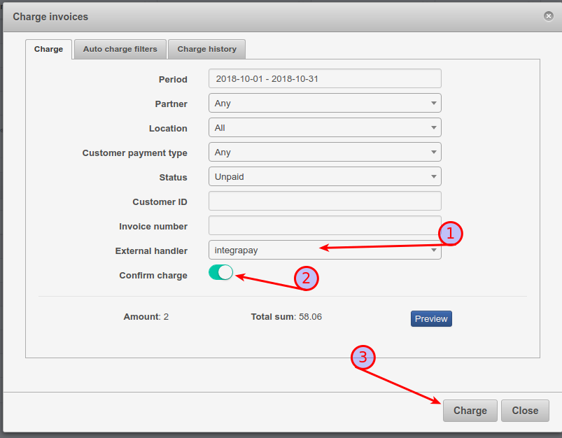

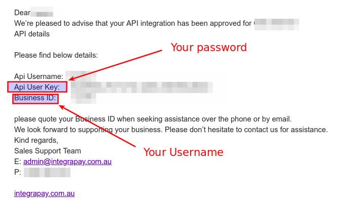

The "Charge history" tab contains the charge history of all charges you have made, sometimes it is very helpful when there are finance issues.
