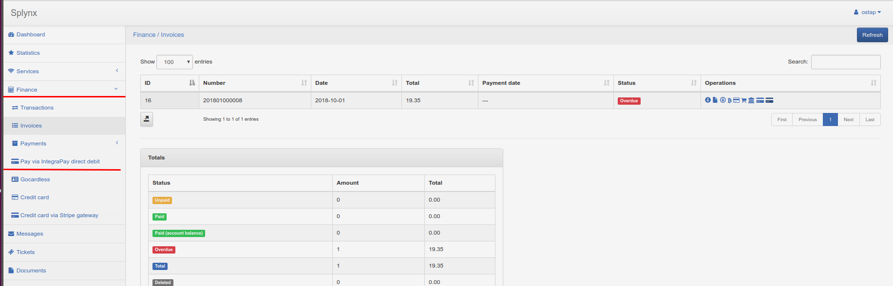
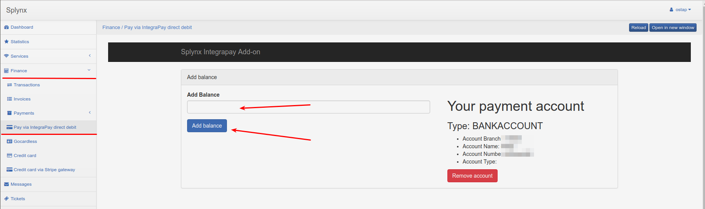

**Integrapay**
============

**Integrapay** is a Splynx add-on. It uses to synchronize customers, invoices and payments with  payment software - https://www.integrapay.com.au/ Customers using Integrapay can pay your invoices through banks or you can charge your customers bank accounts by debit orders.

To install Splynx-Integrapay add-on, use following commands:

```
apt-get update
apt-get install splynx-integrapay
```
or you can install it from Web UI:

*Config → Integrations → Add-ons:*


Then first step - you should to register in https://www.integrapay.com.au/. After that you need to set your User name and Password in Splynx *Config → integration → modules list → splynx_addon_integrapay*:


Also in this repository you can set "Service fee" for and "fee vat" customers:


After that you configure Add-on customers will see new pay button near their invoices and new item of finance menu:




Customer have to go to the *Finance → Pay via IntegraPay direct debit* and set his Bank Account or Credit Card (depends on what he will use to pay for invoices):


After that customer have configured his Bank account or credit card he can pay invoices with https://www.integrapay.com.au/. by pay button:


Also customers can to add their balance by *Financ → Pay via IntegraPay direct debit*:



Besides, you can charge all customers, using one button! Go to *Finance → Invoices*, set the period and click "Charge" as at the screenshot:


