IPpay by Convergence
==================

IPpay is a Splynx add-on which allows refilling of customer balances and paying invoices via the IPpay payment gateway - https://www.ippay.com/.

The Add-on can work with different credit cards, and if cards are saved on customer profiles, the addon allows you to charge all customers using *Direct debit orders*.

The add-on can be installed in two methods, via the CLI or the Web UI of your Splynx server

To install the *splynx-ippay* add-on via CLI, the following commands can be used:


```bash
apt-get update
apt-get install splynx-ippay
```
To install it via the Web UI:

Navigate to `Config → Integrations → Add-ons`:

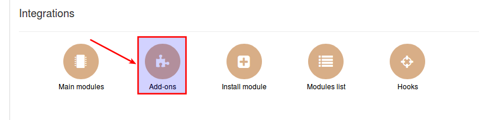

Locate or search for the "splynx-ippay" add-on and click on the install in the *Actions* column:

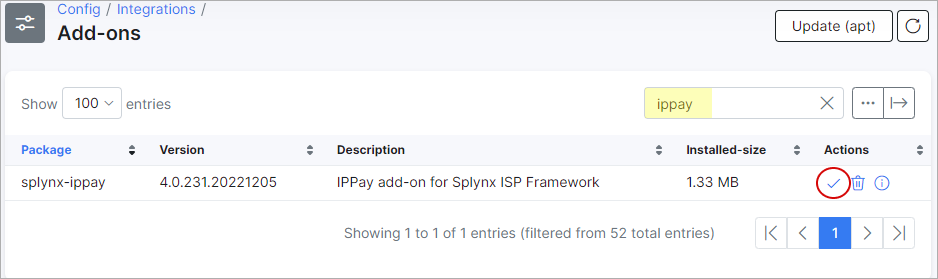

Click on the "OK, confirm" button to begin the installation process:

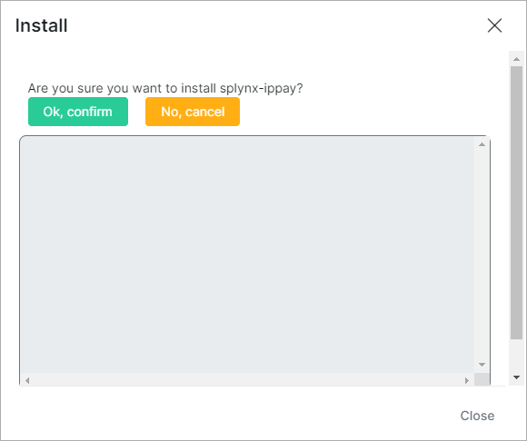

After installation process has completed, you have to configure addon:

Navigate to `Config → Integrations → Modules list`:

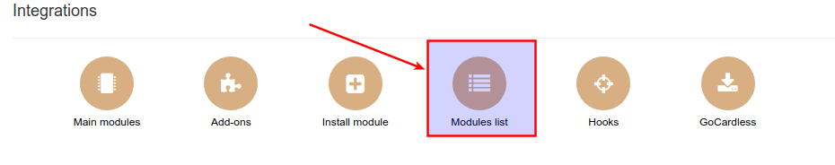

Locate or search for the "splynx-ippay" add-on and click on the edit icon in the *actions column:

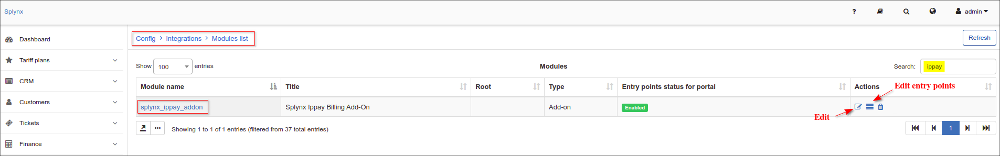


Customers then have to add a credit card in the customer portal under *Finance/Credit card*:

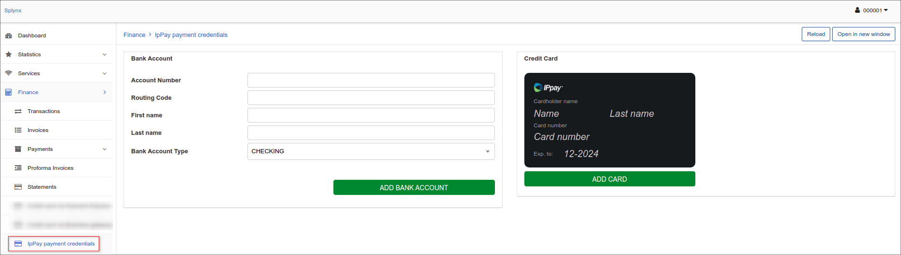

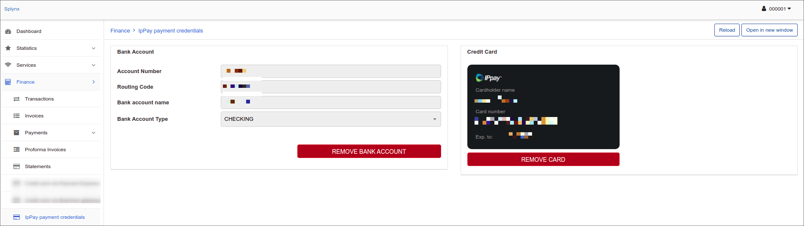

Now customers can pay for their invoices using the IPpay system in *Finance / Invoices*:

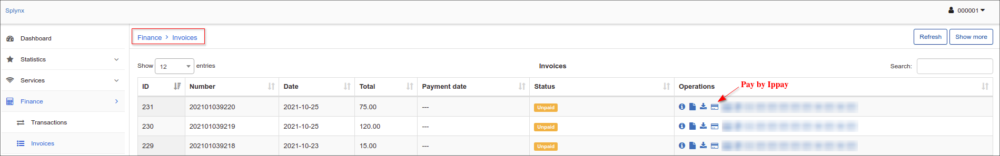

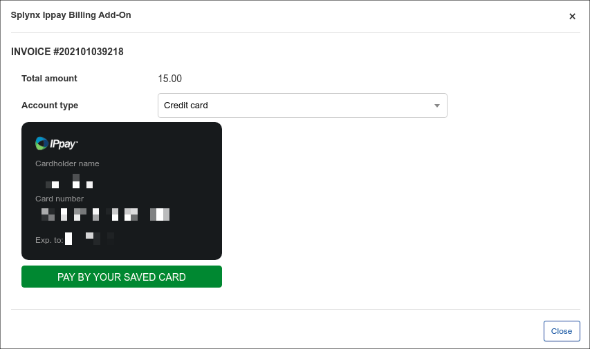

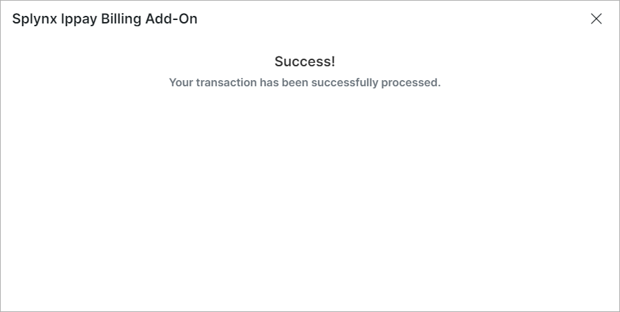

If everything went well, you will see the status of invoice marked as "Paid" (in the portal and in the admin page):

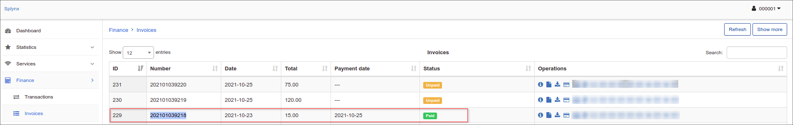

On the customer portal dashboard, customers can also see the list of non-paid invoices and a "Pay" button near each invoice:

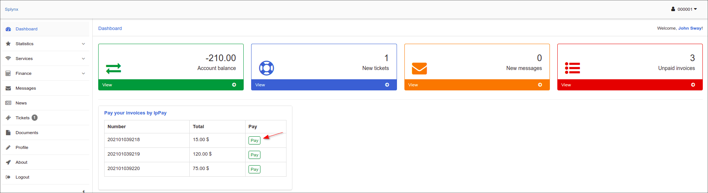

To refill balances, customers can use the following link - “http://yoursplynxurl/ippay”, where they have to enter an Amount of payment and click on "Add":

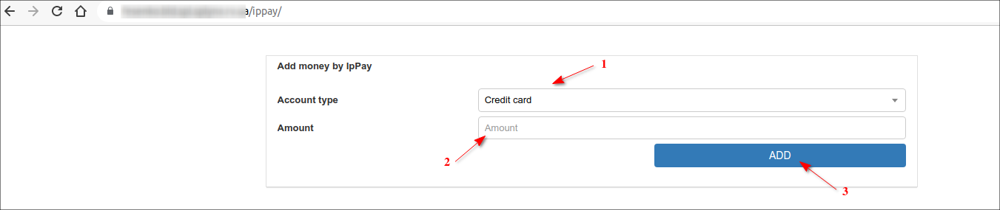

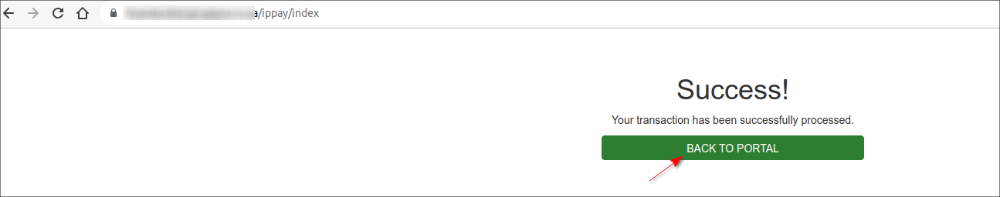

Additionally, you can charge all customers using one button! Navigate to *Finance → Invoices*, set the period and click on "Charge" as depicted below:

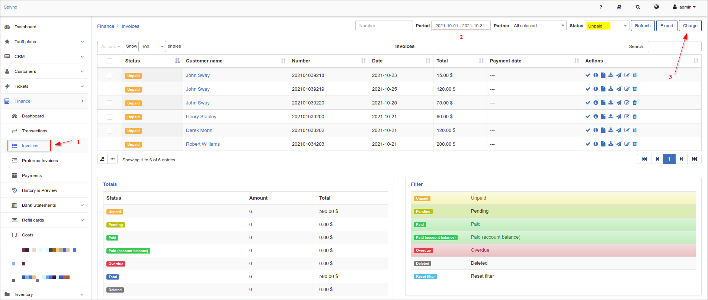

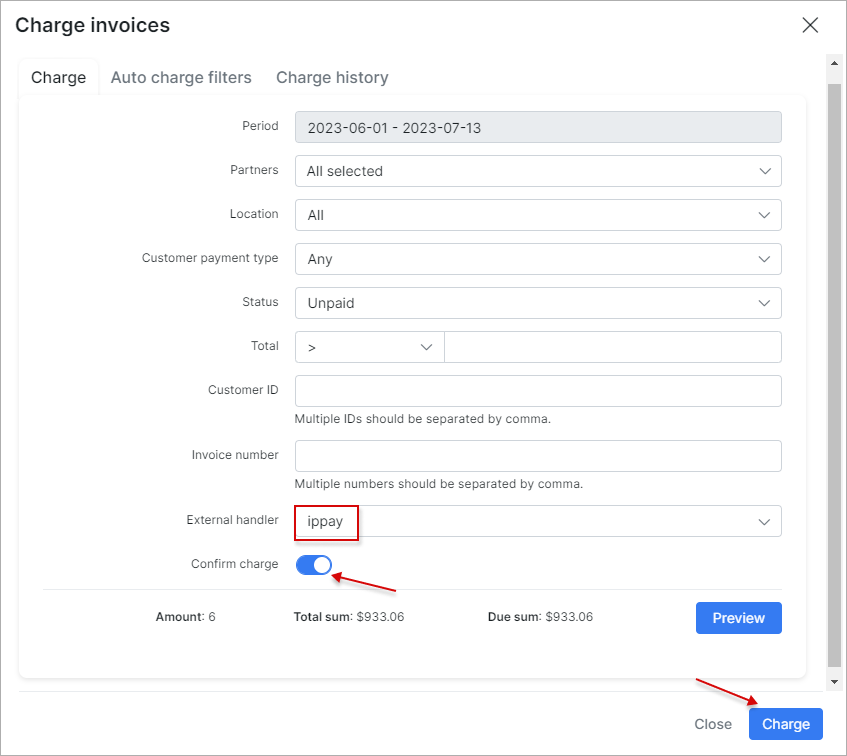

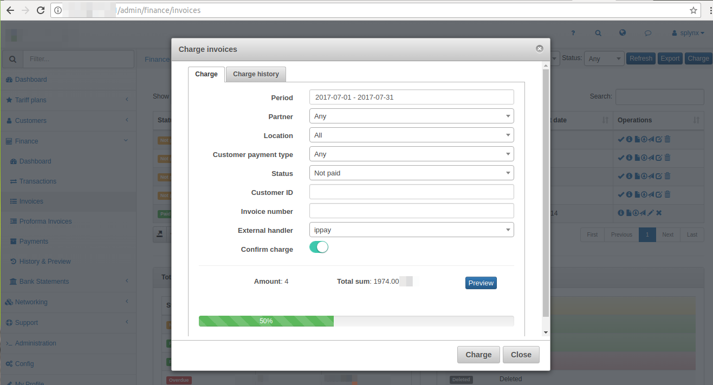
