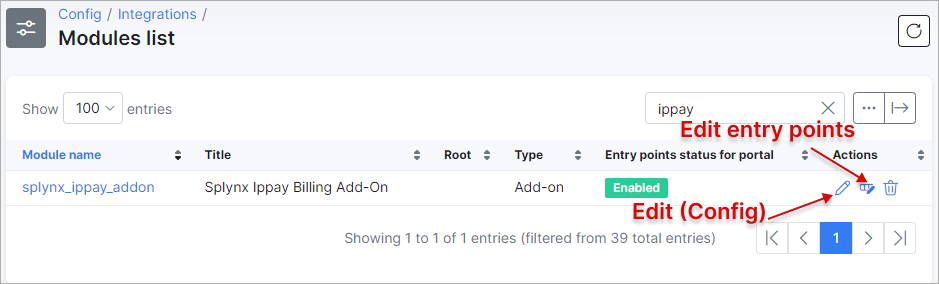
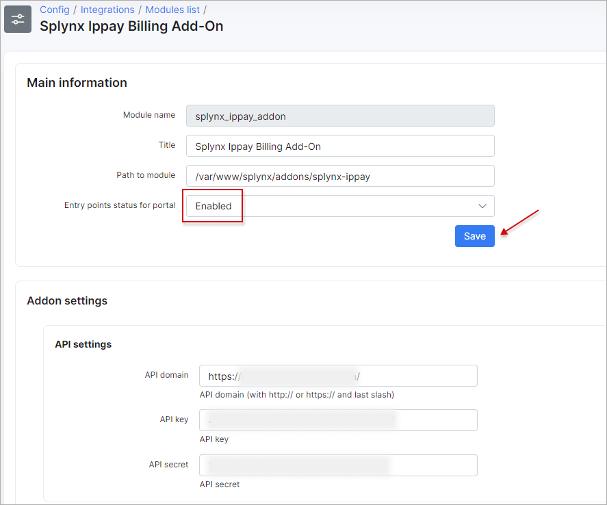
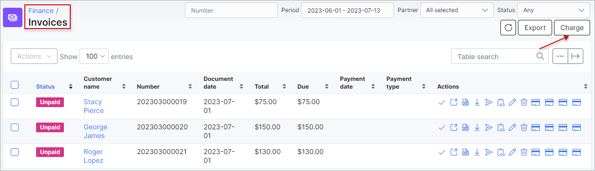

IPpay
==================

IPpay is a Splynx add-on which allows refilling of customer balance and paying invoices via the IPpay payment gateway - https://www.ippay.com/.

**IPpay contact details**:
 
```
Aaron Cooper - Account Manager

acooper@ippay.com

Tel: 417-483-4651
```
*********************************************
The add-on can work with different credit cards and bank accounts (if cards or bank accounts are saved in customer profiles). It allows you to charge all customers using *Direct debit orders*.

## Installation

The add-on can be installed in two methods: via the CLI or the Web UI of your Splynx server.

To install the *IPpay* add-on via CLI, the following commands can be used:


```
apt-get update
apt-get install splynx-ippay
```
To install it via the Web UI, navigate to `Config → Integrations → Add-ons`:


Locate or search for the `splynx-ippay` add-on and click the *Install* icon in the *Actions* column:


Click the `OK, confirm` button to begin the installation process:


## Configuration

After the installation process is complete, you need to configure the add-on by navigating to `Config → Integrations → Modules list`:


Locate or search for the `splynx-ippay` add-on and click the
<icon class="image-icon"></icon> *Edit (Config)* icon in the *Actions* column:



`Terminal ID` can be obtained from your *IPpay* account.




## Invoice payment

After completing the configuration, customers can add a credit card or bank account on the [Customer Portal](customer_portal/customer_portal.md) in `Finance → IpPay payment credentials`:


Now customers can pay for their invoices using the *IPpay* system in `Finance → Invoices` on the Customer Portal:


Moreover, if one or both payment methods are added by the customer, the **administrator can pay the invoices directly from the customer's profile**:


If everything goes well, you will see the invoice status marked as **Paid** on both the customer and admin portals:


On the Customer portal Dashboard, customers can also see the list of unpaid invoices in the *Ippay* widget (entry point) and buttons with the same name to pay such invoices.


The configuration of add-on **Entry points** can be found in `Config → Integrations → Modules list`. Click the <icon class="image-icon"></icon> (*Edit entry points*) icon near the `splynx_ippay_addon` module item in *Actions* column. More information about *Modules list* can be found [here](configuration/integrations/modules_list/modules_list.md).

To refill balances, customers can use the following link - ``` https://<splynx_domain_address>/ippay ```, where they have to choose the *Account type*, enter the *Amount* of payment and click the `Add` button:


________________________

Additionally, you can charge all customers in one click. Navigate to `Finance → Invoices`, set the period and click the `Charge` button as depicted below:




## Direct payments

Using payment links is the simplest way to accept payments made with a credit card or bank account. This feature is available in the *IPpay* add-on for paying *Invoices* and *Proforma Invoices*. 

It provides convenience and simplicity for your customers, leading to an increase in on-time payments. For instance, you can include a payment link in the email containing the (proforma) invoice. As a result, customers can quickly make payments by clicking on the link instead of logging into their *Portal* page. 

If customers have saved their payment credentials on the *Portal*, they won't need to provide further details when using the direct payment link in the future. However, if the credit card is not linked on the *Portal*, the payment details will need to be entered each time the payment link is used.

To create a direct payment link, please use the patterns below:

**To pay the Invoice:**

<details style="font-size: 15px; margin-bottom: 5px;">
<summary><b>by invoice ID</b></summary>
<div markdown="1">

```
https://<splynx_domain_address>/ippay/direct-pay-invoice-by-id?item_id=<Invoice_id>

```
</div>
</details>

<details style="font-size: 15px; margin-bottom: 5px;">
<summary><b>by invoice number</b></summary>
<div markdown="1">

```
https://<splynx_domain_address>/ippay/direct-pay-invoice?item_id=<Invoice_number>

```
</div>
</details>

<br>

**To pay the Proforma Invoice:**

<details style="font-size: 15px; margin-bottom: 5px;">
<summary><b>by proforma invoice ID</b></summary>
<div markdown="1">

```
https://<splynx_domain_address>/ippay/direct-pay-proforma-by-id?item_id=<proforma_id>

```
</div>
</details>

<details style="font-size: 15px; margin-bottom: 5px;">
<summary><b>by proforma invoice number</b></summary>
<div markdown="1">

```
https://<splynx_domain_address>/ippay/direct-pay-proforma?item_id=<proforma_number>

```
</div>
</details>
