Moneris
=======

Moneris is a Splynx add-on used to pay invoices and proforma invoices with the _Moneris Payment Gateway_ -  [https://www.moneris.com/](https://www.moneris.com/).


The add-on can be installed in two methods, via the CLI or the Web UI of your Splynx server.

To install the add-on via CLI the following commands can be used:

```bash
apt-get update
apt-get install splynx-moneris
```

To install it via the Web UI

 Info: <icon class="image-icon"> This installation method is available only for Splynx versions ≥ 2.1.

Navigate to `Config / Integrations / Add-ons`  

  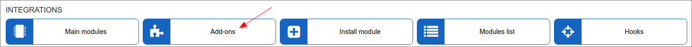

Locate or search for the "splynx-moneris" add-on and click on the install icon the *Actions* column, you will be presented with a window to confirm or cancel the installation, click on confirm to begin the installation process:

  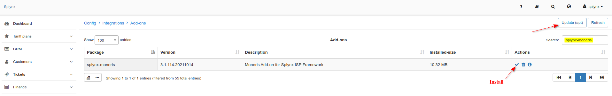


After the installation process has completed, the add-on should be configured.

Navigate to `Config / Integrations / Modules list`,:

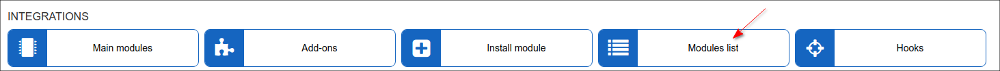

Locate or search for the "splynx-moneris" add-on and click  on the edit icon<icon class="image-icon"></icon>

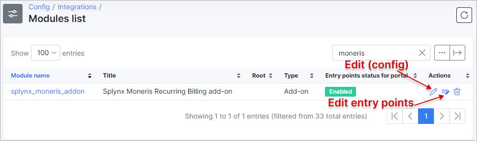

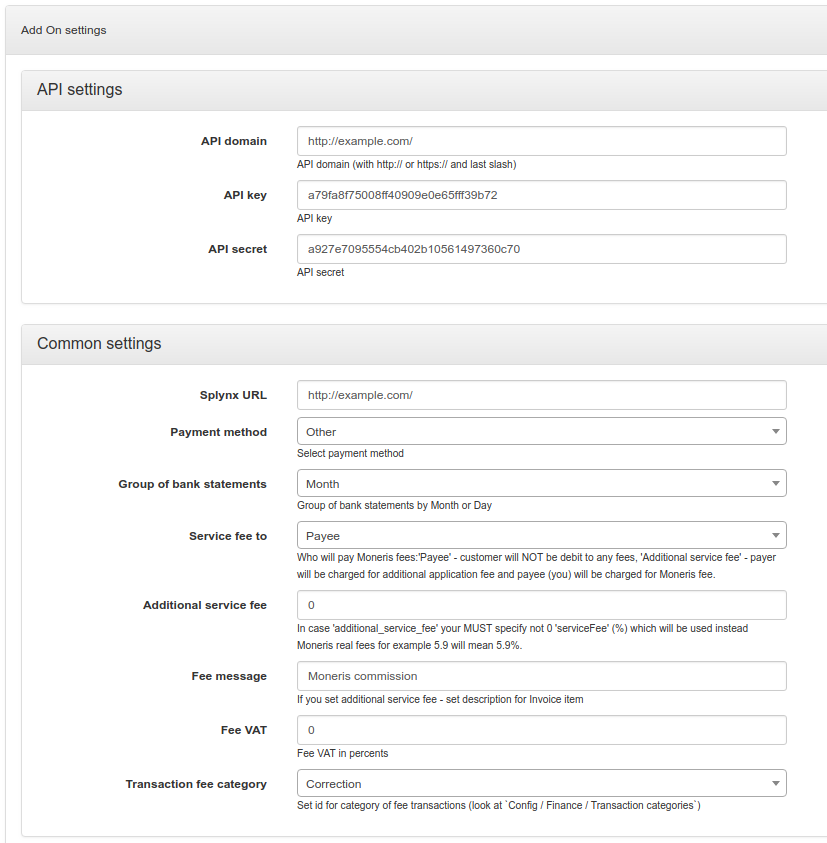

**Parameters**

**API domain** - your Splynx URL.  
**API key**, **API secret** - default values. Don't change it if it is not entirely necessary.  
**Splynx URL** - your Splynx URL.  
**Payment method** - when a customer pays by using this add-on, this will be the payment type.

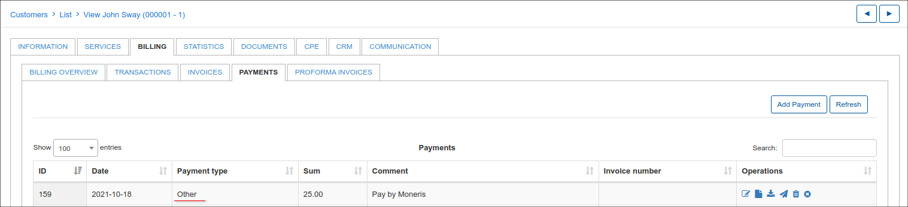

**Group of bank statements** - Group bank statements (_Finance / Bank Statements / History_) monthly or daily.  
**Service fee to**:

* Payee - customer won't pay Additional service fee.
* Additional service fee - customer will pay Additional service fee.

**Additional service fee** - if **Service fee to** is set to: _Additional service fee_, you have to specify the Additional service fee_ percent here.  
**Fee message** - _Additional service fee_ description.  
**Fee VAT** - _Additional service fee_ VAT percent.  
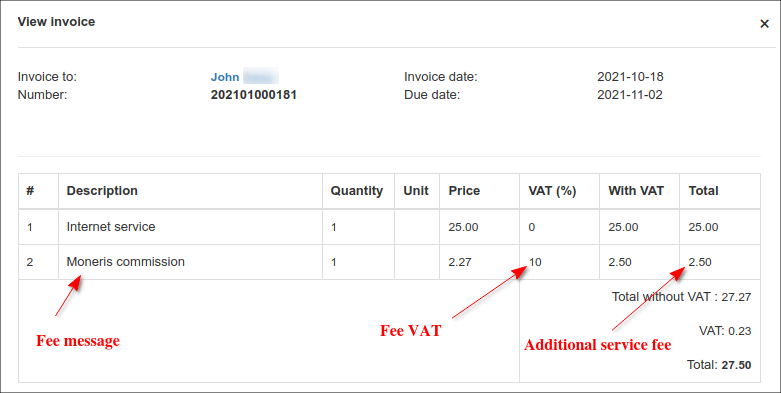

**Transaction fee category** - [transaction category](configuration/finance/transaction_categories/transaction_categories.md) of the _Additional service fee_.
<icon class="image-icon"></icon> It is only used for [proforma invoices](finance/proforma_invoices/proforma_invoices.md). For [invoices](finance/invoices/invoices.md), the _Additional service fee_ category is always _Service._
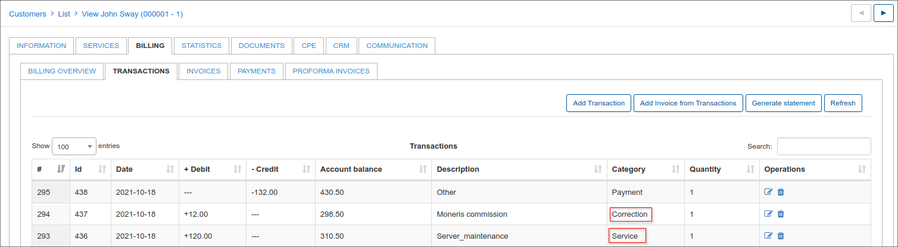

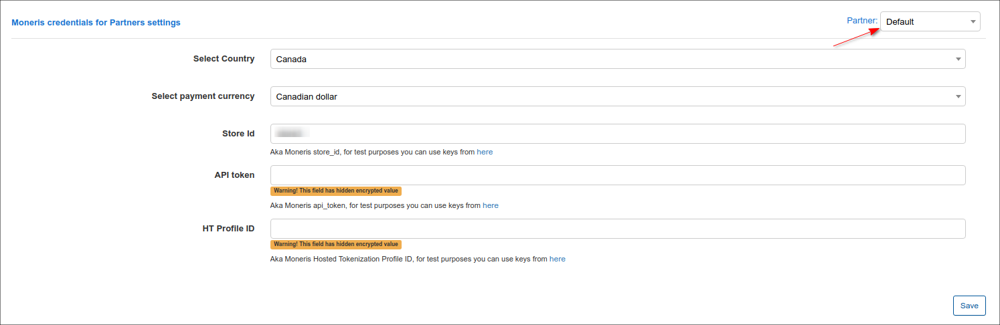

These settings can be different for each [partner](administration/main/partners/partners.md):

**Select Country** - country.<br>
**Select payment currency** - currency.<br>
**Store Id**, **API token**, **HT Profile ID** - these values you can find in Moneris portal.


After the successful configuration of the add-on, customers can pay for their invoices using the Moneris system in _Finance / Invoices_:

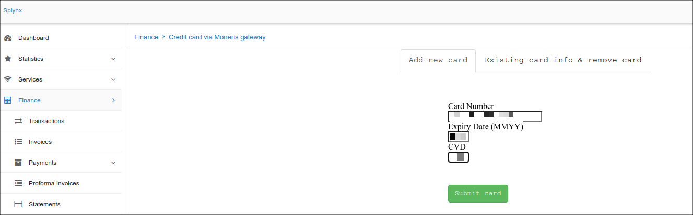

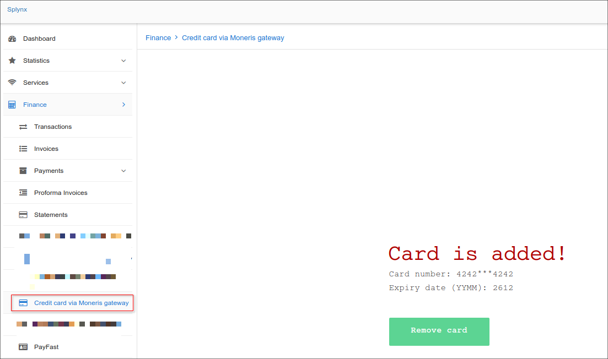


If everything went well, you will see the status of invoice marked as "Paid" (portal and admin).
