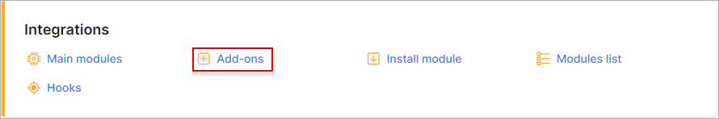
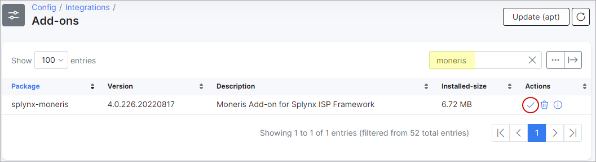
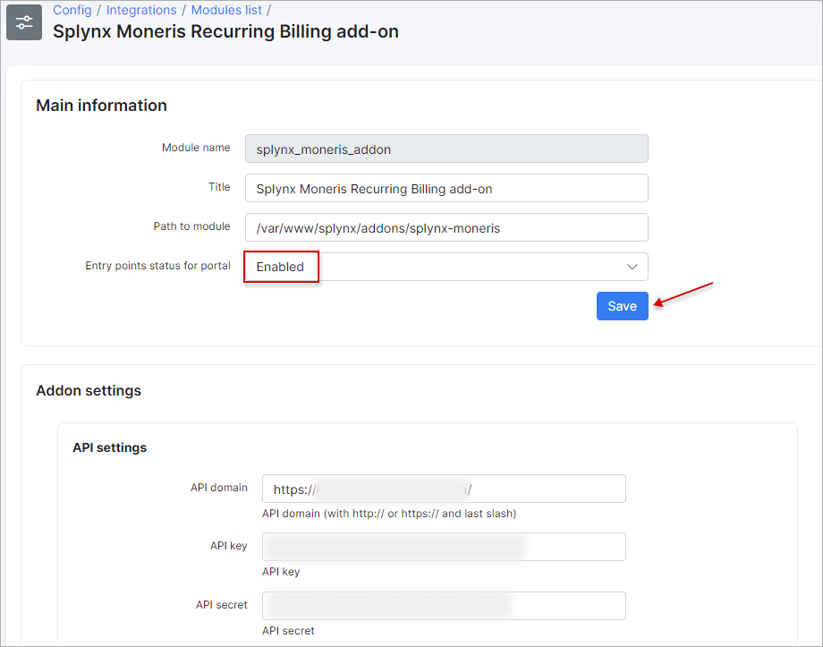
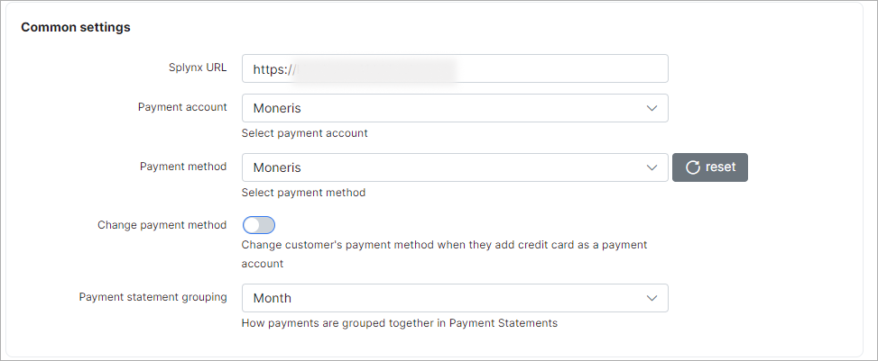
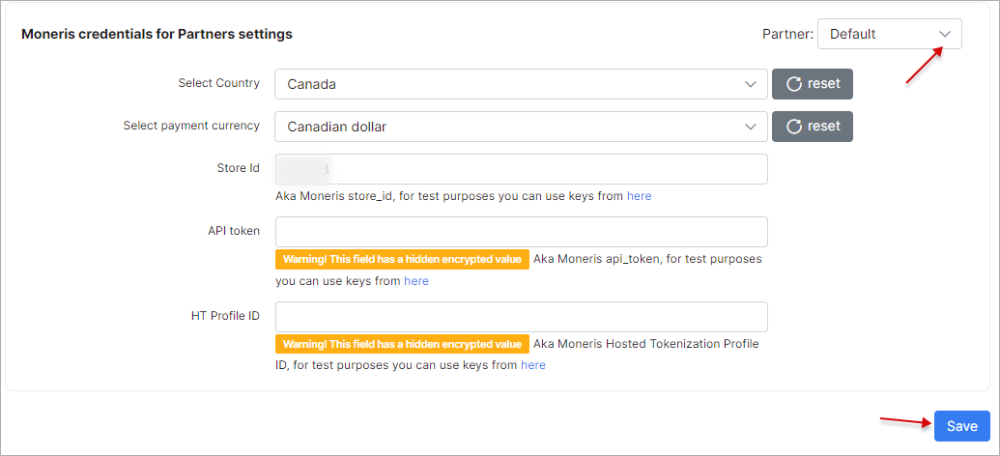
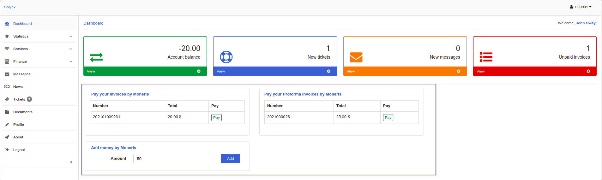

Moneris
=======

Moneris is a Splynx add-on used to pay invoices and proforma invoices with the [Moneris Payment Gateway](https://www.moneris.com).

## Installation

The add-on can be installed in two methods: via the CLI or the Web UI of your Splynx server.

To install the add-on via CLI, the following commands can be used:

```bash
apt-get update
apt-get install splynx-moneris
```

To install it via the Web UI, navigate to `Config → Integrations → Add-ons`:  

  

Locate or search for the `splynx-moneris` add-on, and click the *Install* icon in the *Actions* column. You will be presented with a window to confirm or cancel the installation. Click `OK, confirm` to begin the installation process:

  


After the installation process has completed, the add-on should be configured.

Navigate to `Config → Integrations → Modules list`:


Locate or search for the `splynx-moneris` add-on and click the `Edit` icon <icon class="image-icon"></icon> :


## Configuration

**API settings**



- **API domain** - your Splynx URL (with last slash);
- **API key** / **API secret** - the auto-generated values in Splynx. Do not change these values unless it is particularly necessary.

**Common settings**



- **Splynx URL** - your Splynx URL (without last slash);  
- **Payment account** - the [account](configuration/finance/payment_accounts/payment_accounts.md) that will be used in customer's profile, by default it's *Moneris*;
- **Payment method** - when a customer pays by using this add-on, this will be shown in the [payment type](configuration/finance/payment_methods/payment_methods.md) column;
- **Change payment method** - enable/disable the ability to change the customer's payment method when they add a credit card as a payment account;
- **Payment statement grouping** - how to group payment statements (`Finance → Payment Statements → History`) - monthly or daily.

**Moneris credentials for Partners settings**



If you are using the multiple [partners](administration/main/partners/partners.md) scheme in the Splynx system, you can divide the Moneris configuration among them. To do this, create a new partner in Splynx, then in the Moneris configuration, select the appropriate partner and configure the required settings.

<icon class="image-icon"></icon> The fields marked with `*` sign indicate different values from the original ones. The original values are associated with the **Default** partner.

- **Select Country** - the country to choose;<br>
- **Select payment currency** - the currency to choose;<br>
- **Store Id**, **API token**, **HT Profile ID** - these values can be found in the Moneris portal.

The configuration of the add-on **Entry points** is in `Config → Integrations → Modules list`, near the `splynx-moneris` module item in the *Actions* column. Click the <icon class="image-icon"></icon> (*Edit entry points*) icon. More information about *Modules list* can be found [here](configuration/integrations/modules_list/modules_list.md).

By using **Entry points**, you can enable add-on features which can allow customers to pay for (proforma) invoices, pay directly from *Portal Dashboard* or add money to the balance from *Dashboard*.

## Invoice payment

After the successful configuration of the add-on, customers can pay for their invoices using the Moneris gateway in `Finance → Invoices` on the Customer Portal.

The credit card can be added in `Finance → Credit card via Moneris gateway` section of the *Customer Portal*.


After successfully adding the credit card, customers can proceed to pay the invoices in `Finance → Invoices` or the proforma invoices in `Finance → Proforma Invoices`:


If everything goes well, you will see the status of invoice marked as `Paid` (on the customer and admin portal).

On the Customer Portal *Dashboard*, customers can also see the list of unpaid invoices in the Moneris widget (entry point) and buttons with the same name to pay these invoices. Additionally, customers can refill their account balance by using the Add Money by Moneris widget on the *Dashboard*.



------------

## Direct payments


Using payment links is the simplest way to accept credit card payments. This feature is available in the Moneris add-on for paying **Invoices** and **Proforma Invoices**. 

It provides convenience and simplicity for your customers, thereby increasing the number of on-time payments. 

For instance, you can include a payment link in the email containing the (proforma) invoice. As a result, customers can quickly make payments by clicking on the link instead of logging into their Portal page. 

If customers have already saved their card details on the Portal, they won't need to provide additional information when using the direct payment link in the future. 

However, if the credit card is not linked to the Portal, payment details will need to be entered each time the payment link is used.

To create a direct payment link, please use the patterns below:

**To pay the Invoice:**

<details style="font-size: 15px; margin-bottom: 5px;">
<summary><b>by invoice ID</b></summary>
<div markdown="1">

```
https://<splynx_domain_address>/moneris/direct-pay-invoice-by-id?item_id=<Invoice_id>
```
</div>
</details>

<details style="font-size: 15px; margin-bottom: 5px;">
<summary><b>by invoice number</b></summary>
<div markdown="1">

```
https://<splynx_domain_address>/moneris/direct-pay-invoice?item_id=<Invoice_number>
```
</div>
</details>

<br>

**To pay the Proforma Invoice:**

<details style="font-size: 15px; margin-bottom: 5px;">
<summary><b>by proforma invoice ID</b></summary>
<div markdown="1">

```
https://<splynx_domain_address>/moneris/direct-pay-proforma-by-id?item_id=<proforma_id>
```
</div>
</details>

<details style="font-size: 15px; margin-bottom: 5px;">
<summary><b>by proforma invoice number</b></summary>
<div markdown="1">

```
https://<splynx_domain_address>/moneris/direct-pay-proforma?item_id=<proforma_number>
```
</div>
</details>

