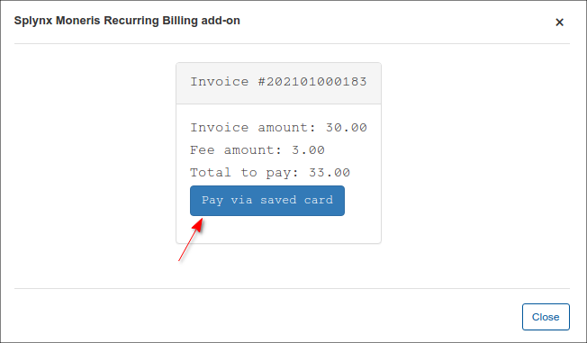
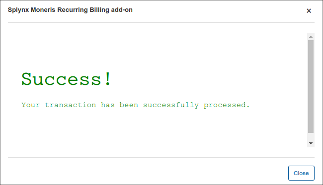

Moneris
=======

Moneris is a Splynx add-on used to pay invoices and proforma invoices with the [Moneris Payment Gateway](https://www.moneris.com).


The add-on can be installed in two methods, via the CLI or the Web UI of your Splynx server.

To install the add-on via CLI the following commands can be used:

```bash
apt-get update
apt-get install splynx-moneris
```

To install it via the Web UI

Navigate to `Config / Integrations / Add-ons`  

  

Locate or search for the `splynx-moneris` add-on and click on the install icon the *Actions* column, you will be presented with a window to confirm or cancel the installation, click on confirm to begin the installation process:

  


After the installation process has completed, the add-on should be configured.

Navigate to `Config / Integrations / Modules list`,:


Locate or search for the `splynx-moneris` add-on and click  on the edit icon <icon class="image-icon"></icon>


------------

### Addon settings

**Parameters**

- **API domain** - your Splynx URL (with last slash);
- **API key** / **API secret** - the auto generated values in Splynx. Do not change these values unless it is particularly necessary;
- **Splynx URL** - your Splynx URL (without last slash);  
- **Payment account** - the [account](configuration/finance/payment_accounts/payment_accounts.md) that will be used in customer's profile, by default it's *Moneris*;
- **Payment method** - when a customer pays by using this add-on, this will be the [payment type](configuration/finance/payment_methods/payment_methods.md);


- **Group of bank statements** - how to group the bank statements (`Finance → Bank Statements → History`) monthly or daily;  
- **Service fee to**: **Payee** value - customer won't pay **Additional service fee**. **Additional service fee** value - customer will pay *Additional service fee* specified in the next field;

- **Additional service fee** - if **Service fee to** option is set to: _Additional service fee_, you have to specify the additional service fee percent value in the current field, it will be used instead *Moneris* real fees, for example 5.9 would mean 5.9%;
- **Fee message** - the _Additional service fee_ description. The default value is *Moneris commission*;
- **Fee VAT** - the VAT of _Additional service fee_ in percent.  Will be included into the service fee;


- **Transaction fee category** - [transaction category](configuration/finance/transaction_categories/transaction_categories.md) of the _Additional service fee_.

In case in Splynx system is used the multiple [partners](administration/main/partners/partners.md) scheme, you can divide Moneris configuration between them. Create a new partner in Splynx, in Moneris config select the necessary partner and set the required settings.


**Note:** The fields marked with `*` sign have the different values from original ones (original values are related to **Default** partner).

**Select Country** - the country to choose;<br>
**Select payment currency** - the currency to choose;<br>
**Store Id**, **API token**, **HT Profile ID** - these values you can find in Moneris portal.


After the successful configuration of the add-on, customers can pay for their invoices using the Moneris gateway in `Finance → Invoices` on the Portal:






If everything went well, you will see the status of invoice marked as "Paid" (portal and admin).

------------

### Direct payments

Using the payments links is the simplest way to accept payments made with credit card. This feature is available in the *Moneris* addon to pay *Invoices* and *Proforma Invoices*. This provides convenience and simplicity for your customer, so the amount of on-time payments will increase. For example, you can add a payment link to the e-mail with the (proforma) invoice, as a result, the customer can make payment quickly by clicking onto this link instead of logging in to their *Portal* page. In case the customer has saved the card details on the *Portal*, they do not need to add further details when using the direct payment link in the future. If the credit card in not linked on the Portal, the payment details need to be entered each time the payment link is used.

To create a direct payment link, please use the patterns below:

**To pay the Invoice:**

<details>
<summary>by invoice ID</summary>
<div markdown="1">

```
https://<splynx_domain_address>/moneris/direct-pay-invoice-by-id?item_id=<Invoice_id>
```
</div>
</details>

<details>
<summary>by invoice number</summary>
<div markdown="1">

```
https://<splynx_domain_address>/moneris/direct-pay-invoice?item_id=<Invoice_number>
```
</div>
</details>


**To pay the Proforma Invoice:**

<details>
<summary>by proforma invoice ID</summary>
<div markdown="1">

```
https://<splynx_domain_address>/moneris/direct-pay-proforma-by-id?item_id=<proforma_id>
```
</div>
</details>

<details>
<summary>by proforma invoice number</summary>
<div markdown="1">

```
https://<splynx_domain_address>/moneris/direct-pay-proforma?item_id=<proforma_number>
```
</div>
</details>

<details>
<summary><b>Screenshots</b></summary>
<p markdown="1">


</p>
</details>

------------
