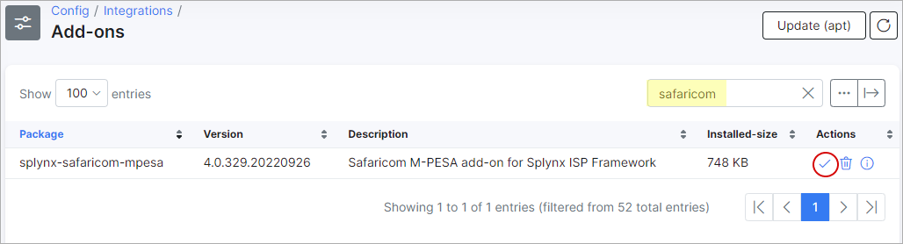
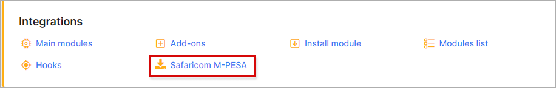
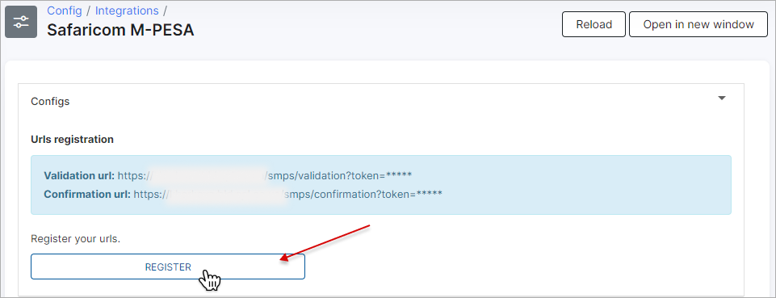
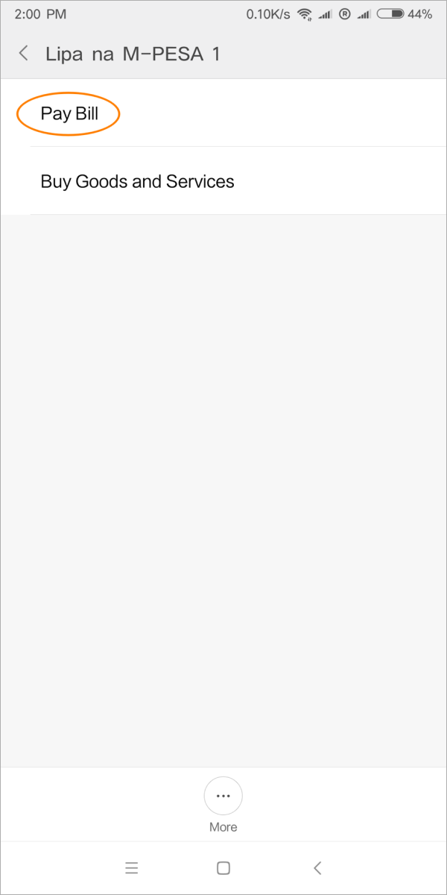
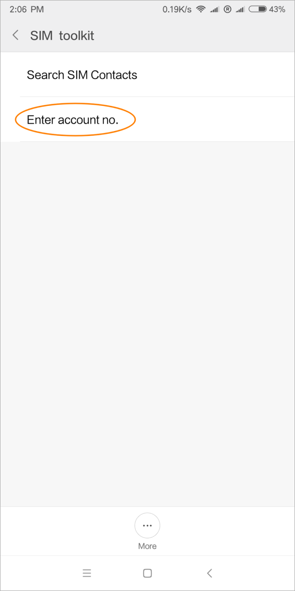
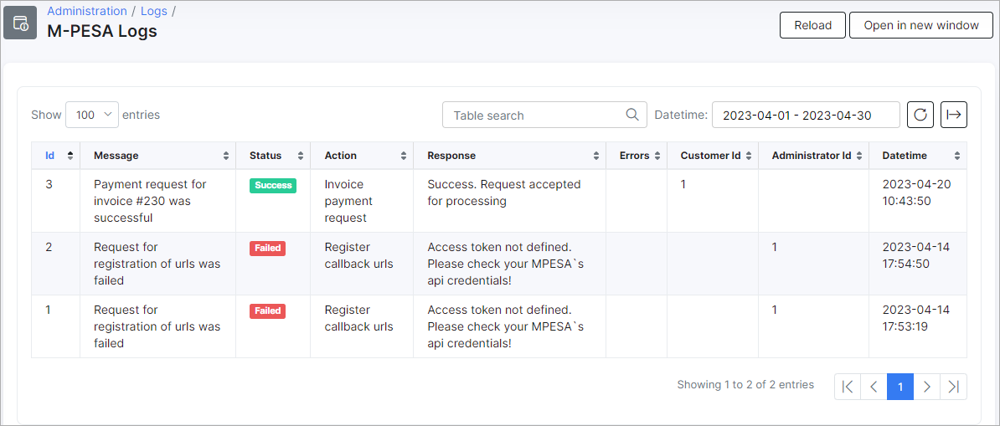

Safaricom M-PESA
================

**Safaricom M-PESA** is a Splynx add-on which allows customers to pay via [Safaricom](https://www.safaricom.co.ke) platform.

### Add-on installation

The add-on can be installed in two methods, via the CLI or the Web UI of your Splynx server.

To install the **Safaricom M-PESA** add-on via CLI, the following commands can be used:

```
sudo apt-get update
sudo apt-get install splynx-safaricom-mpesa
```
To install it via the Web UI:

Navigate to `Config -> Integrations -> Add-ons`:


Locate or search for the `splynx-safaricom-mpesa` add-on and click on the *Install* icon in the *Actions* column, you be presented with a window to confirm or cancel the installation, click on the **OK, confirm** button to begin the installation process:




### Add-on settings

After the installation process has completed, you should configure the add-on.

Navigate to `Config / Integrations / Modules list`


Locate or search for the `splynx_addon_safaricom_mpesa` item and click on the
<icon class="image-icon"></icon> (*Edit*) icon in the *Actions* column:


The general configuration of the *Safaricom M-PESA* integration module can be viewed and edited here. Double check if **Entry points status for portal** option is enabled and **API domain** (with last slash) value is set correctly. **API key**, **API secret** - the default auto-generated values. Do not change this unless entirely necessary.

- **Mpesa credentials:** **Consumer Key/Secret**, **Short code**, **Lipa Na Mpesa Online Passkey** and **(Initiator) Security Credential** - please register your [M-PESA account](https://www.safaricom.co.ke/personal/m-pesa/getting-started/register-for-m-pesa). After registration, you can obtain these values from MPESA.

**Common settings:**

- **Splynx url** - the URL of your Splynx server (without last slash);
- **Payment method ID** - select the [payment method](configuration/finance/payment_methods/payment_methods.md) for payments that will be made. By default the new method will be created - *M-PESA Paybill*;
- **Search customer by** - what field (*Invoice number*, *M-PESA Phone*, *Login*) will be used to search for the customer in Splynx (during payment);
- **Check Debt amount** - the toggle allows to enable/disable to check whether the payment amount is sufficient for paying the debt. If enabled and the customer's account balance is less than 0, the payment amount must be equal to or larger than the customer's debt;
- **Minimum payment amount** - Minimum payment's amount (no less than 0). The payment amount must be larger than this value;
- **Bank statements group** - Group [bank statements](finance/bank_statement_processing/bank_statement_processing.md) by `month` or `day`';
- **Convert received funds to USD** - convert received payment from MPESA (Kenyan shilling) to USD. Enable if you use USD currency in Splynx;
- **USD to KES exchange rate** - the current Splynx internal dollar exchange rate of the KES;
- **Ignore validation** - toggle is used to ignore/allow payment validation automatically when confirmation is received. If the toggle is enabled and the confirmation is received but there is no validation, the payment will be created. Otherwise, the payments will be rejected.

The configuration of add-on **Entry points** can be found in `Config → Integrations → Modules list`, near the `splynx-safaricom-mpesa` module item in *Actions* column, click on the <icon class="image-icon"></icon> (*Edit entry points*) icon. More information about *Modules list* can be found [here](configuration/integrations/modules_list/modules_list.md).

By using **Entry points**, you can enable add-on features which can allow customers to pay for (proforma) invoices, add money to the balance from *Dashboard* etc.

After the successful configuration of the add-on, you should register your URLs under `Config → Integrations → Safaricom M-PESA`:





## Payment process

In this example, the customer pays via **SIM menu**.

  <br>

 

- **Business no.** – MPESA short code (Paybill Number). This is the same value as `Config → Integrations → Safaricom M-PESA → Short code`.

 

- **Account no.** – the value that will be sent to Splynx, it depends on the item (*Invoice number*, *M-PESA Phone*, *Login*) which is selected in `Config → Integrations → Safaricom M-PESA → Search customer by`, according to it the customer will be found.

 

After making a payment, the customer receives an SMS:


Their payments will appear in Splynx:


The customer can pay from Portal with confirmation on cell phone.


### Safaricom M-PESA account

**Paybill Application**

Here are the requirements to use Paybill - https://www.safaricom.co.ke/personal/m-pesa/lipa-na-m-pesa/paybill

<icon class="image-icon"></icon> **NOTE:** Splynx supports only the **Paybill** option as the payment option and does not support a **Till Number**.

After the Paybill application and approval, you need a developers account from the official *M-Pesa Daraja Portal* in order to integrate the customers to the business [API](https://www.safaricom.co.ke/business/corporate/m-pesa-payment-services/m-pesa-api) (Customer to Business - C2B).

**Daraja Portal**

This is the official M-Pesa Portal that is used to host your application. You need to register an account either as an individual or as a company. Follow this link to [sign up](https://developer.safaricom.co.ke/login-register) on the Portal.

**Create a test app in Sandbox**

Sandbox is a testing environment. You can use it to test your app before going to production.

The *Safaricom M-PESA* add-on uses a C2B API. Documentation gives a brief description how to test this C2B API- https://developer.safaricom.co.ke/docs.

Create an app by adding the app name and select product (C2B).


The App contains the following tabs:


- **Keys** – add-on configuration requires a **Consumer Key** and **Secret** from this tab;
- **Products** – shows the approval status of your application API products.
- **Details** – the details tab gives you a summary of your app and the terms and conditions.

The sandbox app is just used to test API calls, made for each different scenario. Test results are put into test case documents, which are excel documents that can be downloaded from the M-PESA portal.  
(Safaricom doesn’t really validate these test cases but it’s important to fill in “Success” results for Authentication, c2b simulation, registering callbacks and reversal)

**Production mode**

This step involves moving your application into production.

* After the on-going process, a new app is created with new credentials.
* We use these live credentials to configure the M-PESA add-on in Splynx.
* Note that after add-on module configuration for production mode, Splynx will register your callback URLs automatically.

**Requirements:**

1. *Test cases results* – this is an excel document with results from your test scenarios.  

    
2. *Shortcode* – this is the Paybill number you are using.

3. *Business Admin/business manager* – these are admin users, with *Business Administrator* or *Business Manager* roles on the M-PESA portal.

    

*Operator*


### M-PESA web portal


This is another M-PESA portal, where your app is hosted. It can be found on the website - https://org.ke.m-pesa.com. You can't access this portal without certificate.

How to apply and install a digital M-PESA certificate:

<iframe frameborder=0 height=270 width=350 allowfullscreen src="https://www.youtube.com/embed/wQyBkJDsmuw?wmode=opaque">Video on youtube</iframe>

### Add-on log files

*M-PESA* add-on logs can be found in `Administration → Logs`:


In *M-PESA Logs* the full payment statistic records can be viewed:



### Direct payments

Using the payments links is the simplest way to accept payments. This feature is available in the *Safaricom M-PESA* add-on to pay *Invoices* and *Proforma Invoices*. This provides convenience and simplicity for your customers, so the amount of on-time payments will increase. For example, you can add a payment link to the e-mail with the (proforma) invoice, as a result, the customer can make payment quickly by clicking onto such link instead of logging in to their *Portal* page.

To create a direct payment link, please use the patterns below:

**To pay the Invoice:**

<details>
<summary>by invoice ID</summary>
<div markdown="1">

```
https://<splynx_domain_address>/smps/direct-pay-invoice-by-id?item_id=<Invoice_id>

```
</div>
</details>

<details>
<summary>by invoice number</summary>
<div markdown="1">

```
https://<splynx_domain_address>/smps/direct-pay-invoice?item_id=<Invoice_number>

```
</div>
</details>


**To pay the Proforma Invoice:**

<details>
<summary>by proforma invoice ID</summary>
<div markdown="1">

```
https://<splynx_domain_address>/smps/direct-pay-proforma-by-id?item_id=<proforma_id>

```
</div>
</details>

<details>
<summary>by proforma invoice number</summary>
<div markdown="1">

```
https://<splynx_domain_address>/smps/direct-pay-proforma?item_id=<proforma_number>

```
</div>
</details>

### Troubleshoot

**Important**

Any request made to M-Pesa support team should be sent via the email used in the Paybill application process.

M-Pesa will not take into action any request sent to them without verifying ownership of the Paybill Number.

Every Email sent must include the Paybill Number and Organization Name as registered during application.


<details>
<summary><b>Requests to M-PESA support team</b></summary>
<p markdown="1">


**External Validation**

* External Validation is disabled by default; this means that M-Pesa is incharge of validating all payments requests to your Paybill.
* M-Pesa servers will accept any payments request, as long as the MSISDN (phone number) is allowed to use M-Pesa services.
* This means that no transaction details are sent to the Splynx server.
* To enable external Validation, you are required to send a request to **m-pesabusiness@safaricom.co.ke**. The email letter should be sent from the email address used to create the account on the Daraja Portal.

**Business manager / administrator**

* To create a Business Manager / administrator you need a logging credentials to access https://org.ke.m-pesa.com
* It is required to send an email to M-Pesa support requesting creation of a System admin.
* The Email should be in form of a scanned letter on the company letter head, signed by two signatories and bearing the organization stamp.
* Also attach the administrator’s scanned ID copy on both sides.
* The letter should have the following details:
  * *Organization Name*
  * *Organization Short code*
  * *First Name*
  * *Middle Name*
  * *Last Name*
  * *Id type (National Id, passport)*
  * *Id/pp Number*
  * *Nationality*
  * *Date of Birth*
  * *Phone number*
  * *Administrators User Name*
  * *Email*

The request should be sent to **m-pesabusiness@safaricom.co.ke**.

**Re-registering callbacks**

* After URL registration, it’s important to note that you cannot re-register new ones without deleting the previous.
* Since there is no API to delete callback URLs, you are required to write an official letter to M-PESA support team requesting them to delete the URLs.
* The letter should be on the company letter head and should include:
  * *Old URLs you want to delete*
  * *The new URLs you need to register*
  * *Shortcode – Paybill Number*

Please send your request to **m-pesabusiness@safaricom.co.ke**.


</p>
</details>
