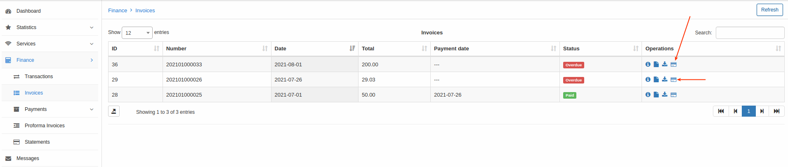
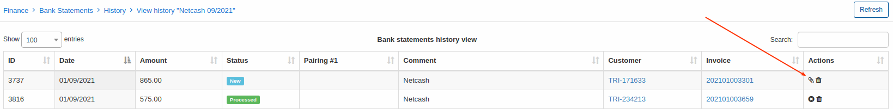

Netcash
====================

Using the Netcash addon, customers can pay for their invoices with a few clicks from the customer portal.

The addon can be install in two methods, via the CLI or Web UI of your Splynx server.

To install the addon via the Web UI, navigate to **Config → Integrations → Add-ons**


Locate or search for the "splynx-netcash" addon and click on the install button in the *Actions* column:


To install it via CLI, the following commands can be used:

```bash
apt update
apt install splynx-netcash
```

After the installation  process has completed, the addon has to be configured, to do this navigate to **Config → Integrations → Modules list**


Locate or search for the "splynx-netcash" addon and click on the edit button in the *Actions* column:


The "Service key" field must be inserted with your PayNow service key:


Under the "Payment notifications" section, you have to configure all URLs with the value in the following format:

* **Accept URL** - https://yoursplynx.net/netcash/result?type=accept

* **Decline URL** - https://yoursplynx.net/netcash/result?type=decline

* **Notify URL** - https://yoursplynx.net/netcash?type=notify

* **Re-direct URL** - https://yoursplynx.net/netcash/result?type=redirect

Where *yoursplynx.net* your Splynx domain name.

The rest of the parameters doesn't have to be changed or you can configure an additional service fee(if needed) and other common settings.

After the configuration of the addon, entry points(widgets for portal) should be enabled:

Navigate to **Config / Integrations / Module list**, locate or search for the "splynx-netcash" module and click on the entry points icon in the *Actions* column:


Entry points (widgets) on the customer's portal for customers to pay their invoices can be enabled/disabled here.

We've enabled 2 entry points and they are available from the customer's portal:

On the dashboard:


And under Finance/Invoices:


We also have a widget for prepaid customers to add an amount of money directly from the customer portal. To enable it navigate to the addon's entry points menu and locate the following entry point/widget:


You will then see it on the customer's portal:


Netcash logs can be found under **Administration → Logs → Netcash logs**


We highly recommend to check Netcash logs in case of payment failure to understand the reason of it.

Also all Netcash bank statements can be found under **Finance/Bank statements/View history**:


Here you'll see all payment attempts. Here is short description for statement statuses:

* **New** - this status means a new payment what wasn't processed yet. In some cases it should be processed manually using this button:



* **Processed** - successfully processed payment;

* **Error** - declined payment, not processed;

* **Pending** - the payment was made but still not processed.

### Troubleshooting

In most cases when some Netcash payments weren't processed in Splynx (for example under bank statements you have multiply payment with "New" status even if payment was completed and it exists in Netcash) it's related to payment notification URLs under PayNow configuration. Make sure that all URLs are correct.

Also you can check Netcash logs under **Administration/Logs/Netcash logs** for a possible reason of failed payment.
