Netcash Debit Order (formerly SagePay direct debit)
====================

**Netcash Debit Order is a Splynx add-on (previously SagePay direct debit), used to generate debit orders and is processed via** https://netcash.co.za/.

<icon class="image-icon"></icon> **IMPORTANT:** If you have difficulties with a Netcash debit charge in Splynx, please follow the how-to instructions in chapter *'How do I check if my customers have been successfully charged'* [below](payment_systems/netcash_do/netcash_do.md#check_charge).

### Add-on Installation

To install Netcash Debit Orders, navigate to `Config → Integrations → Add-ons`:


Locate the Netcash add-on and click on the install button as on the screenshot below:


Alternatively, the add-on can be installed using the following commands via a terminal on your server:

```
apt update
apt install splynx-netcash-debit-order
```

### Netcash Account Registration

When the installation has completed, you need to **register with Netcash and configure your account:**


**Account service key**:


**Debit orders service key:**


**PCI vault key:**


And your **Merchant account number:**


### Add-on settings

The values above have to be added to the **Partners settings** section of **add-on configuration**, located in `Config → Integrations → Modules list`.


Locate or search for the `splynx_netcash_do_addon` item and click on the
<icon class="image-icon"></icon> (**Edit**) icon in the *Actions* column:

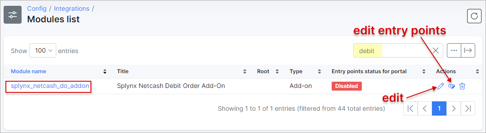

<br>

### Main information


* **Module name** - the module name in the system (for view only);
* **Title** - the module title;
* **Path to module** - path to the module file;
* **Entry points status for portal** - if enabled, the add-on will be available for the Customer portal.


### Addon settings

#### API settings


* **API domain** - api domain should be the same as the Splynx URL. The forward slash `/` is required at the end;

* **API key, API secret** - auto generated default values. Don't change it unless it is absolutely necessary.

<br>

#### Netcash Debit Order settings


<icon class="image-icon"></icon> **NOTE:**


- In the **Admin roles** field, you can choose which build-in roles will have access via the admin panel to `Finance → Netcash Debit Order check payments`. The following roles can be specified in the field **admins roles**: `super-administrator`, `administrator`, `manager`, `financial manager`, `customer creator`, `engineer` and `technician`.

 <icon class="image-icon"></icon> **IMPORTANT**: The roles of `super-administrator`, `administrator` and `manager` are selected by default in the drop down list after add-on installation. It means that the admin account with any of these roles always has access to `Finance → Netcash Debit Order check payments` menu (account's [permissions](administration/main/admins_and_permissions/admins_and_permissions.md) to **Finance** module and **Netcash Debit Order add-on** are required as well).


In Splynx v3.1, the names of admins roles cannot be selected from drop-down list, you should write them into the field manually if it's empty, each role should be separated by coma without spaces.

For example:

```
administrator,super-administrator,manager,engineer

```

<icon class="image-icon"></icon>  But if the admin account has only `technician` role and this role was not set in the add-on config, the access to `Netcash Debit Order check payments` menu for such admin will be **forbidden**.

*********************************************************

- In order to disable the payments sync from `Netcash → Splynx` (e.g. you configured the payments sync from [SageOne](addons_modules/sageone/sageone.md) to Splynx), you can use the **Disable payment processing by system** option. If the toggle is `enabled` - *cron* will not sync payments to Splynx from Netcash side; if it's `disabled` - payments will be synced into Splynx;

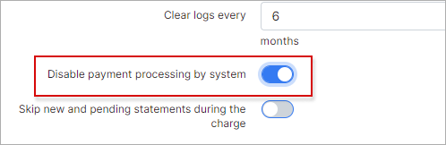.

<br>

#### Notifications settings


Administrators can receive notifications when a customer has created a Netcash payment account. To enable this feature, use the **Notifications settings** provided.

<br>

**Partners settings**


<icon class="image-icon"></icon> **NOTE:**

- **PCI vault key** - this key is only needed when customers use their own credit cards to pay;

- In case in Splynx system is used the multiple [Partners](administration/main/partners/partners.md) scheme, you can divide Netcash configuration between them. Create a new partner in Splynx, in Netcash config select the necessary partner and set the required settings. Pay attention, the fields marked with `*` sign have the different values from original ones (original values are related to **Default** partner);

- The *Netcash Debit Order* add-on supports the **Batch Auto Authorize** function which allows the Splynx system to **authorize batches automatically (once per hour) without manual/human intervention during the invoice payment**. To turn on this functionality, please enable the `Auto-authorise batches` toggle in the add-on configuration page and press `Save` button:


<icon class="image-icon"></icon> **IMPORTANT**:

The **Batch Auto Authorize** function is available on request and access is only granted by *Netcash* management approval. Use this [link](https://api.netcash.co.za/autoauth/#access) to send a request.

<details style="font-size: 16px; margin-bottom: 5px;">
<summary><b>'Auto-authorise batches' explanation</b></summary>
<div markdown="1">

In case you do **not** use the **Batch Auto Authorize** function, we have the following concept: the customers pay invoices, these payments are sent to Netcash side as batch files. After that, the administrator, at some intervals, logs into the Netcash account and manually authorises all customers' payments. The Netcash, for its part, does a final check of such payments and provides the results; Splynx checks the Netcash output results by [cron](https://opensource.com/article/17/11/how-use-cron-linux) and we get the final status of the payments.

If the access is granted and **Batch Auto Authorize** function in enabled in Splynx, the concept will be as follows: the administrator no longer needs to log in and authorise the batches in the Netcash account manually. Splynx will send the request to Netcash **once per hour** in order to receive a list of all currently unauthorised payments and re-send request to Netcash again to authorise them.

The log records about the batch file(-s) authorisation can be found in `Administration → Logs → Netcash Debit Order General Logs`:


</div>
</details>


------------


### Netcash Payment Account and Invoice Charge

To add the *Netcash* payment account, navigate to the customer's **Billing** tab, and click on the card icon in the **Payment accounts** window.


It's **recommended to use the card icon <icon class="image-icon"></icon>  in order to add an account with validation**.

In this section, the admin can add the *Netcash* payment account credentials to the customer profile with the provided bank account or credit card details.

Also, the payment account can be added by clicking on the <icon class="image-icon"></icon> button. However, this method of adding the account will **bypass the Netcash validation procedure**.

Moreover, the Netcash payment account can be added from customer's *Portal* as well:


When customers have the *Netcash* payment accounts configured, the admin can **charge their invoices all at once**.

To perform the charge of `Unpaid` invoices, navigate to `Finance → Invoices` on the sidebar:

|   | General information - how the Charge of invoices works  |
| ------------ | ------------ |
| 1  | The admin charges the invoices in Splynx. Once the charge is successful, the payment statements and batch files will be created and sent to the Netcash gateway and the charged invoices will change their status to `Pending`|
| 2  | On the Netcash side it can take up to two days after the action date to receive the payments as well as non-payments (bounced payments)  |
| 3 | Splynx will check the Netcash gateway **twice a day** for any payments and will allocate them to the correct invoices, in this case the invoices will become `Paid`. If we receive non-payments, the invoices status will return to `Unpaid`  |


<icon class="image-icon"></icon> **NOTE: The ability to charge the customer balances was removed from the add-on features in Splynx v3.1, but it was reintroduced in Splynx v4.0.**


**Debit Order Charge Scenarios**
1. Submit outstanding (due) invoice amounts - use the “netcash-invoices” handler
2. Submit outstanding balance amounts - use the “netcash-oustanding-balances” handler - Balance charge preview is not working currently and will be fixed in v4.2 of Splynx
3. Submit outstanding balance or outstanding invoice amounts (but be able to edit them in preview window) - This will be available in v4.2 of Splynx

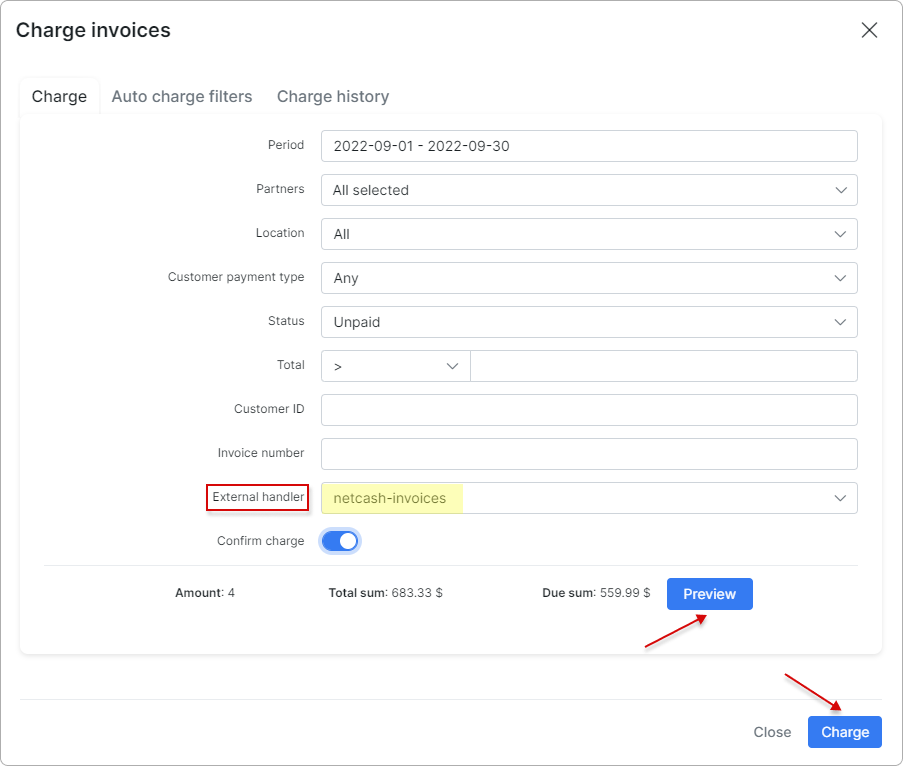


<icon class="image-icon"></icon> **IMPORTANT**

If you charge the invoices using the `netcash-oustanding-balances` charge handler, the **customer will be charged not according to the invoice amount, but with the amount outstanding on the customer’s account**.

**Example:**

*A customer has the invoice with the amount of 10, in the current month, but the balance of the account is -100 (it means that the customer didn't pay for 10 months) in this case, the customer will be charged with the amount of 100 and not 10.*

That's why, **please be very attentive when using the `netcash-oustanding-balances` charge handler**.

<br>

**Authorising Debit Order Batches**

Once the invoices are charged, Splynx will create and send the debit batch file with the payment details to [*https://netcash.co.za/*](https://netcash.co.za/). When the file is received on the *Netcash* side, log in to your *Netcash* account and navigate to `Services → Debit orders → Manage debit orders → Debit batches`, in the debit batch list select the correct item, check the detail of the batch for accuracy. Then, press the **Authorise** button. Select **Email or SMS notifications** if you would like to notify your customers of the debits to be processed to the accounts.


The next step is to release funds to bank account:
- a) **Yes:** *Netcash* will pay the proceeds of the batch less deductions to your bank account when available.
- b) **No:** Proceeds will be credited to your *Netcash* account only – this creates an available balance for salary and creditor payments.

After that, Accept the **Terms and conditions** - the screen will then refresh and display and **Authorise button**. Click on the **Authorise** button again. Your batch is now *authorised*, click **Ok**. *Netcash* has processed the file on the selected action date.

<icon class="image-icon"></icon> **IMPORTANT:** Your batch will now be displayed with an **Unauthorise** button in the *Authorisation* column - **batches can be unauthorised for further editing or deletion up until the cut-off time** for that service type (`Two days` or `Same day`).

<icon class="image-icon"></icon> **NOTE:**

If the toggle of **Disable payment processing by system** option is disabled, Splynx will send **two requests per day** (at **00:15** and **12:15**) to *Netcash* via a *cron* job to retrieve the payments from *Netcash*. This will auto allocate the payments and update the invoice statuses to `Paid`.

You can also **manually run the check payments** for any historic date by using the **Netcash Debit Order check payments** module in the *Finance* section on the sidebar:


The **charge history** can be viewed under the **Charge history** tab:


File records with charged invoices can be downloaded or deleted in this section.


The process of invoice **charging can be automated**. To achieve this, the admin should add the **Auto charge filter**:

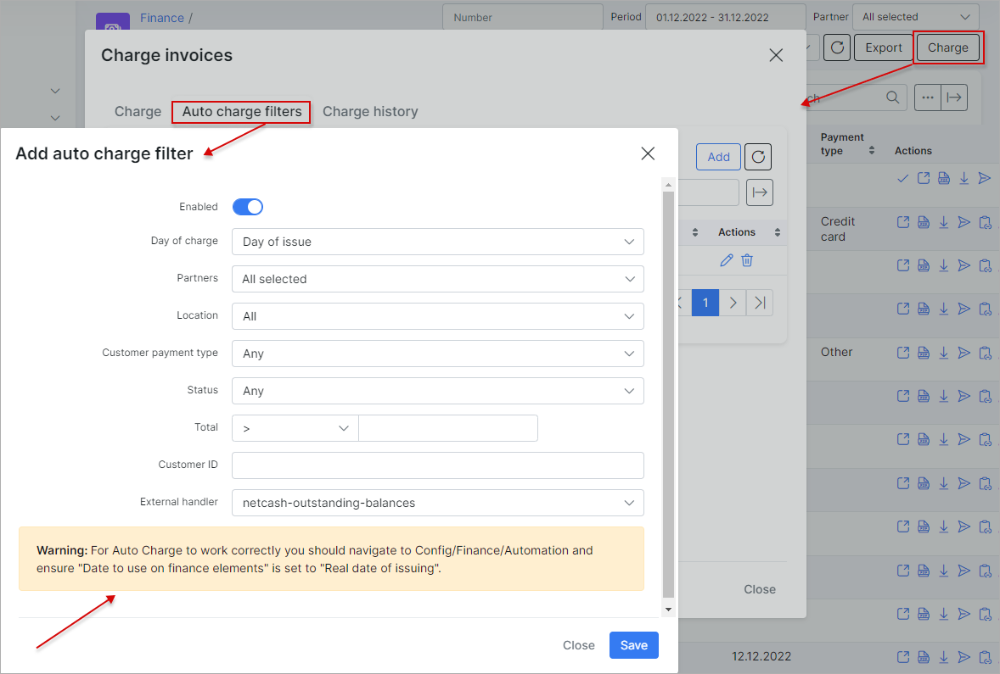

<icon class="image-icon"></icon> **Auto charge filter doesn't require any confirmation from the administrator, so use it with caution.**

**To make Auto Charge work properly you should navigate to `Config → Finance → Automation` and ensure that the value in `Date to use on finance elements` field is set to `Real date of issuing`.**

<details style="font-size: 15px; margin-bottom: 5px;">
<summary><b>How to re-charge the invoices</b></summary>
<div markdown="1">

The debit order batch should be deleted in Netcash as well as the relevant [payment statement](finance/payment_statement_processing/payment_statement_processing.md) in Splynx (be very vigilant when deleting payment statements as deleting the wrong statement can cause payments not to be auto allocated back to the correct invoices), once completed, invoices can be re-charged.

</div>
</details>

<br>

------------

<a id="check_charge"></a>
<br>
#### How do I check if my customers have been successfully charged?

1. After the charge was made, go to `Finance → Invoices`, press the **Charge** button and click on the **Charge history** tab. Use the **Search** field or click on the column name (e.g `Id`) to sort items and find the latest `netcash_invoices`/`netcash-outstanding-balances` item you need.
Check its charge status, in case of `Error` status, please download the charge history log by clicking on <icon class="image-icon"></icon> (Download) icon.

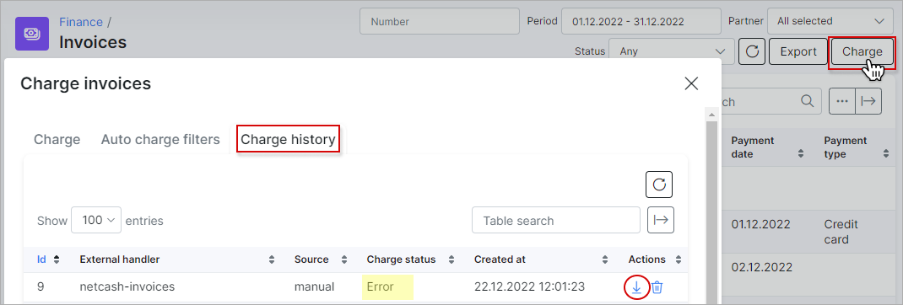

Open and check the log file, you can easily determine the cause of the error.

<icon class="image-icon"></icon> **NOTE:** **If a customer doesn't have the saved payment credentials for *Netcash* service in Splynx, the customer id will be recorded in the charge log to easily identify their profile**.

<details style="font-size: 15px; margin-bottom: 5px;">
<summary><b>The invoice charge log example:</b></summary>
<div markdown="1">

```
ERRORS:

Error: Customer payment account is empty! - Customer id : 7322

OUTPUT:

Start Netcash Debit Order charging..
type: "invoice"
amount items: 1

Fri, 14 Jan 2022 15:16:52 +0200

Work with invoice with id 2155

Loaded invoice number "202201000151"
Customer id: 7322
Invoice amount: 100
No fee
Total amount: 100
Customer payment account is empty! - Customer id : 7322

```
</div>
</details>

<br>

2. If the latest `netcash_invoices`/`netcash-outstanding-balances` item has the charge status as `Ready` on the tab **Charge history** in Splynx, but you still cannot validate the payments in Netcash account, please double check your email box registered with the Netcash service.

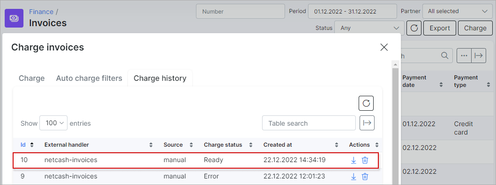

If there are errors in the Batch file, *Netcash* sends the email with the errors details to this email box.

------------


### Entry Points Configuration and Invoice Payment on the Customer portal

After installing the Netcash Debit order add-on, customers can pay their (proforma) invoices directly from their *Portal* page using widgets (entry points).

Make sure that **Entry points** option is **enabled** in **Main information** section of the add-on configuration. Note that changes are not saved until you click on `Save`.


The configuration of add-on **Entry points** can be found in `Config → Integrations → Modules list`, near the `splynx_netcash_do_addon` module item in *Actions* column, click on the <icon class="image-icon"></icon> (*Edit entry points*) icon.

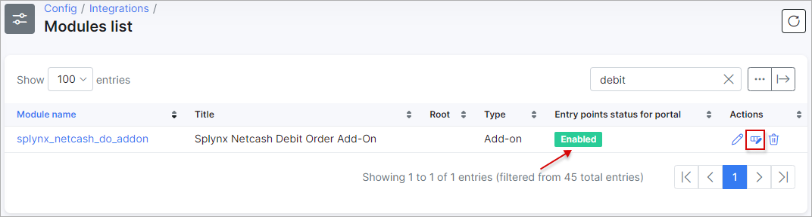


The widgets can be enabled/disabled and updated by partner or location values to make this widget available only for specific partners or locations.

More information about *Modules list* can be found [here](configuration/integrations/modules_list/modules_list.md).


After the points are enabled, let's navigate to the *Customer Portal*:


The first entry point allows customers to pay their (proforma) invoices on the *Dashboard* of the customer *Portal*.

Another entry point allows payment for a specific invoice under  `Finance → Invoices`:


The customer can also **view, update, or remove *Netcash* account details** here:


<icon class="image-icon"></icon> **NOTE:** If the customer pays their invoices using the Netcash Debit Order add-on on the *Customer portal*, the new payment statements will be created on the admin portal in `Finance → Payment statements → History`. We use payment statements in Splynx to track and allocate payments to the correct invoices once retrieved.


------------


### Direct Payments

Using the direct payments links is the simplest way to accept payments made with credit card or bank account. This feature is available in the *Netcash Debit Order* add-on to pay *Invoices* and *Proforma Invoices*. This provides convenience and simplicity for your customer, so the amount of on-time payments will increase.

For example, you can add a payment link to the e-mail with the (proforma) invoice, as a result, the customer can make payment quickly by clicking onto this link instead of logging in to their *Customer portal* page.

In case the customer has saved the payment credentials on the *Customer portal*, later they do not need to add any further details when using the direct payment link.
Otherwise, (the customer payment accounts are not saved), the option `Save and allow future charge` can be used on the direct payment form page to save the customer credit card or bank account credentials on their *Customer portal*.

To create a direct payment link, please **use the patterns** below:

**To pay the Invoice:**

<details style="font-size: 15px; margin-bottom: 5px;">
<summary><b>by invoice ID</b></summary>
<div markdown="1">

```
https://<splynx_domain_address>/netcash-debit-order/direct-pay-invoice-by-id?item_id=<Invoice_id>
```
</div>
</details>

<details style="font-size: 15px; margin-bottom: 5px;">
<summary><b>by invoice number</b></summary>
<div markdown="1">

```
https://<splynx_domain_address>/netcash-debit-order/direct-pay-invoice?item_id=<Invoice_number>
```
</div>
</details>

<br>

**To pay the Proforma Invoice:**

<details style="font-size: 15px; margin-bottom: 5px;">
<summary><b>by proforma invoice ID</b></summary>
<div markdown="1">

```
https://<splynx_domain_address>/netcash-debit-order/direct-pay-proforma-by-id?item_id=<proforma_id>
```
</div>
</details>

<details style="font-size: 15px; margin-bottom: 5px;">
<summary><b>by proforma invoice number</b></summary>
<div markdown="1">

```
https://<splynx_domain_address>/netcash-debit-order/direct-pay-proforma?item_id=<proforma_number>
```
</div>
</details>

<br>

<details style="font-size: 15px; margin-bottom: 5px;">
<summary><b>Examples</b></summary>
<div markdown="1">


</div>
</details>


------------


### Add-on Log Files

The Netcash logs can be found in `Administration → Logs`:


In **General Logs**, the different records can be viewed (when the statements were created or when payments were processed, etc):


Under **Charge Logs** only logs regarding charges can be found:


------------

### Netcash Debit Order Import

We have created a tool that we use to import account details from the Netcash Master file or any other CSV with the relevant details. We simply require an identifier to match the payment record in the document to the customer on Splynx e.g. an account/reference number or customer name.

This tool can be found under `Config → Tools`:


In this section, a CSV file can be uploaded, a delimiter can be selected and finally, the file can be uploaded:

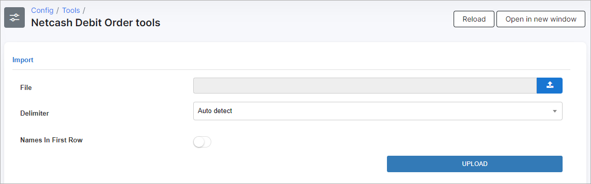

When the data has been uploaded, select the corresponding headers:

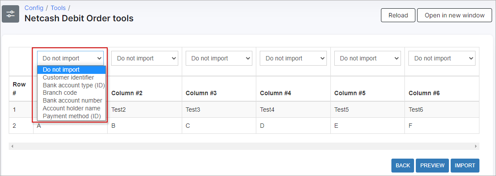

<icon class="image-icon"></icon> **NOTE:** The file must contain the **Customer id**, **Bank account type id**, **Branch code**, **Bank account number**, **Account holder name** and **Payment method id** fields.

<details style="font-size: 15px; margin-bottom: 5px;">
<summary><b>How to change customer's payment method during import</b></summary>
<div markdown="1">


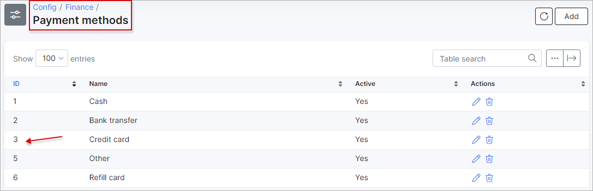

In case **Payment method id** value is set in CSV file and [payment method](configuration/finance/payment_methods/payment_methods.md) exists in Splynx, the customer's `Payment method` (*Customers → List → Customer → Billing → Billing Config→ Billing Settings section → Payment method field*) will be changed after import.

If **Payment method id** value is empty in CSV file - the customer's payment method will not be changed.

And, when **Payment method id** value is incorrect - it will be ignored during import.

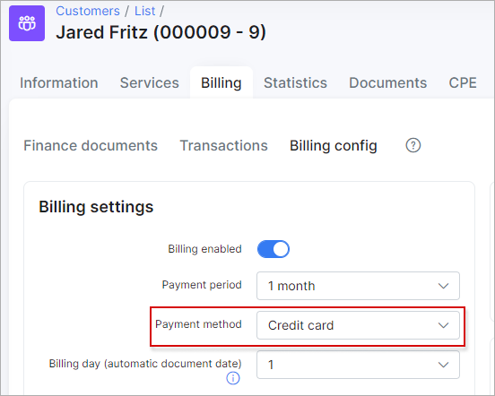

</div>
</details>
