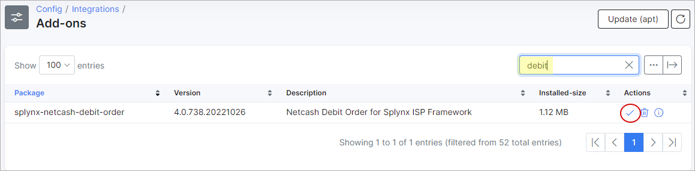
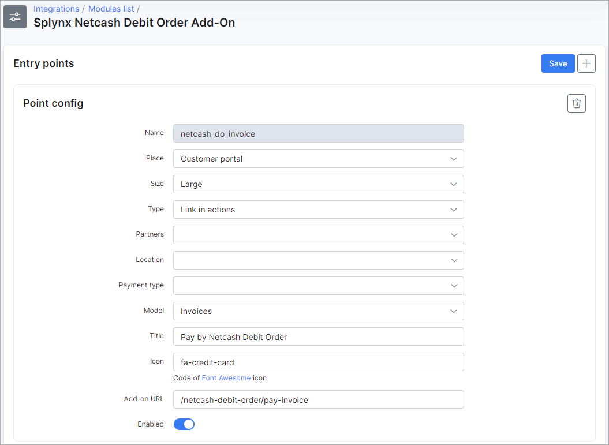
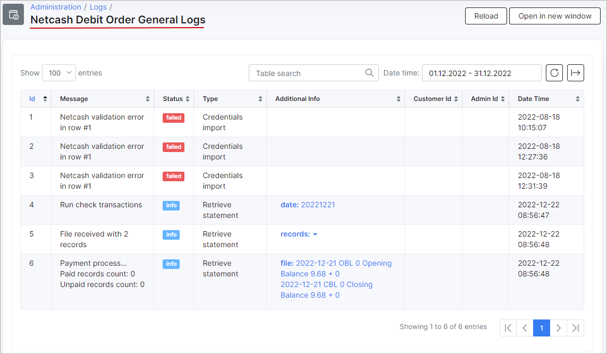

Netcash Debit Order (formerly SagePay direct debit)
====================

**Netcash Debit Order is a Splynx add-on (previously SagePay direct debit), used to generate debit orders and is processed via https://netcash.co.za/**

To install Netcash Debit Orders, navigate to **Config → Integrations → Add-ons:**


Locate the Netcash addon and click on the install button as depicted below:



Alternatively, the addon can be installed using the following commands via a terminal on your server:

```
apt update
apt install splynx-netcash-debit-order
```

**When the installation has completed, you need to register with Netcash and configure your account:**


**Account service key**:


**Debit orders service key:**


**PCI vault key:**


And your **merchant account number**.


These values have to be added into **Config → Integrations → Modules list -> Netcash** :


****PCI vault key - this key is only needed when customers use their own credit cards to pay.****


You can also set service and unpaid fees for customers and set which admins roles have access via the admin panel.


Also, admins can be notified when a customer has created a Netcash payment account. To enable this feature, use the "Notifications settings" provided.


## Adding a Netcash Payment account

To add a Netcash payment account, navigate to the customer's "Billing" tab, and click on the card icon in the Payment accounts window.
***Recommended method - using the card icon to add an account with validation.***


In this section, an admin can add a Netcash payment account for the customer with the provided bank account or credit card details.

Also, a payment account can be added by clicking on the "+" button, however, this method of adding an account will bypass the Netcash validation procedure.

When customers have Netcash payment accounts configured, the admin can charge their invoices all at once.

This is the concept that will allow us to run debit orders.

Navigate to `Finance / Invoices`:


Invoices can be charged by full invoice amount or by customer balance:


If you charge the invoices using the “Netcash_balance” charge handler, the customer will be charged not according to an invoice amount, but with the amount outstanding on the customer’s account. <br>
For example, a customer has an invoice with an amount of 10, in the current month, but the balance of the account is -100 (meaning the customer didn't pay for 10 months) in this case, the customer will be charged with the amount of 100 and not 10. <br>
***Please be very attentive when using the “Netcash_balances” charge handler***.

**Please note that the ability to charge balances have been removed from the features of the addon, however, it will be re-introduced in version 3.2 of Splynx**


Once charged, Splynx will create and send the debit batch file with the payment details to  [*https://netcash.co.za/*](https://netcash.co.za/). When the file is received in Netcash, you should select the correct batch type, either “two days” or “same day” as well as the action date. The last step is to click on authorize and complete the procedure, after which Netcash will process the file on the selected action date.


Splynx will send two requests per day (00:15 and 12:15) to Netcash via a cron job to retrieve the payments from Netcash. This will auto allocate the payments and update the invoice statuses to “paid”. You can also manually run the check payments for any historic date by using the “*Netcash debit order check payments*” in the finance module:


The charge history can be viewed under the "Charge history" tab:


File records with charged invoices can be downloaded or deleted in this section.

The process of invoice charging can be automated. To achieve this, an admin should add an "Auto charge filter":


Be vigilant when creating this filter as it will process the charge without any human interaction/intervention.

### Customer portal widgets (entry points)

After installing the Netcash Debit order addon, customers can pay their invoices directly from their portal page using widgets.

The first step is to enable the widgets (entry points) in the module configuration:


Once here, widgets can be enabled/disabled and updated by partner or location values to make this widget available only for specific partners or locations.



Once it's enabled let's navigate to the customer portal:


The first entry point allows customers to pay their invoices on the dashboard of the customer portal.

Another entry point allows payment for a specific invoice under  **Finance -> Invoices**:


The customer can also view, update, or remove Netcash account details here:


**Note** if the customer pays their invoices using the Netcash Debit Order addon in the portal, a new bank statement will be created in the admin portal (**Finance/Bank statements/History**). We use bank statements in Splynx to track and allocate payments to the correct invoices once retrieved.

### Admin page widgets and log files

Netcash logs can be found under **Administration/Logs**:


In general logs and different records can be viewed, like when a statement was created or when payments were processed, etc:



Under charge logs only logs regarding charges can be found:


We have created a tool that we use to import account details from the Netcash Master file or any other CSV with the relevant details. We simply require an identifier to match the payment record in the document to the customer on Splynx eg. an account/reference number or customer name. This tool can be found under **Config -> Tools**:


In this section, a CSV file can be uploaded, a delimiter can be selected and finally, the file can be uploaded:


When the data has been uploaded, select the corresponding header:


The file must contain the ID/Name, bank account type, branch code, bank account number, and bank account name.

### General information

1. **Description on how the add-on works**:

  **1.1**. An admin will charge the invoices in Splynx. Once charged successfully, bank statements + batch files will be created and sent to Netcash and the charged invoices will change to a "Pending" state;

  **1.2** Netcash can take up to two days after the action date to receive the payments as well as non-payments (bounced payments);

  **1.3** Splynx will check Netcash twice a day for any payments and allocate them to the correct invoice in which case the invoice will become “paid”. In the case we receive non-payments, the invoice status will return to unpaid.

2. **How to re-charge invoices**:

  **2.1** The debit order batch should be deleted in Netcash as well as the relevant bank statement in Splynx (be very vigilant when deleting bank statements as deleting the wrong statement can cause payments not to be auto allocated back to the correct invoices), once completed, invoices can be re-charged.
