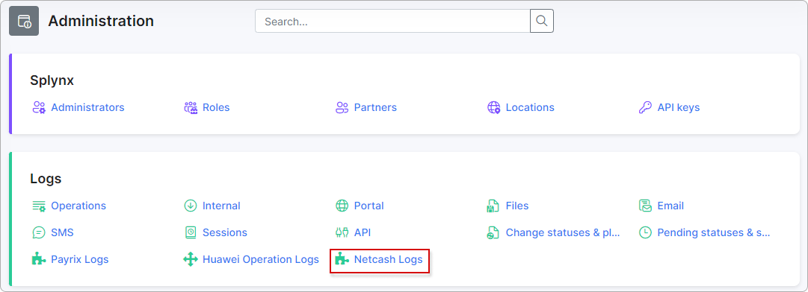

Netcash Pay Now
====================

Using the **Netcash Pay Now** add-on, customers can pay for their invoices with a few clicks from the [Customer portal](customer_portal/customer_portal.md).

The add-on can be install in two methods, via the CLI or Web UI of your Splynx server.

To install the add-on **via the Web UI**, navigate to `Config → Integrations → Add-ons`:


Locate or search for the `splynx-netcash` add-on and click on the install button in the *Actions* column:


To install it **via CLI**, the following commands can be used:

```bash
apt update
apt install splynx-netcash
```

After completing the installation process, you need to configure the add-on, to do this navigate to `Config → Integrations → Modules list`


Locate or search for the `splynx-netcash_add-on` and click **Edit** in the *Actions* column:


Your **Pay Now service key** should be inserted into the **Service key** field in Splynx:


Under the **Payment notifications** section, you have to configure all URLs with the value in the following format:

* **Accept URL** - https://yoursplynx.net/netcash/result?type=accept

* **Decline URL** - https://yoursplynx.net/netcash/result?type=decline

* **Notify URL** - https://yoursplynx.net/netcash/result?type=notify

* **Re-direct URL** - https://yoursplynx.net/netcash/result?type=redirect

where **yoursplynx.net** is your Splynx domain name.

The rest of the parameters doesn't have to be changed or you can configure an additional service fee (if needed) and other common settings.

After the configuration of the add-on, entry points (widgets for portal) should be enabled:


Navigate to `Config → Integrations → Module list`, locate or search for the `splynx-netcash_add-on` and click on the *Edit entry points* icon in the *Actions* column:


The **Entry points** (widgets) on the customer's *Portal* to pay their invoices can be enabled/disabled here.

We've enabled 2 entry points and they are available now on the customer's *Portal*:

On the **Dashboard**:


And under `Finance → Invoices`:


We also have the entry point (widget) for **prepaid customers to add an amount of money directly from the customer portal**. To enable it navigate to the addon's entry points menu and locate the following entry point/widget:


You will then see it on the customer's *Portal*:


Netcash Pay Now **logs** can be found under `Administration → Logs → Netcash Logs`



We highly recommend to check *Netcash Pay Now* logs in case of payment failure to understand the reason of it.

Also all *Netcash Pay Now* payment statements can be found under `Finance → Payment statements → History`:


Here you can find all payment attempts. A description of **statement statuses**:


- **New** - this status means a new payment what wasn't processed yet. In some cases it should be processed manually with this button: <icon class="image-icon"></icon>.

- **Processed** - a successfully processed payment;

- **Error** - a declined payment, not processed;

- **Pending** - a payment was made but still not processed.

### Troubleshooting

- In most cases, when some *Netcash Pay Now* payments **weren't processed** in Splynx (for example under *Payment Statements* you have multiply payment with `New` status even if payment was completed and it exists in Netcash Pay Now account) it's related to **payment notification URLs** under *Pay Now* configuration. Make sure that all *URLs* are correct;

- Also you can check *Netcash Pay Now* logs under `Administration → Logs → Netcash Logs` for the possible reason of failed payment.
