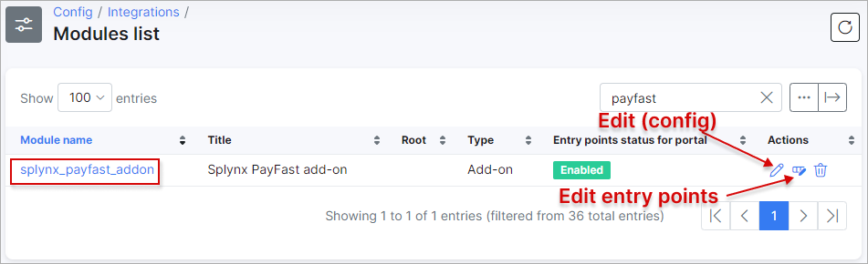
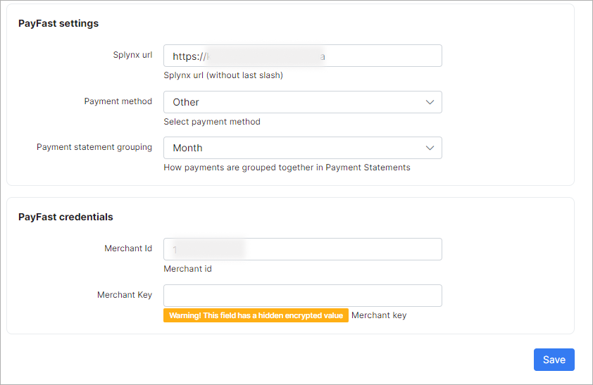
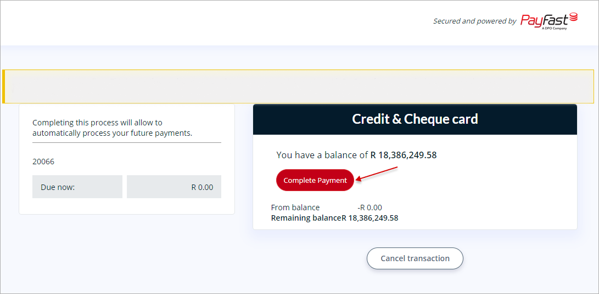
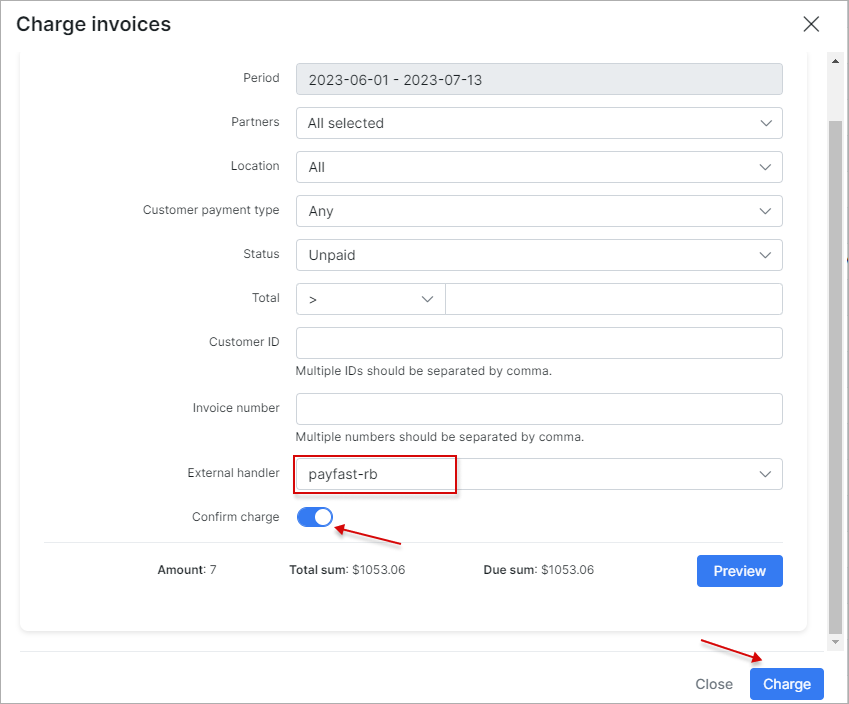

Payfast
======================

Payfast is a Splynx add-on that enables customers to refill their balances and pay invoices using the [PayFast payment gateway](https://www.payfast.io).

We've developed two different add-ons for utilizing this payment system: **splynx-payfast** and **splynx-payfast-rb**.

The first add-on - `splynx-payfast` is used for payments which proceed only in the PayFast system.

The second add-on - `splynx-payfast-rb` can work with different credit cards using PayFast. It enables you to charge all customers using **Direct debit order**.

<icon class="image-icon"></icon> **WARNING!** PayFast makes use of ports *80*, *8080*, *8081* and *443* only. So your `Splynx Url` has to be on the same ports!

The add-ons can be installed in two method: via the CLI or the Web UI of your Splynx server.


## splynx-payfast


To install the *splynx-payfast* add-on via CLI, the following commands can be used:

```bash
apt-get update
apt-get install splynx-payfast
```
To install it via the Web UI, navigate to `Config → Integrations → Add-ons`:


Locate or search for the **splynx-payfast** add-on and click the *Install* icon in the *Actions* column:


Click the `OK, confirm` button to begin the installation process:


After completing the installation process, you need to configure the parameters in the `Config → Integrations → Modules list`.

Locate or search for the **splynx-payfast** add-on and click the *Edit (config)* icon in the *Actions* column:



You will be presented with the following window:




**PayFast credentials**:

* **Merchant Id** - the Merchant ID is provided by the PayFast system and is used to uniquely identify the receiving account. You can find this ID on the merchant's settings page;

* **Merchant Key** - the Merchant Key is provided by the PayFast system and is used to uniquely identify the receiving account. You can find the Merchant Key on the merchant's settings page.

It adds an extra level of certainty to ensure the correct account is used, as both the ID and the Key must be accurate for the transaction to proceed.

______________________

Thereafter, customers can pay their invoices and refill their balances using the PayFast system. Customers will see a new icon <icon class="image-icon"></icon> to pay as shown below:


Customers can also **refill their balances** using the following link - ``` https://<your_domain>/payfast ```.


When clicking the `Pay` button, you will be redirect to https://payfast.io and you’ll need to **complete your payment**:


## splynx-payfast-rb


To install the *splynx-payfast-rb* add-on via CLI, the following commands can be used:

```bash
apt-get update
apt-get install splynx-payfast-rb
```
To install it via the Web UI, navigate to `Config → Integrations → Add-ons`:


Locate or search for the **splynx-payfast-rb** add-on and click the *Install* icon in the *Actions* column:


Thereafter, you need to log into your account at https://www.payfast.io/ and enable **Subscription state** and **Ad hoc payments state**:


Also, it's necessary to set your **Notify Url**, for example, `https://<your_domain>/payfast-rb/notify`. When a successful payment is made, *PayFast* will send an *Instant Transaction Notifications (payment confirmation)* to this URL before redirecting the customer to the **return_url**:


For more information about recurring billing integration, please visit the [PayFast website](https://developers.payfast.co.za/docs#recurring_billing).

Once these options have been configured, you need to set up the parameters in `Config → Integrations → Modules list`. Click the *Edit (config)* icon:


______________________________________

To **add a PayFast-RB payment account**, a customer should navigate to their [Customer Portal](customer_portal/customer_portal.md), open `Finance → PayFast-RB` and enter their credentials.


After that, a customer will be redirected to a new page to complete a zero payment:

<icon class="image-icon"></icon> <sub>**The following three screenshots are taken from the sandbox environment. In the production environment, the general appearance of the page and its properties may be different**</sub>



A zero **payment verification may take up to 2-3 minutes, please do not close the next window**:


If a zero payment was successful, the following message will be displayed and the customer will be redirected back to the Customer Portal:


In `Finance → Invoices`, a customer can use another icon <icon class="image-icon"></icon> to pay an invoice, as shown below:


To **refill balances**, customers can use the following link - ``` http://<your_domain>/payfast-rb ```.


You can also **charge all customers** in one click. Navigate to: `Finance → Invoices`, set the period and click the `Charge` button as shown below:





## Direct payments using PayFast and PayFast-RB


Using the payment links is the simplest way to accept credit card payments. This feature is available in the *PayFast* and *PayFast-RB* addons for paying **Invoices** and **Proforma Invoices**. It provides convenience and simplicity for your customers, thereby increasing the likelihood of on-time payments.

For instance, you can include a payment link in the email containing the (proforma) invoice. As a result, customers can quickly make payments by clicking on the link instead of logging into their Portal page. 

If customers have already saved their card details on the Customer Portal, they won't need to provide additional information when using the direct payment link in the future. 

However, if the credit card is not linked to the Customer Portal, payment details will need to be entered each time the payment link is used.

To **create a direct payment link**, please use the patterns below:


- **For PayFast →**

**To pay the Invoice:**

<details style="font-size: 15px; margin-bottom: 5px;">
<summary>by invoice ID</summary>
<div markdown="1">

```
https://<splynx_domain_address>/payfast/direct-pay-invoice-by-id?item_id=<Invoice_id>
```
</div>
</details>

<br>

<details style="font-size: 15px; margin-bottom: 5px;">
<summary>by invoice number</summary>
<div markdown="1">

```
https://<splynx_domain_address>/payfast/direct-pay-invoice?item_id=<Invoice_number>
```
</div>
</details>

<br>

**To pay the Proforma Invoice:**

<details style="font-size: 15px; margin-bottom: 5px;">
<summary>by proforma invoice ID</summary>
<div markdown="1">

```
https://<splynx_domain_address>/payfast/direct-pay-proforma-by-id?item_id=<proforma_id>
```
</div>
</details>

<br>

<details style="font-size: 15px; margin-bottom: 5px;">
<summary>by proforma invoice number</summary>
<div markdown="1">

```
https://<splynx_domain_address>/payfast/direct-pay-proforma?item_id=<proforma_number>
```
</div>
</details>

<br>

---

- **For PayFast-RB →**

**To pay the Invoice:**

<details style="font-size: 15px; margin-bottom: 5px;">
<summary>by invoice ID</summary>
<div markdown="1">

```
https://<splynx_domain_address>/payfast-rb/direct-pay-invoice-by-id?item_id=<Invoice_id>
```
</div>
</details>

<br>

<details style="font-size: 15px; margin-bottom: 5px;">
<summary>by invoice number</summary>
<div markdown="1">

```
https://<splynx_domain_address>/payfast-rb/direct-pay-invoice?item_id=<Invoice_number>
```
</div>
</details>

<br>

**To pay the Proforma Invoice:**

<details style="font-size: 15px; margin-bottom: 5px;">
<summary>by proforma invoice ID</summary>
<div markdown="1">

```
https://<splynx_domain_address>/payfast-rb/direct-pay-proforma-by-id?item_id=<proforma_id>
```
</div>
</details>

<br>

<details style="font-size: 15px; margin-bottom: 5px;">
<summary>by proforma invoice number</summary>
<div markdown="1">

```
https://<splynx_domain_address>/payfast-rb/direct-pay-proforma?item_id=<proforma_number>
```
</div>
</details>
