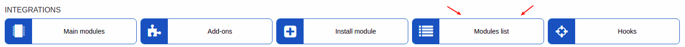

Payfast.co.za payments
======================

Payfast is a Splynx add-on. It allows to refill balance and pay invoices via PayFast payment gateway - [https://www.payfast.co.za](https://www.payfast.co.za).

We developed two different add-ons for using this payment system: *splynx-payfast* and *splynx-payfast-rb*. First add-on - *splynx-payfast* is using for payments which proceed only in PayFast system. Second add-on can work with different credit-cards using PayFast and allows to charge all customers by using *Direct debit order*.

**WARNING!** PayFast makes use of ports 80, 8080, 8081 and 443 only. So Splynx_url have to be on the same ports!

splynx-payfast
--------------
To install *splynx-payfast* add-on, use next commands:

```bash
apt-get update
apt-get install splynx-payfast
```
or you can install it from Web UI:

Config → Integrations → Add-ons:


After installation you have to configure params in Config → Integrations → Modules list. Look at the screenshot:



*Merchant details*

NAME | DESCRIPTION
------------ | -------------
merchant_id | The Merchant ID as given by the PayFast system. Used to uniquely identify the receiving account. This can be found on the merchant’s settings page.
merchant_key | The Merchant Key as given by the PayFast system. Used to uniquely identify the receiving account. This provides an extra level of certainty concerning the correct account as both the ID and the Key must be correct in order for the transaction to proceed. This can be found on the merchant’s settings page.

After that, customers can pay their invoices and refill balances using PayFast system. They will see a new button to pay as on the screenshot:


And if in config entry points enabled customer will see few widgets on customer portal:


And they can also refill balance using link - “*http://yoursplynxurl/payfast*”.


After that you will press button “pay” you will be redirect to the [https://payfast.co.za](https://payfast.co.za) and you’ll need to Compleate your Payment:


**PayFast configured like test environment on our server so URL looks like on a screenshot**


splynx-payfast-rb
-----------------

And now it is time of splynx-payfast-rb. To install *splynx-payfast-rb* add-on, use next commands:

```bash
apt-get update
apt-get install splynx-payfast-rb
```
or use Web UI:

Config → Integrations → Add-ons:


Now you need to go to your account on the https://www.payfast.co.za/ and turn on *"Sabscription state"* and *"Ad hoc payments state":*


Now, as in previous add-on, after installation you have to configure param in Config → Integrations → Modules list. Look at the screenshot:


Now customers will see another button to pay as on the screenshot:


To refill balance customers can use the link - “*http://yoursplynxurl/payfast-rb*”, where they have to enter registration details for the first time:


You can also charge all customers using one button! Go to: Finance → Invoices, set period and click "Charge" as on the screenshot:


