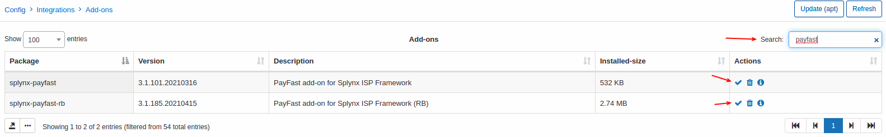
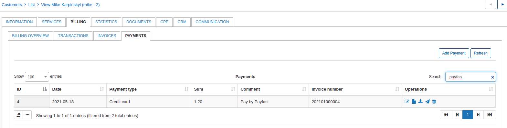

Payfast.co.za payments
======================

Payfast is a Splynx add-on which allows refilling of customer balances and paying invoices via the PayFast payment gateway - [https://www.payfast.co.za](https://www.payfast.co.za).

We've developed two different add-ons for using this payment system: `splynx-payfast` and `splynx-payfast-rb`. The first add-on - `splynx-payfast` is used for payments which processed only by the PayFast system (mostly for prepaid billing) and the second one can work with different credit-cards using PayFast and allows you to charge the customer by using `Direct debit order` (mostly for recurring billing).

**WARNING!** PayFast uses ports 80, 8080, 8081 and 443 only.

### Installation

Navigate to `Config → Integrations → Add-ons` and find a packet by name:

Press on install button on needed add-on, confirm the installation and wait for installation finish.

Once add-on is installed it will be marked with green:

If the add-on is marked with yellow color it means that it can be updated. Just click in update button under actions.

Now we need to configure Payfast add-ons. To do this navigate to `Config -> Integrations -> Modules list`:

and click on edit button under needed add-on:

### splynx-payfast

Let's configure and test payments using `splynx-payfast` add-on. First of all we need to navigate to `Config -> Integrations -> Modules list` and configure the module:

Under _Main information_ section you need only enable enrty points for portal and save settings. With this option you can display/hide entry points on a customer's portal:

_API settings_ should be configured by default and it's not recommended for change.

Under _PayFast settings_ you need to set next parameters:

* **Splynx url** - Splynx URL without last slash. Must be the same as you see in your browser address bar;

* **Payment method** - select payment method for payments what will be made with PayFast add-on;

* **Service fee** - specify service fee % if needed;

* **Fee request** - add fee to request. If enabled - fee will be added to the invoice;

* **Fee message** - set description for invoice item (if Fee request is enabled);

* **Fee VAT** - select VAT for fee;

* **Fee category** - select category for fee transaction;

* **Group bank statements** - select method how to group payments under `Finance -> Bank statements -> History`.

Under _PayFast credentials_ you need to specify `Merchant ID` and `Merchant key`.

* **Merchant ID** - The Merchant ID as given by the PayFast system. Used to uniquely identify the receiving account. This can be found on the merchant’s settings page;

* **Merchant key** - The Merchant Key as given by the PayFast system. Used to uniquely identify the receiving account. This provides an extra level of certainty concerning the correct account as both the ID and the Key must be correct in order for the transaction to proceed. This can be found on the merchant’s settings page.

Now customer can pay invoices directly from a portal page dashboard:

Or under `Finance -> Invoices`:

Let's pay using pay button under `Finance -> Invoices`:

Just click on **Pay** button and you should be redirected to Payfast and complete a payment. Once completed you should be redirected back to Splynx portal and invoice will be paid if payment was successful.

To check processed and not-processed payment by Payfast you can navigate to `Finance -> Bank statements -> History` and click on Payfast record:

As you can see we have 1 processed payment. You can cancel it with this button:

Also it will be displayed under customer account:

### Entry points

Almost each installed module in Splynx has its own entry points. For example the button "Pay" under each invoice it's an entry point which you can configure.
Configuration of entry points for each add-on in Splynx is the same so you can easily use this description to configure entry points for PayPal add-on or even for Speedtest add-on.

You can enable/disable entry points for portal for each installed module in Splynx under settings of the module:

Once this option enabled you can configure entry points by clicking on this button:

Let's take a look what can be done with entry points:

Here we can add a new entry point, delete some of them (not recommended) and change some parameters for each entry point. We do not recommend to change next parameters: `Place`, `Size`, `Type`, `Module`, `Icon`, `Add-on URL`. To enable/disable displaying of this entry point on portal just use an appropriate button and save config at the bottom of the page.

Example of entry points on portal:

Using this entry point customer can pay the invoice directly on a dashboard by clicking on "Pay" button:

Also the invoice can be paid under _Finance/Invoices_:

### Payfast recurring billing

The installation process for this add-on is the same, just find a package `splynx-payfast-rb` and install it.

Once installed let's nagivate to module configuration:

section "API settings" will be generated automatically so you don't need to change it. Under sections "PayFast API authorization settings" insert your PayFast credentials.

Under section "Sections" specify your Splynx URL but without last slash and next finance options:

* **Payment account** - generated automatically, please do not change;

* **Payment method** - select payment methor for new payments from PayFast RB;

* **Service fee** - % of service fee;

* **Add fee to request** - enable/disable a separate line for fee into request;

* **Fee message** - a message what will be displayed under request (if previous option enabled);

* **Fee VAT** - select one of available taxes to apply to fee;

* **Category of the transactions** - select category for transactions what will be created by this add-on;

* **Bank statements group** - how to group(by month or day) bank statements under _Finance / Bank statements / History_ .

Once it's configured we can charge some invoices by Payfast Recurring billing add-on:
