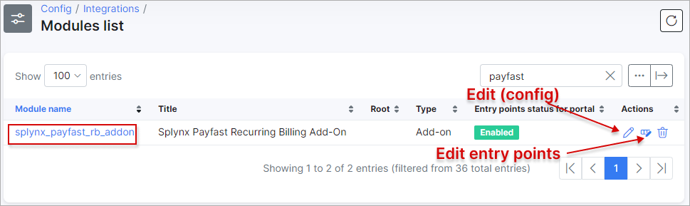
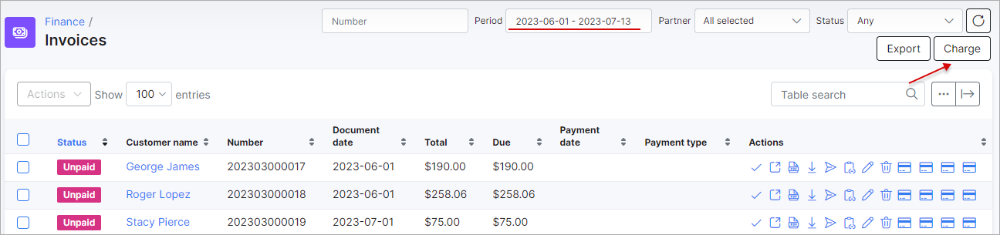

Payfast.co.za payments
======================

Payfast is a Splynx add-on which allows refilling of customer balances and paying invoices via the [PayFast payment gateway](https://www.payfast.co.za).

We've developed two different add-ons for using this payment system: **splynx-payfast** and **splynx-payfast-rb**.

The first add-on - `splynx-payfast` is used for payments which proceed only in the PayFast system.

The second add-on - `splynx-payfast-rb` can work with different credit-cards using PayFast and allows you to charge all customers by using **Direct debit order**.

<icon class="image-icon"></icon> **WARNING!** PayFast makes use of ports *80*, *8080*, *8081* and *443* only. So your `Splynx Url` has to be on the same ports!

The add-ons can be installed in two method, via the CLI or the Web UI of your Splynx server.


### splynx-payfast


To install the *splynx-payfast* add-on via CLI, the following commands can be used:

```bash
apt-get update
apt-get install splynx-payfast
```
To install it via the Web UI:

Navigate to `Config → Integrations → Add-ons`:


Locate or search for the **splynx-payfast** add-on and click on the install icon in the *Actions* column


Click on the **OK, confirm** button to begin the installation process


After the installation process has completed, you have to configure the parameters in `Config → Integrations → Modules list`.

Locate or search for the **splynx-payfast** add-on and click on edit in the *Actions* column,


you will be presented with the following window


**Merchant details**:

NAME | DESCRIPTION
------------ | -------------
merchant_id | The Merchant ID as given by the PayFast system. Used to uniquely identify the receiving account. This can be found on the merchant’s settings page.
merchant_key | The Merchant Key as given by the PayFast system. Used to uniquely identify the receiving account. This provides an extra level of certainty concerning the correct account as both the ID and the Key must be correct in order for the transaction to proceed. This can be found on the merchant’s settings page.

Thereafter, customers can pay for their invoices and refill their balances using the PayFast system. Customers will see a new icon <icon class="image-icon"></icon> to pay as shown below:


Customers can also **refill their balances** using the following link - ``` https://<your_domain>/payfast ```.


When clicking on the **Pay** button, you will be redirect to https://payfast.co.za and you’ll need to **complete your payment**:


### splynx-payfast-rb


To install the *splynx-payfast-rb* add-on via CLI, the following commands can be used:

```bash
apt-get update
apt-get install splynx-payfast-rb
```
To install it via the Web UI:

Navigate to `Config → Integrations → Add-ons`:


Thereafter, you need to log into your account on https://www.payfast.co.za/ and enable **Subscription state** and **Ad hoc payments state**:


Also, it's necessary to set your **Notify Url**, e.g. ``` https://<your_domain>/payfast-rb/notify ```, when the successful payment is made, *PayFast* will send an *Instant Transaction Notifications (payment confirmation)* to this url before a customer gets redirected to **return_url**:


More info related to recurring billing integration is [here](https://developers.payfast.co.za/docs#recurring_billing).

Once these options were configured, you have to configure the parameters in `Config → Integrations → Modules list` as shown below:




To **add a PayFast-RB payment account**, a customer should navigate to their [Portal](customer_portal/customer_portal.md), open `Finance → PayFast-RB` and enter their credentials.


After that, a customer will be redirected to a new page to complete a zero payment:

<icon class="image-icon"></icon> <sub><sup>**The following three screenshots are taken from the sandbox environment, in the production environment the general appearance of the page and its properties may be different**</sup></sub>.


A zero **payment verification may take up to 2-3 minutes, please do not close the next window**:


If a zero payment was successful, the following message will be displayed and the customer will be redirected back to the Portal:


In `Finance → Invoices`, a customer can use another icon <icon class="image-icon"></icon> to pay an invoice, as shown below:


To **refill balances**, customers can use the following link - ``` http://<your_domain>/payfast-rb ```.


You can also **charge all customers** using just one button. Navigate to: `Finance → Invoices`, set the period and click on **Charge** as shown below:




### Direct payments using PayFast and PayFast-RB


Using the payments links is the simplest way to accept payments made with credit card. This feature is available in the *PayFast* and *PayFast-RB* addons to pay *Invoices* and *Proforma Invoices*. This provides convenience and simplicity for your customer, so the amount of on-time payments will increase. For example, you can add a payment link to the e-mail with the (proforma) invoice, as a result, the customer can make payment quickly by clicking onto this link instead of logging in to their *Portal* page. In case the customer has saved the card details on the *Portal*, they do not need to add further details when using the direct payment link in the future. If the credit card in not linked on the *Portal*, the payment details need to be entered each time the payment link is used.

To **create a direct payment link**, please use the patterns below:


<details style="font-size: 15px; margin-bottom: 5px;">
<summary><b>for PayFast</b></summary>
<div markdown="1">


**To pay the Invoice:**

<details style="font-size: 15px; margin-bottom: 5px;">
<summary>by invoice ID</summary>
<div markdown="1">

```
https://<splynx_domain_address>/payfast/direct-pay-invoice-by-id?item_id=<Invoice_id>
```
</div>
</details>

<br>

<details style="font-size: 15px; margin-bottom: 5px;">
<summary>by invoice number</summary>
<div markdown="1">

```
https://<splynx_domain_address>/payfast/direct-pay-invoice?item_id=<Invoice_number>
```
</div>
</details>

<br>

**To pay the Proforma Invoice:**

<details style="font-size: 15px; margin-bottom: 5px;">
<summary>by proforma invoice ID</summary>
<div markdown="1">

```
https://<splynx_domain_address>/payfast/direct-pay-proforma-by-id?item_id=<proforma_id>
```
</div>
</details>

<br>

<details style="font-size: 15px; margin-bottom: 5px;">
<summary>by proforma invoice number</summary>
<div markdown="1">

```
https://<splynx_domain_address>/payfast/direct-pay-proforma?item_id=<proforma_number>
```
</div>
</details>


</div>
</details>


<br>


<details style="font-size: 15px; margin-bottom: 5px;">
<summary><b>for PayFast-RB</b></summary>
<div markdown="1">

**To pay the Invoice:**

<details style="font-size: 15px; margin-bottom: 5px;">
<summary>by invoice ID</summary>
<div markdown="1">

```
https://<splynx_domain_address>/payfast-rb/direct-pay-invoice-by-id?item_id=<Invoice_id>
```
</div>
</details>

<br>

<details style="font-size: 15px; margin-bottom: 5px;">
<summary>by invoice number</summary>
<div markdown="1">

```
https://<splynx_domain_address>/payfast-rb/direct-pay-invoice?item_id=<Invoice_number>
```
</div>
</details>

<br>

**To pay the Proforma Invoice:**

<details style="font-size: 15px; margin-bottom: 5px;">
<summary>by proforma invoice ID</summary>
<div markdown="1">

```
https://<splynx_domain_address>/payfast-rb/direct-pay-proforma-by-id?item_id=<proforma_id>
```
</div>
</details>

<br>

<details style="font-size: 15px; margin-bottom: 5px;">
<summary>by proforma invoice number</summary>
<div markdown="1">

```
https://<splynx_domain_address>/payfast-rb/direct-pay-proforma?item_id=<proforma_number>
```
</div>
</details>


</div>
</details>


------------
