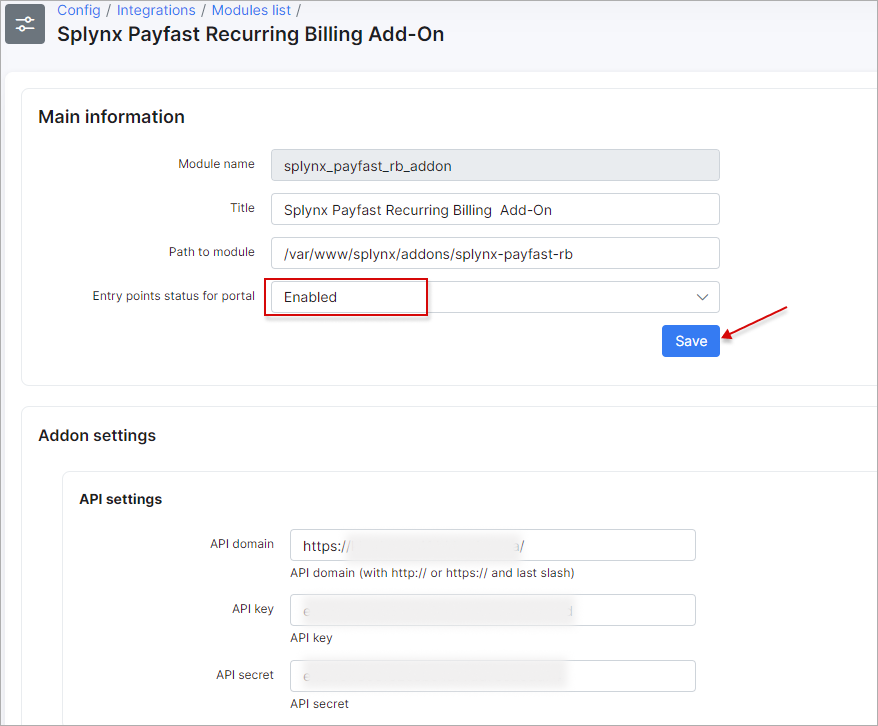

Payfast.co.za payments
======================

Payfast is a Splynx add-on which allows refilling of customer balances and paying invoices via the PayFast payment gateway - [https://www.payfast.co.za](https://www.payfast.co.za).

We've developed two different add-ons for using this payment system: *splynx-payfast* and *splynx-payfast-rb*. The first add-on - *splynx-payfast* is used for payments which proceed only in the PayFast system. The second add-on can work with different credit-cards using PayFast and allows you to charge all customers by using *Direct debit order*.

**WARNING!** PayFast makes use of ports 80, 8080, 8081 and 443 only. So your Splynx_url has to be on the same ports!

The add-ons can be installed in two method, via the CLi or the Web UI of your Splynx server.


splynx-payfast
-------------

To install the *splynx-payfast* add-on via CLie, the following commands can be used:

```bash
apt-get update
apt-get install splynx-payfast
```
To install it via the Web UI:

Navigate to `Config → Integrations → Add-ons`:


Locate or search for "splynx-payfast" add-on and click on the install icon in the *Actions* column


Click on the "OK, confirm" button to begin the installation process


After the installation process has completed, you have to configure the parameters in `Config → Integrations → Modules list`.

Locate or search for thr "splynx-payfast" add-on and click on edit in the *Actions* column, you will be presented with the following window


*Merchant details*

NAME | DESCRIPTION
------------ | -------------
merchant_id | The Merchant ID as given by the PayFast system. Used to uniquely identify the receiving account. This can be found on the merchant’s settings page.
merchant_key | The Merchant Key as given by the PayFast system. Used to uniquely identify the receiving account. This provides an extra level of certainty concerning the correct account as both the ID and the Key must be correct in order for the transaction to proceed. This can be found on the merchant’s settings page.

Thereafter, customers can pay for their invoices and refill their balances using the PayFast system. Customers will see a new button to pay as depicted below:


Customers can also refill their balances using the following link - “*http://yoursplynxurl/payfast*”.


When clicking on the “pay” button, you will be redirect to [https://payfast.co.za](https://payfast.co.za) and you’ll need to Complete your Payment:


splynx-payfast-rb
-----------------

To install the *splynx-payfast-rb* add-on via CLI, the following commands can be used:

```bash
apt-get update
apt-get install splynx-payfast-rb
```
To install it via the Web UI:

Navigate to `Config → Integrations → Add-ons`:


Thereafter, you need to log into your account on  https://www.payfast.co.za/ and enable *"Subscription state"* and *"Ad hoc payments state":*


Once it is enabled, as in the previous add-on, after the installation process has completed, you have to configure the parameters in *Config → Integrations → Modules list*. as depicted below:




Customers will see another button to pay in the customer portal, as depicted below:


To refill balances, customers can use the following link - “*http://yoursplynxurl/payfast-rb*”, where they have to enter their registration details for the first time:


You can also charge all customers using one button! Navigate to: *Finance → Invoices*, set the period and click on "Charge" as depicted below:


