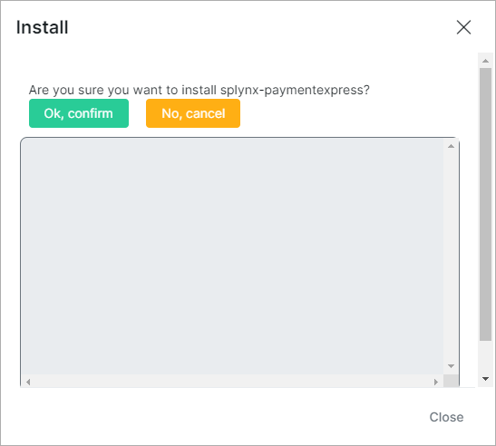
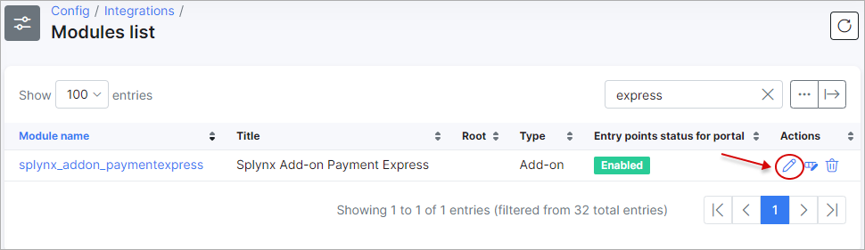
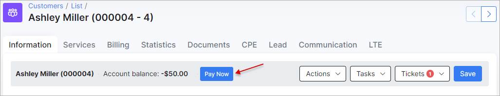
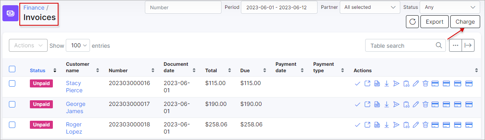
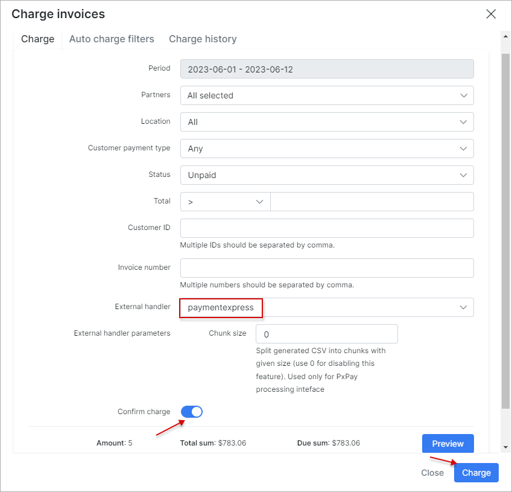

Paymentexpress
==============

Paymentexpress is a Splynx add-on which allows refilling of customer balance and paying invoices via the payment gateway - https://www.paymentexpress.com/.

The add-on can work with different credit cards, if cards are saved on customer profiles, the add-on allows you to charge all customers using *Direct debit orders*.


### Add-on installation


The add-on can be installed in two methods, via the **CLI** or **Web UI** of your Splynx server.

To install the *Payment Express* add-on via **CLI**, the following commands can be used:

```
apt-get update
apt-get install splynx-paymentexpress
```
To install it via the **Web UI**:

Navigate to `Config → Integrations → Add-ons`:


Locate or search for the `splynx-paymentexpress` add-on and click on the *Install* icon in the *Actions* column:


Click on the **OK, confirm** button to begin the installation process:




### Add-on settings


After the installation process has completed, you have to configure the add-on:

Navigate to `Config → Integrations → Modules list`:


Locate or search for the `splynx-paymentexpress` add-on and click on the <icon class="image-icon"></icon> (*Edit*) icon in the *Actions* column:



**Main information and API settings:**


* **API domain** - api domain should be the same as Splynx URL. The forward slash `/` is required at the end;

* **API key, API secret** - auto generated default values. Don't change it unless it is absolutely necessary.


**Payment Express settings**

* **Payment Express processing interface** - select how payments will be processed. Available methods: **PxPay** - uses a Hosted Payment Page to accept sensitive card data, it provides a financially secure and compliant solution without exposing merchants to sensitive information. Instead of hosting a payment page on their own website, PxPay allows merchants to redirect their customer to a payment page hosted by Windcave. To process a transaction, PX Pay allows merchants to send XML requests to Windcave via HTTPS posts to the relevant PxPay endpoint; **PxPost** - enables merchants to initiate transactions by sending XML messages using the HTTPs Protocol. Individual Posts are sent, with correctly formatted XML fields, to the relevant PxPost endpoint;

* **Currency** - select a currency. Windcave supports a number of currencies, which can be used with all interfaces;


**Payment Express PxPost credentials**

Enter your PxPost *Payment Express* account credentials in the related fields.


**Payment Express PxPay credentials**

Type your PxPay *Payment Express* account credentials in the related fields.

In case in Splynx system is used the multiple [Partners](administration/main/partners/partners.md) scheme, you can divide the *Payment Express* configuration between them. Create a new partner in Splynx, in the *Payment Express* config select the necessary partner and set the required settings.


**Note:** The fields marked with `*` sign have the different values from original ones (original values are related to **Default** partner).


**Common settings**


* **Splynx url** - your Splynx URL address with a slash sign at the end;

* **Payment method ID** - when a customer pays using this add-on, the payment will be allocated as this [payment method](configuration/finance/payment_methods/payment_methods.md);

* **Service Fee** - service fee in percent. This option is not recommended to use in conjunction with accounting add-ons;

* **Add fee to request** - add fee (position) to request;

* **Fee message** - if the `Add fee to request` option is enabled, the current message will be added as description for the fee item in the invoice;

* **Fee VAT** - service [fee VAT](configuration/finance/taxes/taxes.md) percent;

* **Transaction fee category** - transaction [category](configuration/finance/transaction_categories/transaction_categories.md) of the fee transactions;

* **Bank statements group** - choose how to group bank statements (`Finance → Bank Statements → History`) monthly or daily.


### Entry points configuration


The configuration of add-on **Entry points** can be found in `Config → Integrations → Modules list`, near the `splynx_addon_paymentexpress` module item in *Actions* column, click on the <icon class="image-icon"></icon> (*Edit entry points*) icon.


More information about *Modules list* can be found [here](configuration/integrations/modules_list/modules_list.md).


### Invoice payment


Once the configuration has been completed, customer can add a credit card on the [Portal](customer_portal/customer_portal.md) in `Finance → Credit card via Payment Express`:


Now customer can pay for their invoices using the *Payment Express* system in `Finance → Invoices` on the Portal (the related entry point should be enabled):


Moreover, if the payment credentials are added by the customer, the administrator can pay the invoices directly from customer's profile as well:


If everything goes well, you will see the status of invoice marked as `Paid` (on the customer or admin portal):


On the *Portal Dashboard* page (the related entry points should be enabled), the customer can also see the list of non-paid (proforma) invoice (-s) in *Payment Express* widget (entry point) and the same-name buttons to pay such invoice (-s).


The customer can refill their balance using the **Add money by Payment Express** menu on *Portal Dashboard* (the `paymentexpress_add_money_on_dashboard` entry point should be enabled).

If the customer is logged into the *Portal*, the following link to refill the balance ``` https://<splynx_domain_address>/paymentexpress ``` is supported as well.

The administrator of Splynx can also top up the customer's balance using the **Pay Now** button on the *Billing Overview* tab of customer's profile (the `paymentexpress_add_money_by_admin` entry point should be enabled).




Additionally, the administrator can charge all customers using one button, navigate to `Finance → Invoices`, set the period and click on **Charge** button as depicted below:



The [Charge history](finance/invoices/invoices.md) tab contains the charge history of all charges you have made, sometimes it is very helpful when there are finance issues.



### Direct payment

Using the payment link is the simplest way to accept payment made with credit card (the **credentials should be entered every time**). This feature is available in the *Payment Express* add-on to pay the *Invoices*.

To create a **direct payment link to pay the invoice**, please use the pattern below:

```
https://<splynx_domain_address>/paymentexpress/direct-pay-invoice?item_id=<Invoice_number>

```
