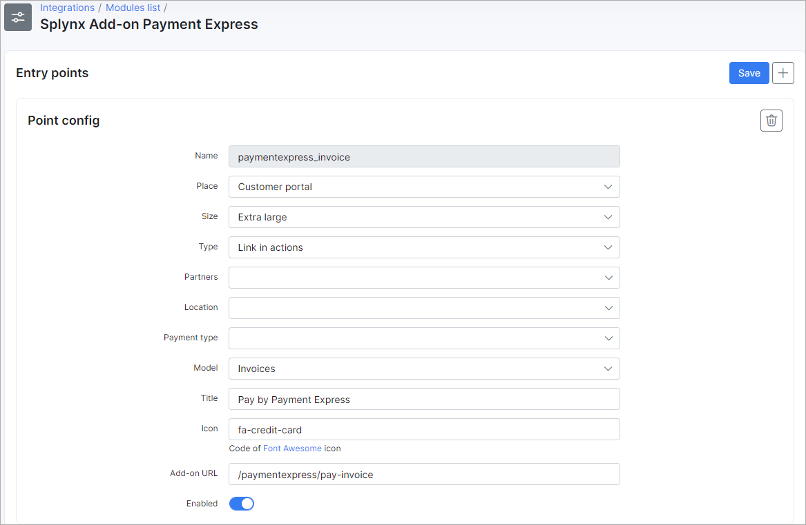
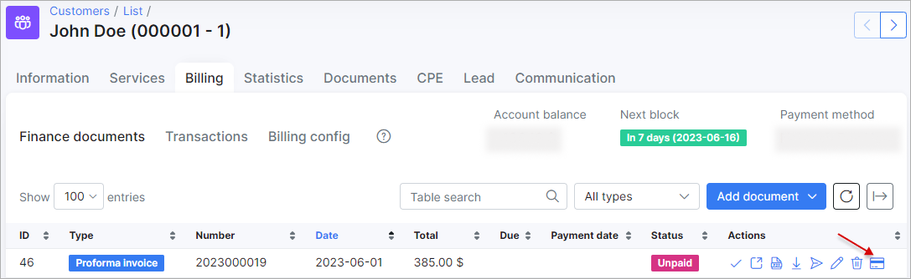

Paymentexpress
==============

Paymentexpress is a Splynx add-on. It allows to refill balance and pay invoices via payment gateway - https://www.paymentexpress.com/

Add-on can work with different credit cards, if cards are saved, then addon allows to charge all customers using Direct debit order.

To install splynx-icharge add-on, use following commands:

```
apt-get update
apt-get install splynx-paymentexpress
```
or you can install it from Web UI:

Config → Integrations → Add-ons:


After installation you have to configure addon:

Config → Integrations → Modules list:


In this menu you can also configure fee parameters:


Customers can save pay-card details for the next payments in "Financ" menu:


or he can add it, from payment window as on the screenshot:


After that, customers can pay their invoices by using Payment Express system. They will see a new button "Pay by Payment Express" as on the screenshot:



also you can turn on entry point in config -> integrations -> modules list -> Splynx Add-on Payment Express as on the screenshot:


After that customers with billing type "Prepaid daily" will be able to refill balance from dashboard:


Customers with other billing type canrefill balance by using the link - “http://yoursplynxurl/paymentexpress/"


When customers saved their credit cards, you can charge all customers, using one button! Go to Finance → Invoices, set the period and click "Charge" as at the screenshot:



