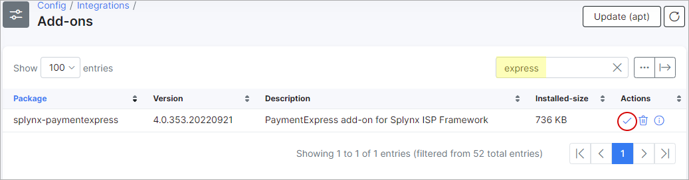
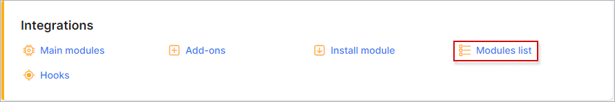
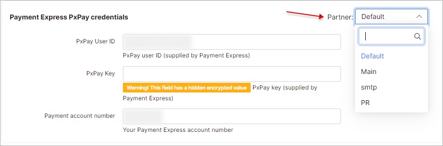
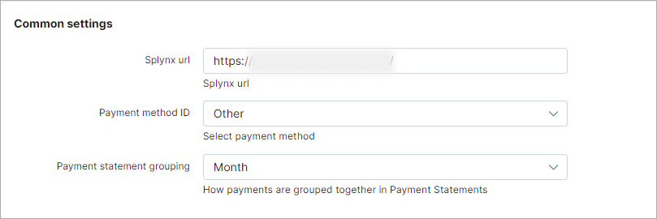

Paymentexpress
==============

Paymentexpress is a Splynx add-on which allows refilling of customer balances and paying invoices via the payment gateway - https://www.paymentexpress.com/

The add-on can work with different credit cards, if cards are saved on customer profiles, the addon allows you to charge all customers using Direct debit orders.

The add-on can be installed in two methods, via the CLI or Web UI of your Splynx server.

To install the "splynx-paymentexpress" add-on via CLI, the following commands can be used:

```
apt-get update
apt-get install splynx-paymentexpress
```
To install it via the Web UI:

Navigate to `Config → Integrations → Add-ons`:


Locate or search for the "splynx-paymentexpress" add-on and click on the install icon in the *Actions* column:



Click on the "OK, confirm" button to begin the installation process:


After the installation process has completed, you have to configure the addon:

Navigate to `Config → Integrations → Modules list`:



Locate or search for the "splynx-paymentexpress" add-on and click on the edit button in the *Actions* column:


Configure these parameters with the details of your paymentexpress account.


You can also configure fee parameters in this section:


Customers can save their pay-card details for future payments in the *Finance* section of the customer portal:





Alternatively, they can add it from the payment window while paying for invoices as depicted below:


Thereafter, customers can pay for their invoices using the Payment Express system. Customers will see a new button "Pay by Payment Express" as depicted below:


You can also enable entry points in *Config -> integrations -> Modules list -> Splynx Add-on Payment Express* as depicted below:


After this entry point has been enabled, customers using the "Prepaid daily" billing type will be able to refill their balances from the customer portal dashboard:


Customers with using billing types can refill their balances using the following link - “http://yoursplynxurl/paymentexpress/"


If customers has saved their credit card details, you can charge all customers using one button! Navigate to *Finance → Invoices*, set the period and click on "Charge" as depicted below:


