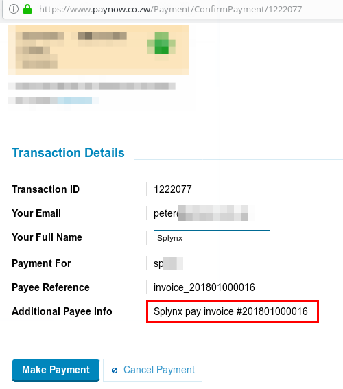

Paynow Zimbabwe
===============

Paynow Zimbabwe is a Splynx add-on to make payments via Paynow payment gateway - [https://paynow.co.zw/](https://paynow.co.zw/).

To install Paynow Zimbabwe add-on, use following commands:

```bash
apt-get update
apt-get install splynx-paynow
```

## Paynow account

To use this Splynx add-on, it is necessary to have **Paynow 3rd party shopping cart**.

To create this:

1. Register your Paynow account
2. Log in
3. In the upper menu, choose **Receive Payments** / **Other ways to get paid**  
    

4. Under **3rd Party Shopping Carts & Business Systems Integration** press the button **Create/Manage Shopping Carts**  
    

5. **Under Advanced Integration** press the button **Create Advanced Integration**  
    

6. Fill out the form and press **Save**
   

7. After you have pressed **Save**, the section **Integration Key** appears.  
    Copy **Intergration ID** and paste it into Splynx.  
    Press the button **Email Key To**. Email letter will be sent to **Notification Email** address. Copy **Integration Key** and paste it into Splynx.
    

## Configuration

Add-on configuration - _Config / Integrations / Modules list / splynx_paynow_addon_


## Entry points

By using **Entry points**, you can enable add-on features. You allow:

1. Customers to pay invoices
   

2. Customers to pay proforma invoices
   

3. Customers to pay invoices and proforma invoices from portal dashboard  
   

4. Customer with **type of billing** - **prepaid** to put money into account from portal dashboard  
   

## Add On settings


* **API domain** - URL of Splynx server
* **API key**, **API secret** - default values. Don't change them
* **Integration ID**, **Integration Key** - values from Paynow portal


* **Splynx url** - URL of Splynx server

* **Payment method ID** - id number of payment method from **Config** / **Finance** / **Payment methods**

* **Bank statements group** - Group bank statements (**Config** / **Finance** / **Bank Statements** / **History**) monthly or daily

* **Service Fee** - Paynow commision (in %). Depends on Paynow plan

* **Add fee to request** - Add **service fee** to proforma invoice (as an additional item)

* **Fee message** - Description of fee invoice item

* **Fee VAT** - VAT of Paynow comission (in %). Will be included into service fee

* **Transaction fee category** - id number of transaction category from **Config** / **Finance** / **Transaction categories**

* **Additional info pattern for Paynow** - the value will be shown at the Paynow payment page. Look at the screenshot:  
  