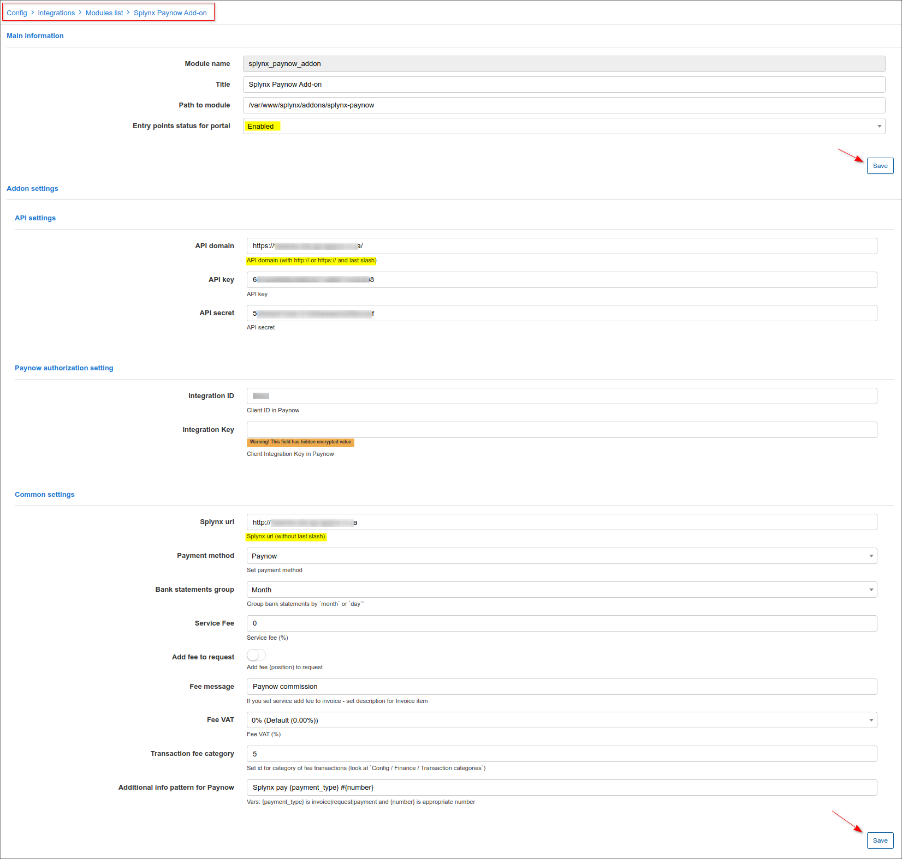
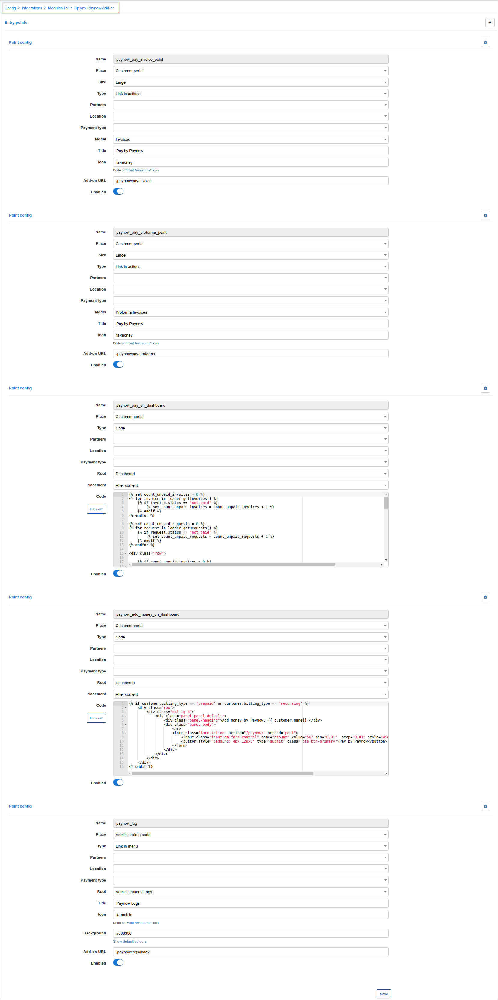
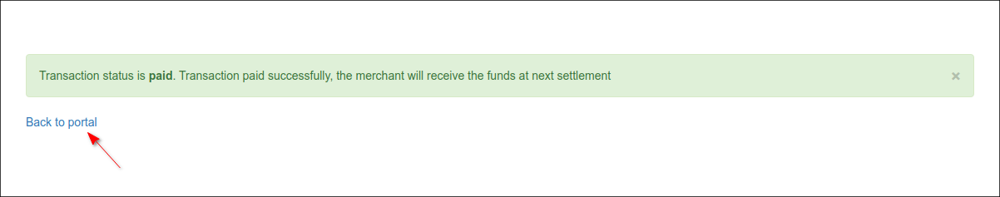
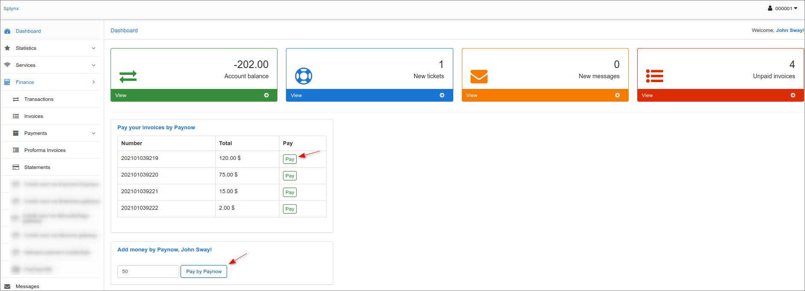
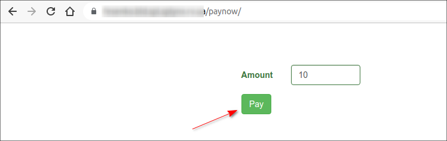
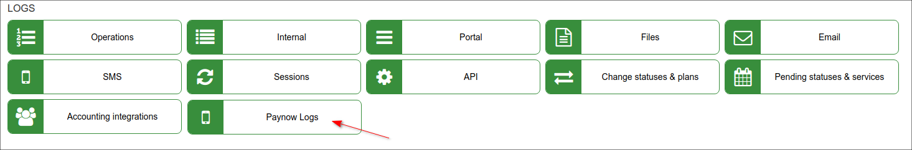
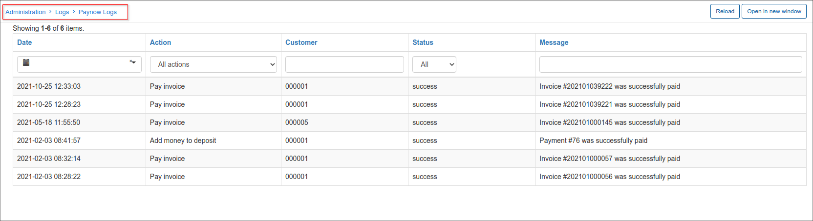

Paynow Zimbabwe
===============

Paynow Zimbabwe is a Splynx add-on used to make payments via the Paynow payment gateway - https://paynow.co.zw.

### Add-on installation

The add-on can be installed in two methods, via the CLI or the Web UI of your Splynx server.

To install the *Paynow* add-on via CLI, the following commands can be used:

```
apt-get update
apt-get install splynx-paynow
```
To install it via the Web UI:

Navigate to `Config → Integrations → Add-ons`:


Locate or search for the `splynx-paynow` add-on and click on the *Install* icon in the *Actions* column:


Click on the **OK, confirm** button to begin the installation process:


### Paynow account

To use the Splynx add-on, it is necessary to have a **Paynow 3rd party shopping cart**.

To create this cart the following steps need to be taken:

1. Register your [Paynow account](https://www.paynow.co.zw);
2. Log in;
3. In the top menu, select `Receive Payments → Other Ways To Get Paid`  


4. Under **3rd Party Shopping Carts & Business Systems Integration** press the button **Create/Manage Shopping Carts**  


5. **Under Advanced Integration** press the button **Create Advanced Integration**  


6. Fill out the form and press **Save**


7. After you have pressed **Save**, the section **Integration Key** will appear. Copy the **Intergration ID** and paste it into Splynx. Press the **Email Key To** button. The email letter will be sent to the **Notification Email** address. Copy the **Integration Key** and paste it into Splynx.


### Add-on settings

Once the add-on has been installed and you have obtained all the details required from *Paynow*, we can proceed with further add-on configuration.

Navigate to `Config → Integrations → Modules list`:


Locate or search for the `splynx_paynow_addon` add-on and click on the
<icon class="image-icon"></icon> (*Edit*) icon in the *Actions* column:




The configuration of add-on **Entry points** can be found in `Config → Integrations → Modules list`, near the `splynx_paynow_addon` module item in *Actions* column, click on the <icon class="image-icon"></icon> (*Edit entry points*) icon. More information about *Modules list* can be found [here](configuration/integrations/modules_list/modules_list.md).

By using **Entry points**, you can enable add-on features which can allow customers to pay for (proforma) invoices, pay directly from *Portal Dashboard* or add money to the balance from *Dashboard*.



### Invoice payment

Once the configuration is completed, customers will see a new button and will be able to pay for their invoices via the *Paynow* system:


Customer will be redirected to *Paynow* payment page, where they have to approve their payment:




If everything goes well, you will see the status of invoice marked as `Paid` (on the customer and admin portal).

On the customer *Portal Dashboard*, customers can also see the list of non-paid invoices in *Paynow* widget (entry point) and the same-name buttons to pay such invoices. Moreover, using the *Add money by Paynow* widget on the *Dashboard* or the direct link ```https://<splynx_domain_address>/paynow``` the customer can refill the account balance.





### Add-on log files

*Paynow* add-on logs can be found in `Administration → Logs`:



In *Paynow Logs* the full payment statistic records can be viewed:




### Direct payments

Using the payments links is the simplest way to accept payments made with credit card. This feature is available in the *Paynow* add-on to pay *Invoices* and *Proforma Invoices*. This provides convenience and simplicity for your customers, so the amount of on-time payments will increase. For example, you can add a payment link to the e-mail with the (proforma) invoice, as a result, the customer can make payment quickly by clicking onto such link instead of logging in to their *Portal* page. In case the customer has saved the payment credentials on the *Portal*, they do not need to add further details when using the direct payment link in the future. If the credit card in not linked on the *Portal*, the payment details need to be entered each time the payment link is used.

To create a direct payment link, please use the patterns below:

**To pay the Invoice:**

<details>
<summary>by invoice ID</summary>
<div markdown="1">

```
https://<splynx_domain_address>/paynow/direct-pay-invoice-by-id?item_id=<Invoice_id>

```
</div>
</details>

<details>
<summary>by invoice number</summary>
<div markdown="1">

```
https://<splynx_domain_address>/paynow/direct-pay-invoice?item_id=<Invoice_number>

```
</div>
</details>


**To pay the Proforma Invoice:**

<details>
<summary>by proforma invoice ID</summary>
<div markdown="1">

```
https://<splynx_domain_address>/paynow/direct-pay-proforma-by-id?item_id=<proforma_id>

```
</div>
</details>

<details>
<summary>by proforma invoice number</summary>
<div markdown="1">

```
https://<splynx_domain_address>/paynow/direct-pay-proforma?item_id=<proforma_number>

```
</div>
</details>
