Paynow Zimbabwe
===============

Paynow Zimbabwe is a Splynx add-on used to make payments via the Paynow payment gateway - [https://paynow.co.zw/](https://paynow.co.zw/).

## installation

The add-on can be installed in two methods, via the CLI or the Web UI of your Splynx server.

To install the "Paynow Zimbabwe" add-on via CLI, the following commands can be used:

```bash
apt-get update
apt-get install splynx-paynow
```
To install it via the Web UI:

Navigate to `Config → Integrations → Add-ons`:


Locate or search for the "splynx-paynow" add-on and click on the install icon in the *Actions* column:

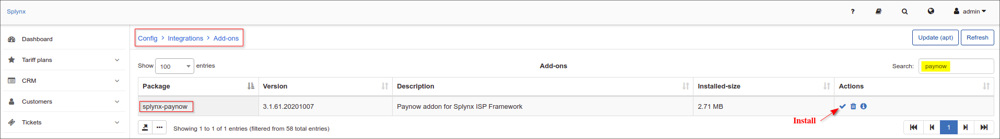

Click on the "OK, confirm" button to begin the installation process:

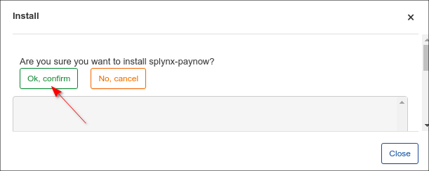

## Paynow account

To use the Splynx add-on, it is necessary to have a **Paynow 3rd party shopping cart**.

To create this cart the following steps need to be taken:

1. Register your Paynow account
2. Log in
3. In the top menu, select **Receive Payments** / **Other ways to get paid**  
    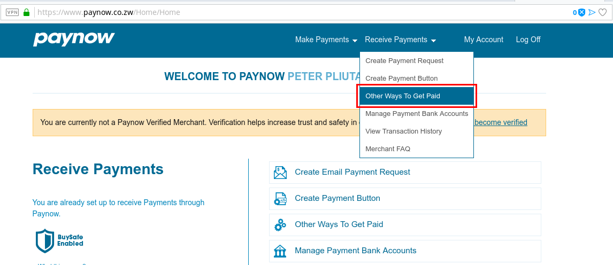

4. Under **3rd Party Shopping Carts & Business Systems Integration** press the button **Create/Manage Shopping Carts**  
    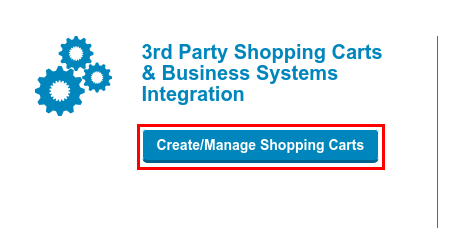

5. **Under Advanced Integration** press the button **Create Advanced Integration**  
    

6. Fill out the form and press **Save**
   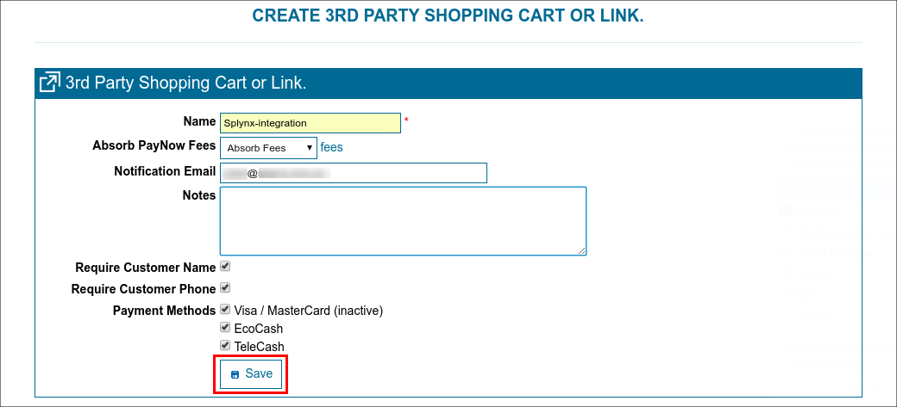

7. After you have pressed **Save**, the section **Integration Key** will appear.  
    Copy the **Intergration ID** and paste it into Splynx.  
    Press the button **Email Key To**. The Email letter will be sent to the **Notification Email** address. Copy the **Integration Key** and paste it into Splynx.
    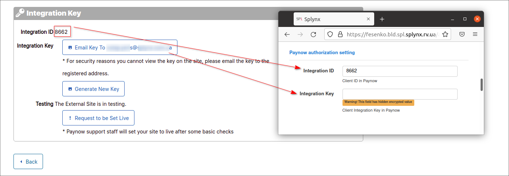

## Configuration

Once the add-on has been installed and you have obtained all the details required from paynow, we can proceed to configurating the add-on.

Navigate to - _Config / Integrations / Modules list / splynx_paynow_addon_ and click on the edit icon in the *Actions* column


## Entry points

By using **Entry points**, you can enable add-on features where you can allow:

1. Customers to pay for invoices
   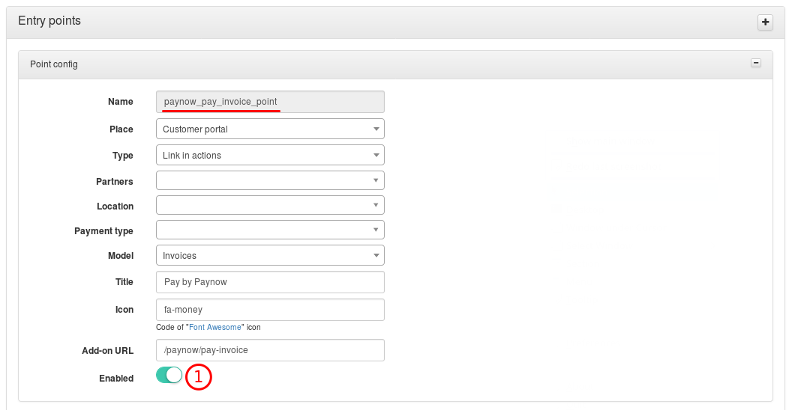

2. Customers to pay for proforma invoices
   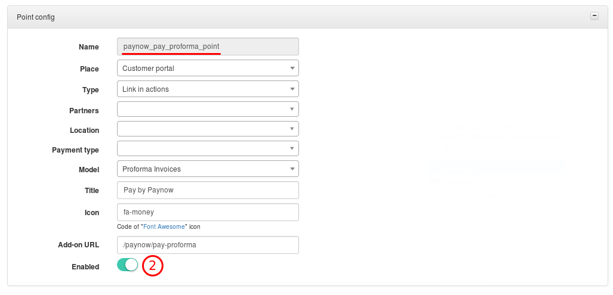

3. Customers to pay for invoices and proforma invoices from the portal dashboard  
   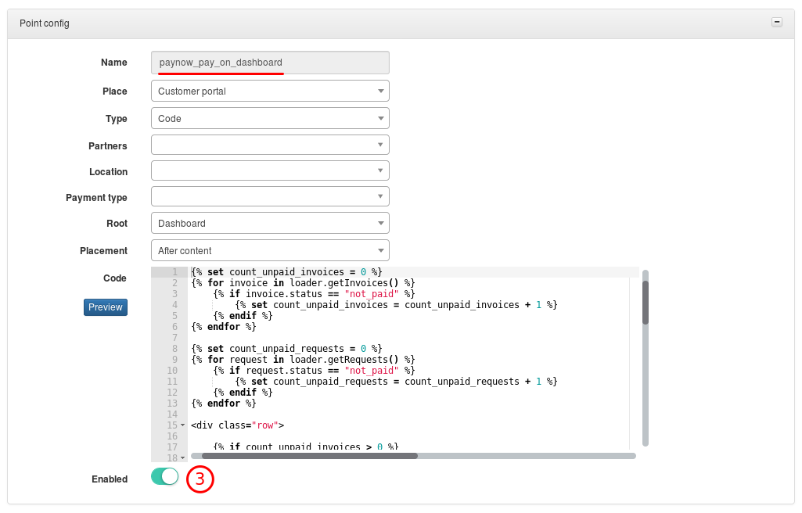

4. Customer with **type of billing** - **prepaid** to put money into their account from the portal dashboard  
   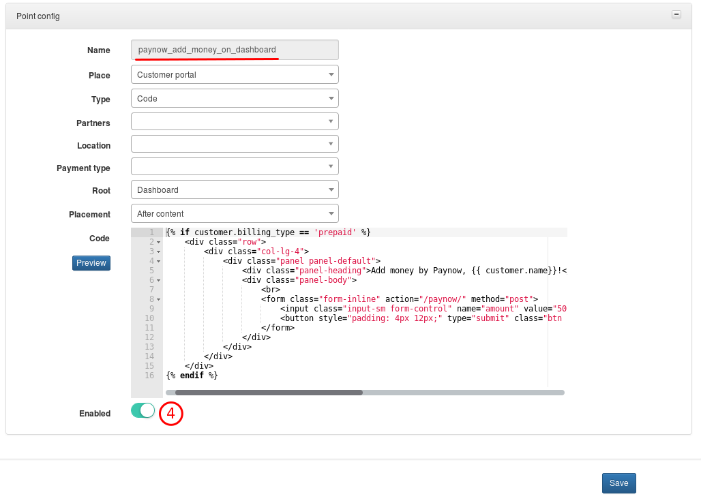

## Add On settings

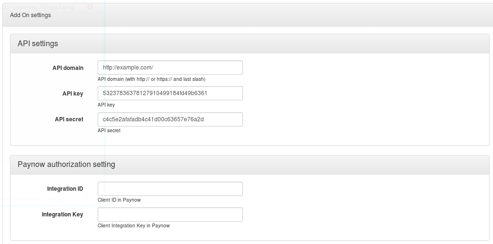

* **API domain** - URL of Splynx server
* **API key**, **API secret** - default values. Don't change this unless entirely necessary
* **Integration ID**, **Integration Key** - values from the Paynow portal

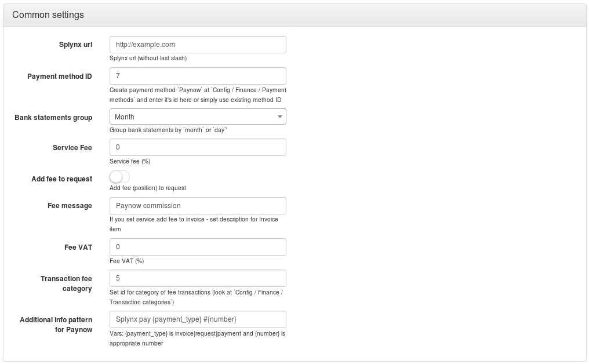

* **Splynx url** - URL of your Splynx server

* **Payment method ID** - id number of the payment method from **Config** / **Finance** / **Payment methods**

* **Bank statements group** - Group bank statements (**Config** / **Finance** / **Bank Statements** / **History**) monthly or daily

* **Service Fee** - Paynow commision (in %). Depends on the Paynow plan

* **Add fee to request** - Add the **service fee** to proforma invoices (as an additional item)

* **Fee message** - Description of the fee invoice item

* **Fee VAT** - VAT of Paynow comission (in %). Will be included into the service fee

* **Transaction fee category** - id number of the transaction category from **Config** / **Finance** / **Transaction categories**

* **Additional info pattern for Paynow** - the value that will be shown on the Paynow payment page.

Thereafter, customers will see a new button and will be able to pay for their invoices via the paynow system:

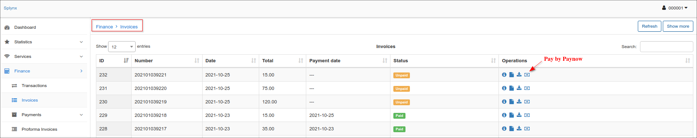

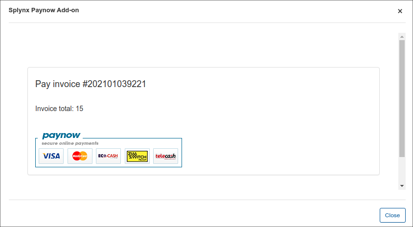

Customer will be redirected to paynow payment page, where they have to approve their payment:

  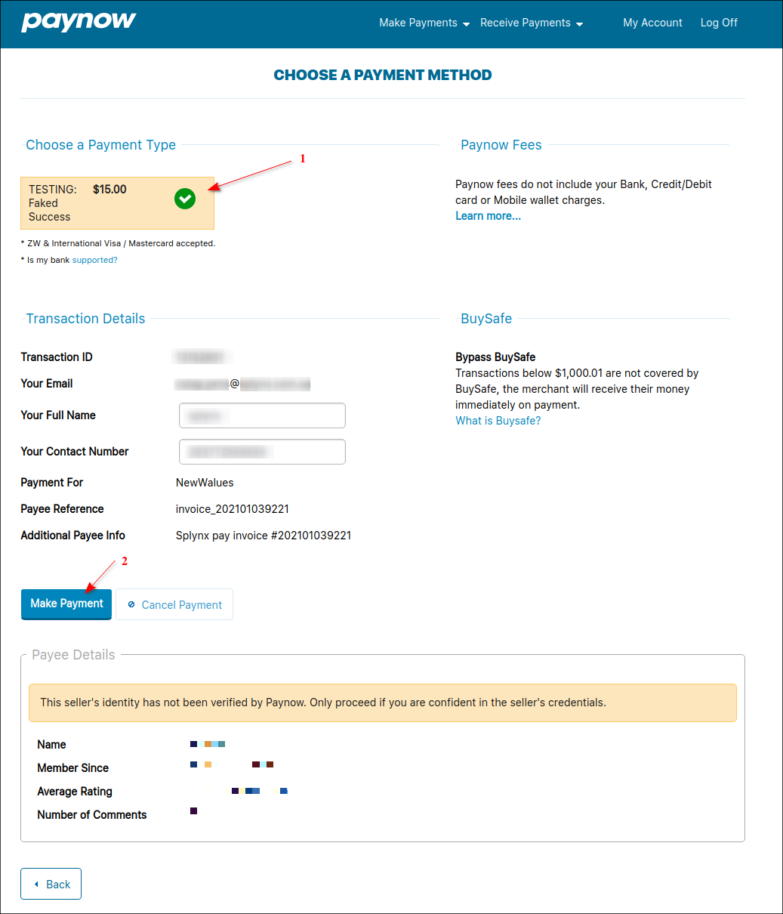
