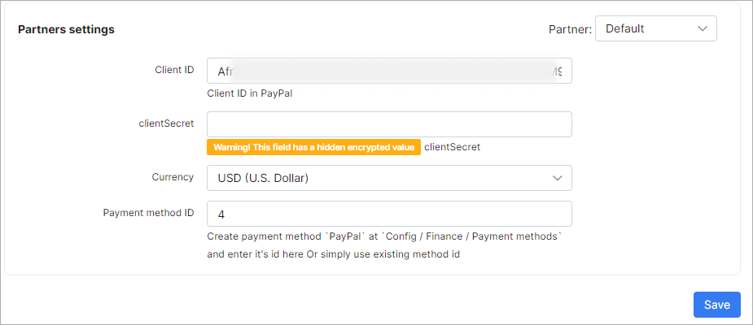

PayPal
==========

You can receive payments via PayPal using Splynx. Splynx generates invoices for services that are sent to customer’s email and to the Splynx Customer Portal. 

From the Customer Portal, the customer can pay for their invoices using PayPal.


When the customer clicks on the PayPal button and applies to pay now, he is redirected to the PayPal page to make the payment.


Customers can also add a credit card on the PayPal payment webpage, if they don’t have a PayPal account.


After payment has been made, the invoice is marked as paid, a transaction is created in Splynx, and the customer’s balance is changed.


---
There are several steps needed to configure the Splynx PayPal add-on. The add-on can be installed in two methods: via the CLI or the Web UI of your Splynx server.

## Installation

To install the PayPal add-on via CLI, the following commands can be used:

```
apt-get update
apt-get install splynx-paypal
```
To install it via the Web UI:

Navigate to `Config → Integrations → Add-ons`:


Locate or search for the "splynx-paypal" add-on and click the *Install* icon in the *Actions* column. You will be presented with a window to confirm or cancel the Installation. Click the `OK, confirm` to begin the installation process:


## Activate the developer’s tool in your PayPal account

Obtain the access to your business PayPal account on the following website: https://developer.paypal.com

The ClientID and ClientSecret are the values Splynx needs to configure the add-on. Click the *Add new Rest API application* and call it *Splynx*.


Thereafter, you can find the ClientID and Secret on the application page. It is important to choose the “Live” version, because it shows the values for the test Sandbox account by default.


When you have obtained the ClientID and Secret, you can insert it into your Splynx server and connect Splynx with PayPal.

## Configure Splynx to work with your PayPal account

Once the add-on has been installed and all details from PayPal have been obtained, we can proceed to configure the add-on.

Navigate to `Config → Integrations → Modules list` and click the *Edit* button of the Splynx PayPal addon:


You can find *Common settings* and *Partners settings* in this section:




<icon class="image-icon"></icon> Each partner can use different settings.

---
You can also enable widgets for the Customer Portal.

Click the *Entry points* button:


## Paying for invoices with PayPal

On the Customer Portal, navigate to `Finance → Invoices`. Select an unpaid invoice and click the "Pay with PayPal" button:


You can allow customers using the *Prepaid (Monthly)* billing type to use the last widget available. To achieve this, the code has to be modified. Replace `if customer.billing_type == 'prepaid'` to `if customer.billing_type == 'prepaid_monthly' or customer.billing_type == 'prepaid'`
