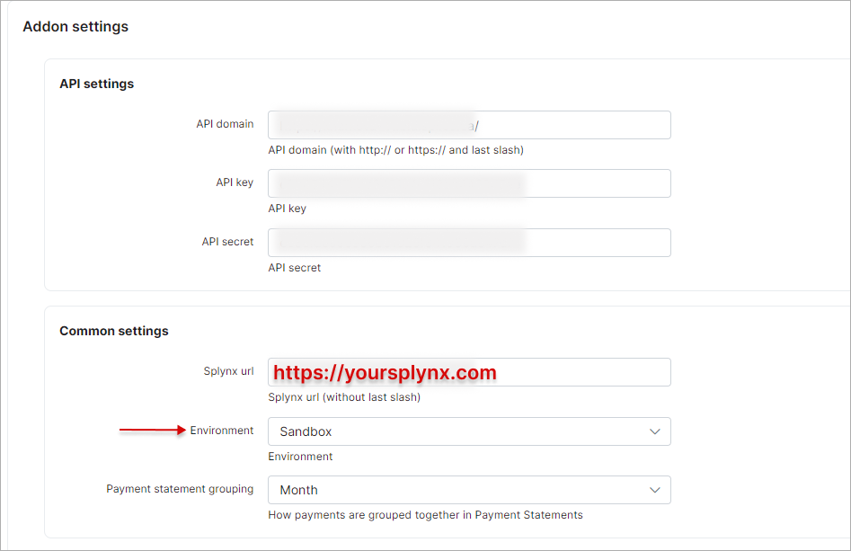

Paypal payments
==========

You can receive payments via PayPal using Splynx. Splynx generates invoices for services that are sent to customer’s email and to Splynx portal. From Splynx portal customer can pay the invoice using Paypal.


When customer clicks the PayPal button and applies to pay now, he is transferred to the PayPal page to make the payment.


Customers can also add a credit card on PayPal payment webpage, if they don’t have a PayPal account.


After payment has made, the invoice is marked as paid, transaction in Splynx is created and customer’s balance is changed.


---
There are several steps needed to configure Splynx PayPal add-on:

#### Install the add-on with commands:
```
apt-get update
apt-get install splynx-paypal
```
or you can install it from Web UI:

Config → Integrations → Add-ons:


#### Activate developer’s tool in your PayPal account.
Get the access to your business PayPal account on website https://developer.paypal.com

ClientID and ClientSecret are the values Splynx needs. Click on Add new Rest API application, call it Splynx.


Then, you can find ClientID and Secret on the page of application. Important is to choose “Live” version, because it shows values for test Sandbox account by default.


When you got the ClientID and Secret, you can put it to Splynx server and connect Splynx with PayPal.

#### Configure Splynx to work with your PayPal account.

You should go to `Config/Modules/List` and click edit Splynx PayPal addon:


where you can find Common settings and Partners settings:




for each partner you can use own settings!

---
#### Also on this page you can enable widgets for the customer portal.
Press "Entry points" button:


First widget(Point) configuration:


Point 1 on customer portal page:


Second widget(Point) configuration:


Point 2 on customer portal page:


##### NOTE: Point 2 will be visible only for customers with *type of billing -> Prepaid (Daily)*

Pay invoices with PayPal:
On customer portal page go to `Finance/Invoices` select unpaid invoice and click a button "pay with PayPal"


You can allow customers with billing type *Prepaid (Monthly)* use last widget. To do this, code should be modified. Replace `if customer.billing_type == 'prepaid'` to `if customer.billing_type == 'prepaid_monthly' or customer.billing_type == 'prepaid'`:
