Paystack
=========

Paystack is a Splynx add-on which allows customers to pay for invoices via the payment gateway - https://paystack.com/.

The add-on can work with different credit cards and bank accounts, if cards or bank accounts are saved on customer profiles, the addon allows you to charge all customers using *Direct debit orders*.

The add-on can be installed in two methods, via the CLI or the Web UI of your Splynx server.

To install the Paystack add-on via CLI, the following commands can be used:

```
apt-get update
apt-get install splynx-paystack
```

To install it via the Web UI:

Navigate to `Config -> Integrations -> Add-ons`:

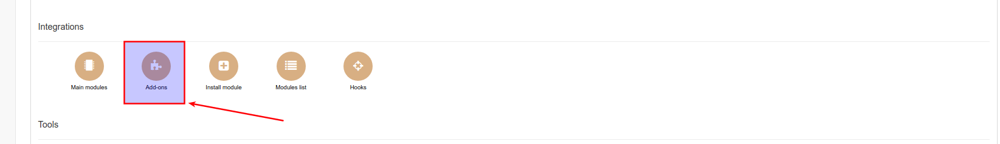

Locate or search for the "splynx-paystack" addon and click on the install icon in the *Actions* column:

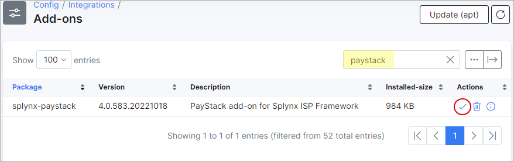

Click on the "OK, confirm" button to begin the installation process:


After the installation process has completed, you have to configure the parameters in *Config -> Integrations -> Modules list*. As depicted below:

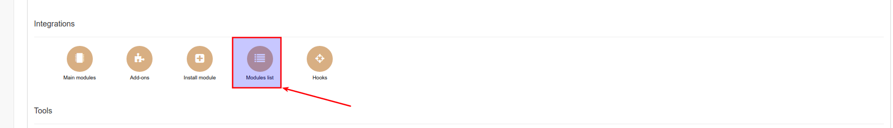

Locate or search for the "splynx-paystack" addon and click on the edit icon in the *Actions* column:

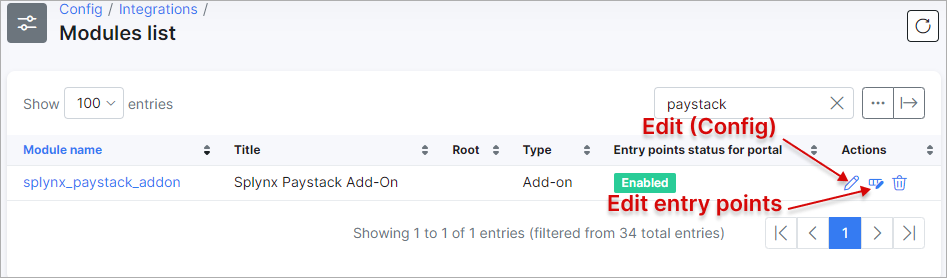

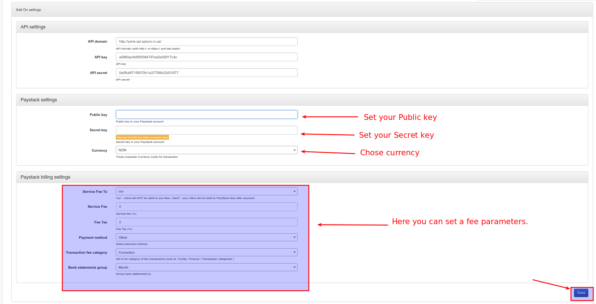

Public and secret keys can be obtained from your *Paystack account:*

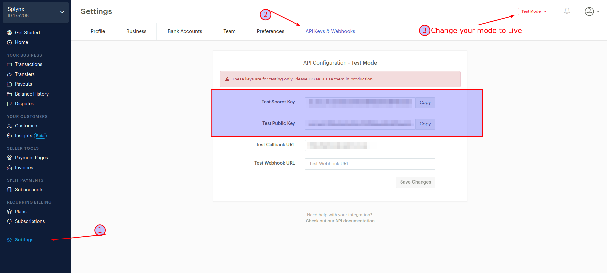

Once the configuration has been completed, customers can pay for their invoices using the Paystack system in *Finance / Invoices:*

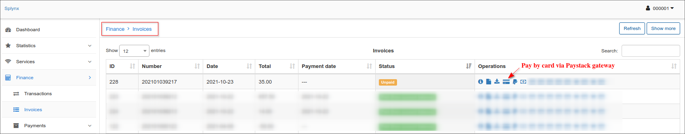

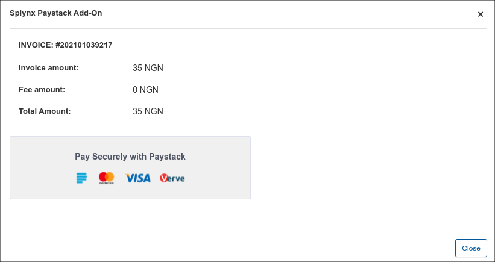

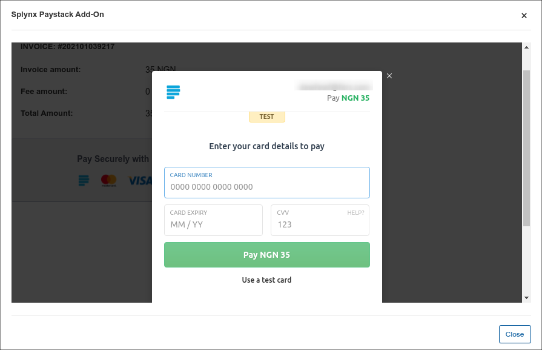

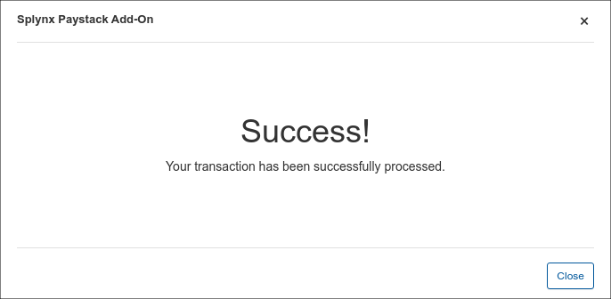

If everything went well, you will see the status of the invoice marked as "Paid" (in the customer and admin portal):

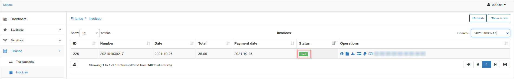

Additionally, you can charge all customers using one button! Navigate to *Finance → Invoices*, set the period and click on "Charge" as depicted below:

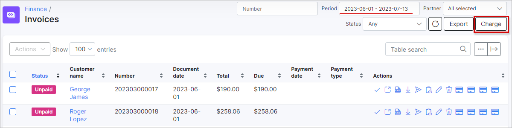

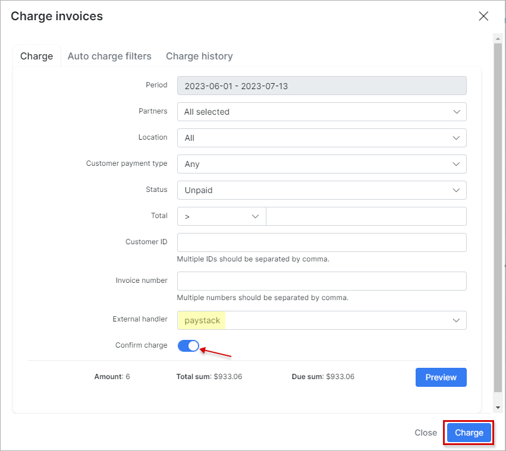
