Paystack
=========

Paystack is a Splynx add-on. It allows to pay invoices via payment gateway - https://paystack.com/.

Add-on can work with different credit cards and bank accounts, if cards or bank accounts are saved, then addon allows to charge all customers using *Direct debit order*.

To install Paystack add-on use following commands:

```
apt-get update
apt-get install splynx-paystack
```

or you can install it from Web UI:

*config -> Integrations -> Add-ons:*


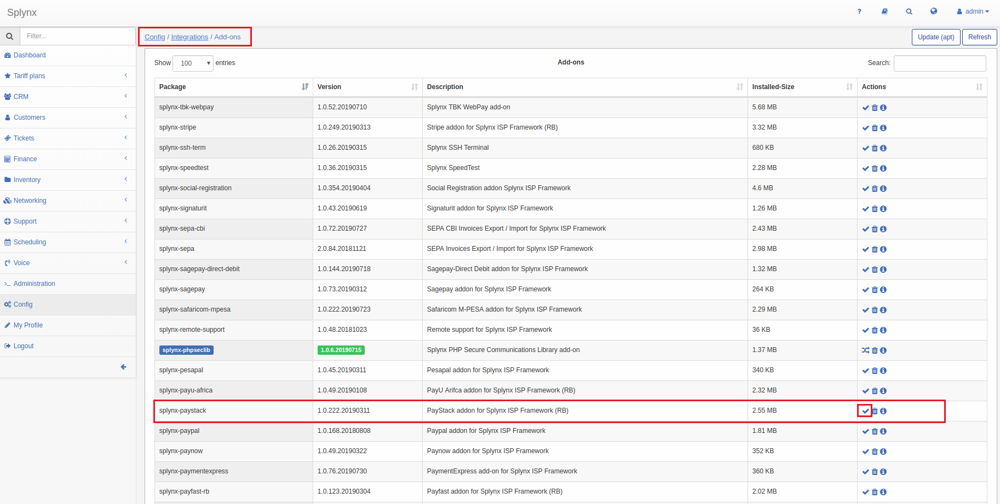

After installation you have to configure parameters in *Config -> Integrations -> Modules list*. And here you can set a fee parameters. Look at the screenshot:


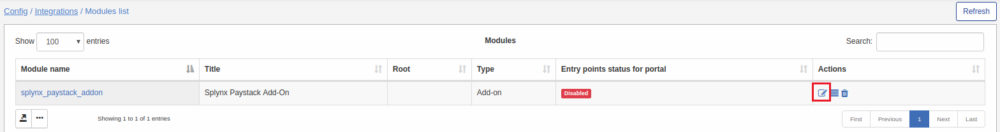

Public and secret keys can be taken from *Paystack account:*

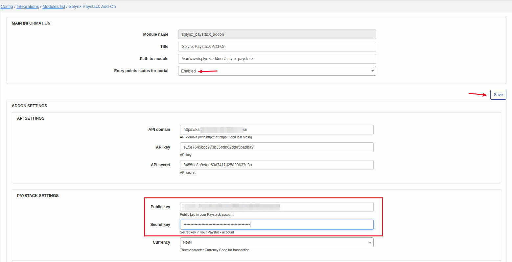
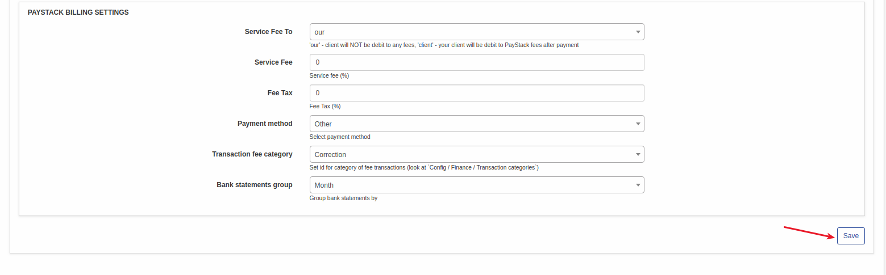

Now customers can pay their invoices using Paystack in *Finance / Invoices:*

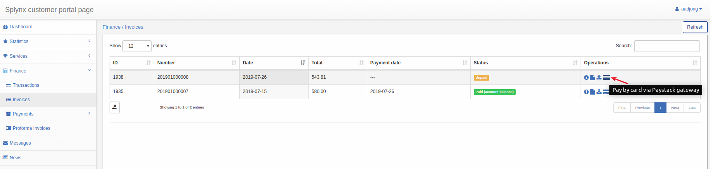

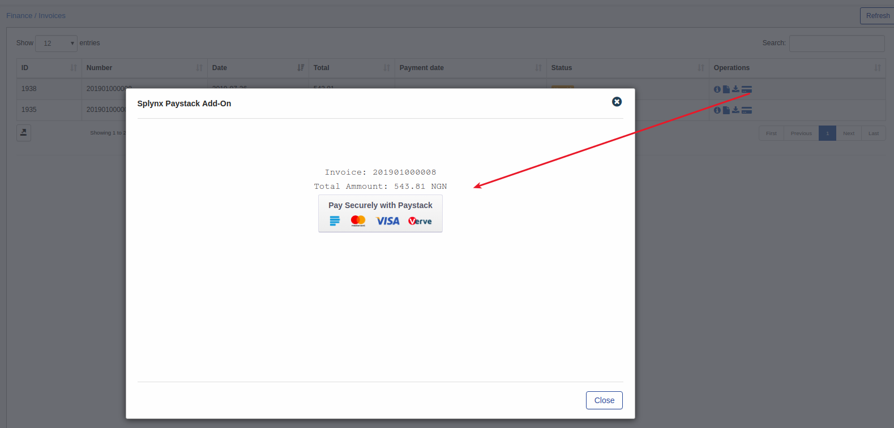

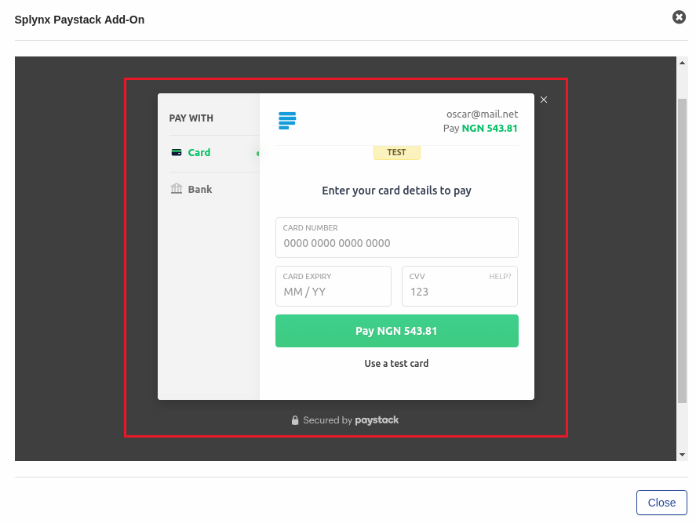

If everything well, you will see status of invoice as "Paid" (portal and admin).
Also customer can add some money for PayStack account from portal dashboard:
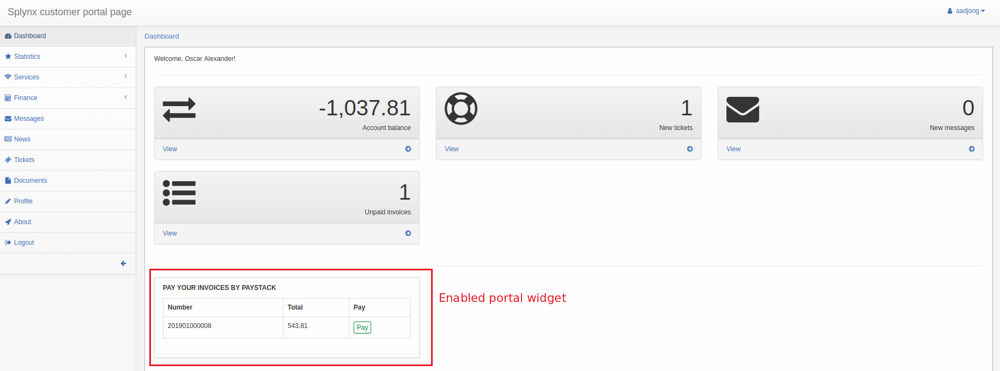

To enable portal widget go to *Config -> Integrations -> Modules list -> PayStack -> Entry points*.
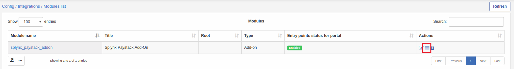

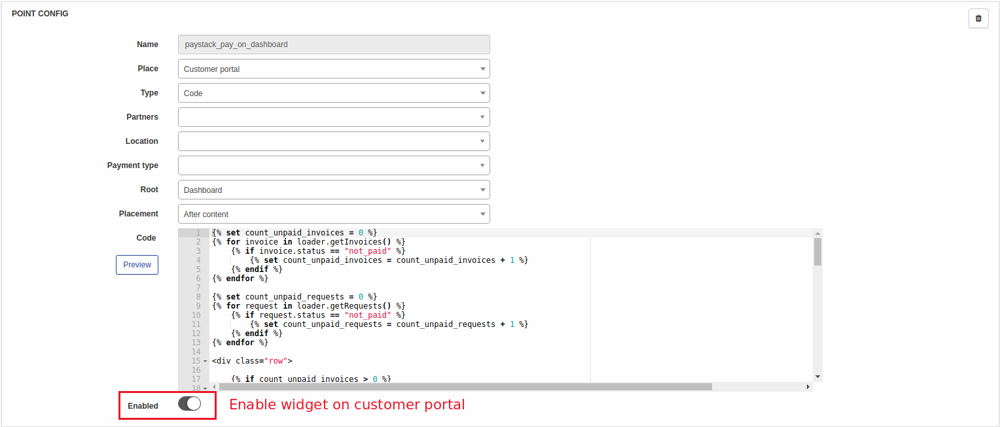

Besides that, you can charge all customers, using one button! Go to Finance → Invoices, set the period and click "Charge" as on a screenshot:

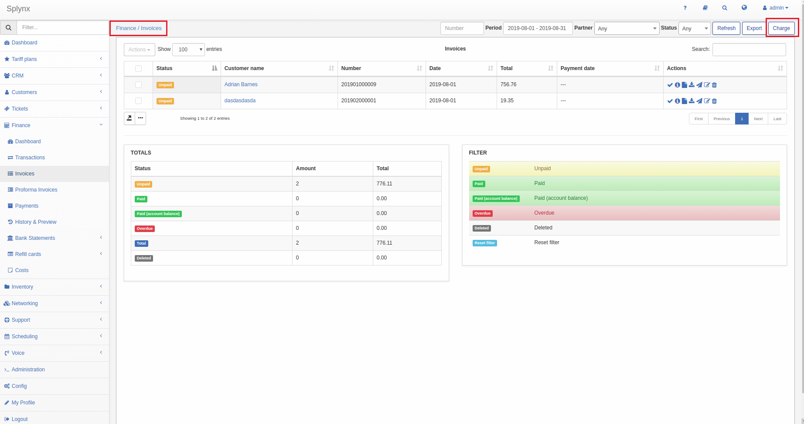

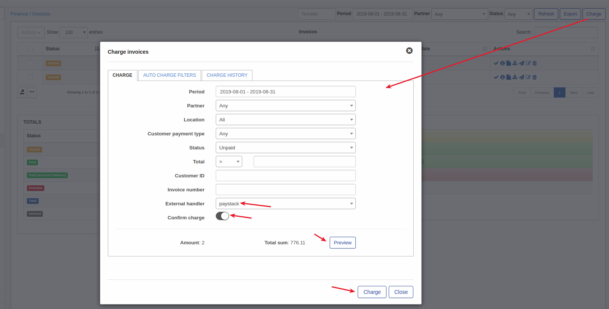
