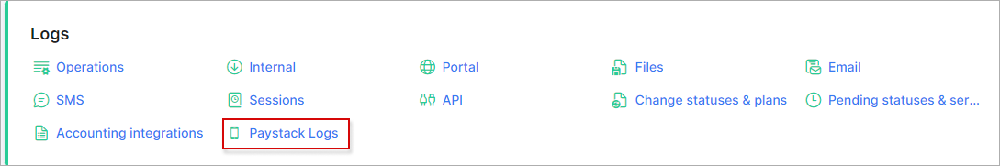

Paystack
=========

Paystack is a Splynx add-on which allows customers to pay for invoices via the payment gateway - https://paystack.com/.

The add-on can work with different credit cards and bank accounts if cards or bank accounts are saved in customer profiles. 

The add-on allows you to charge all customers using *Direct debit orders*.

## Installation

The add-on can be installed in two methods: via the CLI or the Web UI of your Splynx server.

To install the Paystack add-on via CLI, the following commands can be used:

```
apt-get update
apt-get install splynx-paystack
```

To install it via the Web UI, navigate to `Config → Integrations → Add-ons`:


Locate or search for the `splynx-paystack` add-on and click the *Install* icon in the *Actions* column:


Click the `OK, confirm` button to begin the installation process:


## Configuration

After the installation process is complete, you need to configure the parameters in `Config → Integrations → Modules list`, as shown below:


Locate or search for the `splynx-paystack` add-on module and click the
<icon class="image-icon"></icon> (*Edit*) icon in the *Actions* column:


**Public** and **Secret** keys can be obtained from your *Paystack account:*


## Invoice payment

Once the configuration has been completed, customers can pay their invoices on the [Customer Portal](customer_portal/customer_portal.md) using the *Paystack* system in `Finance → Invoices`:


Or directly from the *Portal Dashboard* via *Paystack* widget (entry point):


The configuration of add-on **Entry points** can be found in `Config → Integrations → Modules list`, near the `splynx_paystack_addon` module item in the *Actions* column. Click the <icon class="image-icon"></icon> (*Edit entry points*) icon. More information about *Modules list* can be found [here](configuration/integrations/modules_list/modules_list.md).


If everything goes well, you will see the status of the invoice marked as `Paid` (on the customer and admin portal):


Additionally, you can charge all customers in one click. To do this, navigate to `Finance → Invoices`, set the period, and click the `Charge` button, as shown below:


## Add-on logs

*Paystack* add-on logs can be found in `Administration → Logs`:



In *Paystack Logs* the different records can be viewed, like when a verification was performed or when a transaction was processed, etc.


## Direct payments

Using the payment links is the simplest way to accept payments made with a credit card or bank account. This feature is available in the *Paystack* add-on for paying **Invoices** and **Proforma Invoices**. It provides convenience and simplicity for your customers, increasing the likelihood of on-time payments. 

To create a direct payment link, please use the patterns below:

**To pay the Invoice:**

<details style="font-size: 15px; margin-bottom: 5px;">
<summary><b>by invoice ID</b></summary>
<div markdown="1">

```
https://<splynx_domain_address>/paystack/direct-pay-invoice-by-id?item_id=<Invoice_id>

```
</div>
</details>

<details style="font-size: 15px; margin-bottom: 5px;">
<summary><b>by invoice number</b></summary>
<div markdown="1">

```
https://<splynx_domain_address>/paystack/direct-pay-invoice?item_id=<Invoice_number>

```
</div>
</details>

<br>

**To pay the Proforma Invoice:**

<details style="font-size: 15px; margin-bottom: 5px;">
<summary><b>by proforma invoice ID</b></summary>
<div markdown="1">

```
https://<splynx_domain_address>/paystack/direct-pay-proforma-by-id?item_id=<proforma_id>

```
</div>
</details>

<details style="font-size: 15px; margin-bottom: 5px;">
<summary><b>by proforma invoice number</b></summary>
<div markdown="1">

```
https://<splynx_domain_address>/paystack/direct-pay-proforma?item_id=<proforma_number>

```
</div>
</details>
