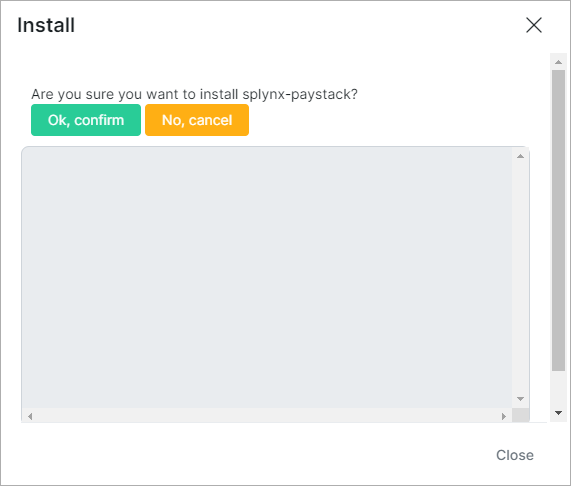

Paystack
=========

Paystack is a Splynx add-on. It's used to synchronize customers, invoices and payments with Paystack payment gateway - https://paystack.com/.

To install Paystack add-on use following commands:

```
apt-get update
apt-get install splynx-paystack
```

or you can install it from Web UI:

*config -> Integrations -> Add-ons:*




After installation you have to configure params in *config -> Integrations -> Modules list*. And here you can set a fee parameters. Look at the screenshot:


Public and secret keys can be taken from *Paystack account:*


Now customers can pay their invoices using Paystack system in *Finance / Invoices:*


If everything went well, you will see status of invoice as "Paid" (portal and admin):


Besides that, you can charge all customers, using one button! Go to Finance → Invoices, set the period and click "Charge" as on a screenshot:


