PayU Africa
===========

**PayU africa** is a Splynx add-on used to pay for invoices via the **PayU** Payment Gateway - [https://www.payu.co.za/](https://www.payu.co.za/)

The add-on can be installed in two methods, via the CLI or the Web UI of your Splynx server.

To install the Payu Africa addon via CLI, the following commands can be used:

```bash
apt-get update
apt-get install splynx-payu-africa
```
To install it via the Web UI:

Navigate to `Config -> Params -> Add-ons`:

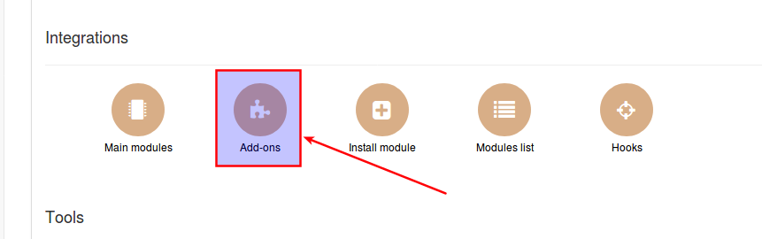

Locate or search for the "splynx-payu-africa" add-on and click on the install icon in the *Actions* column:


Click on the "OK, confirm" button to begin the installation process:

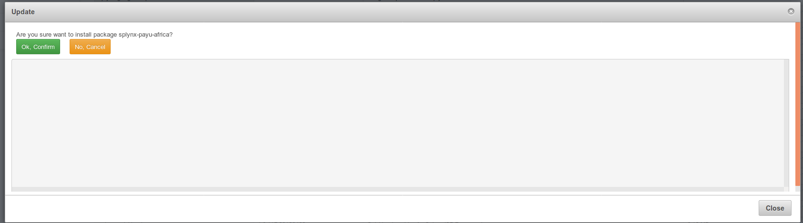


To start the integration you need a PayU account, you can register an account on their registration page - [https://www.payu.co.za/enquiry-form](https://www.payu.co.za/enquiry-form)

PayU will provide you access to the Merchant Portal. On the Merchant Portal you will find a: **Soap user name**, **SOAP Password** and **SafeKey**

After the installation process of the addon has completed, you have to configure it under _Config / Integrations / Modules List_

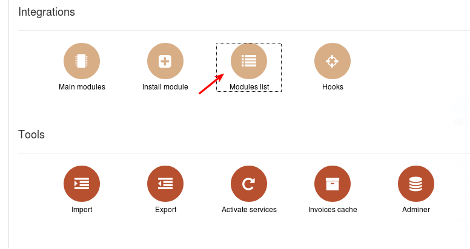

Locate or search for the "splynx-payu-africa" add-on and click on the edit button in the *Actions* column

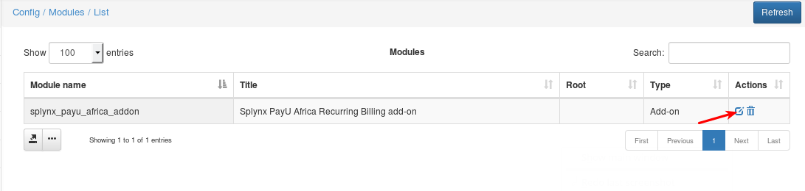

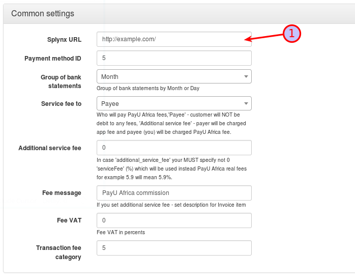

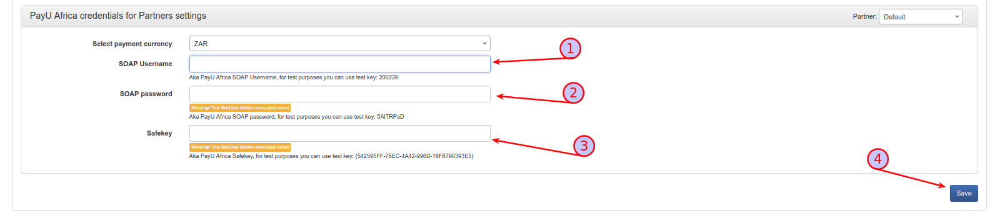

**Parameters**

* **Splynx URL** – URL of your server
* **Soap Username**, **Soap password**, **Safekey** – values from PayU’s Merchant Portal (Obtained in the previous step)

Once the add-on has been configured, customers can pay via the PayU portal in _Finance / Invoices_

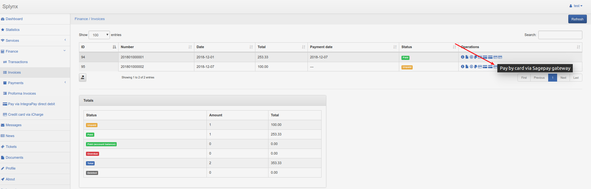

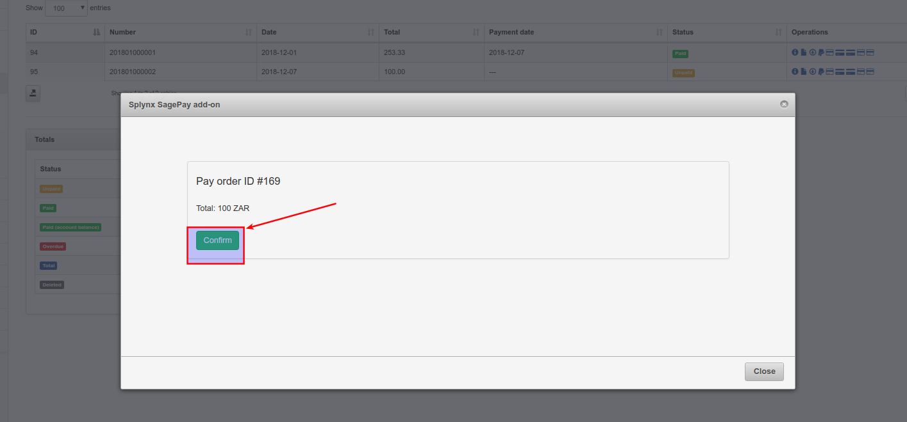

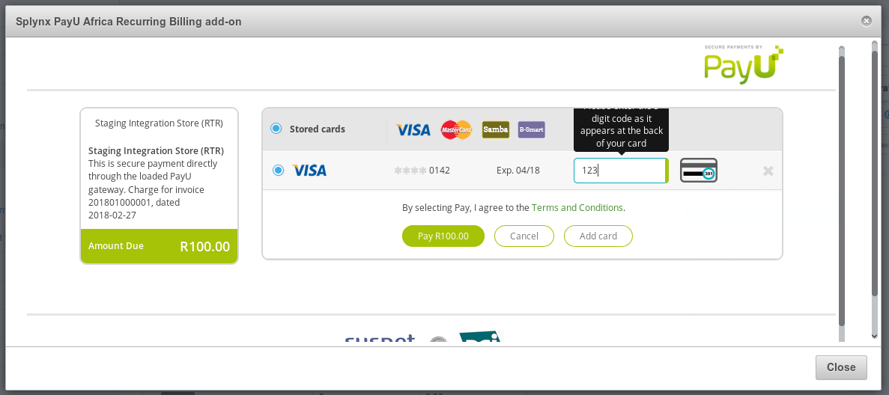
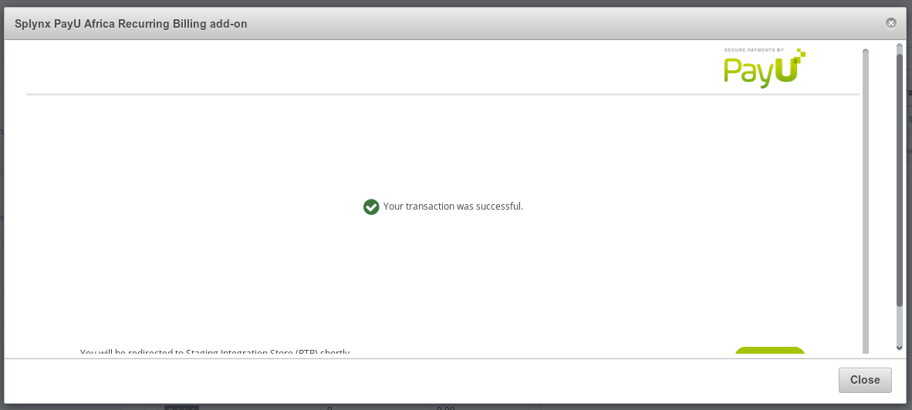

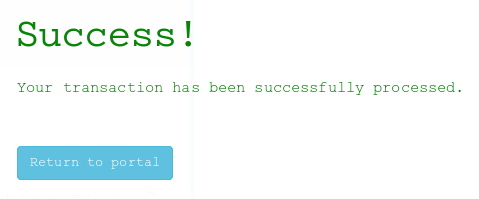

When a customer pays for an invoice, the information of their card is saved onto the system. Customers can view their stored cards when paying for their invoices via the *PayU Africa gateway*. Customers can add or remove their cards during the payment process only.

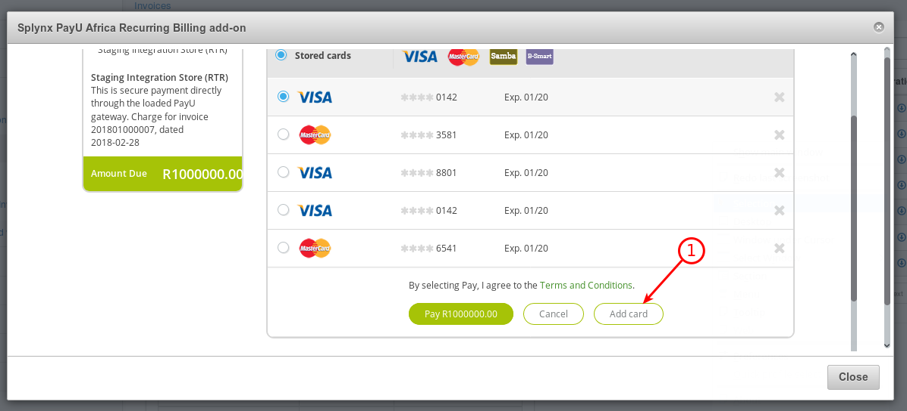

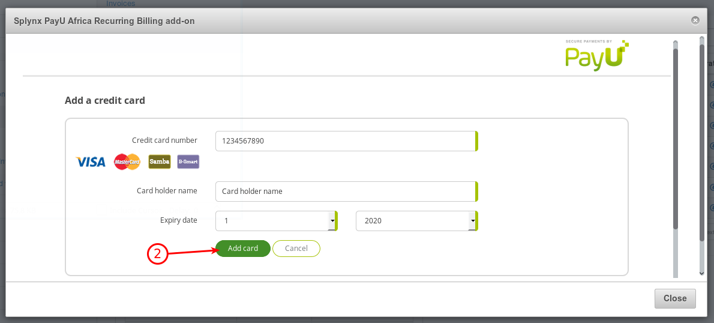

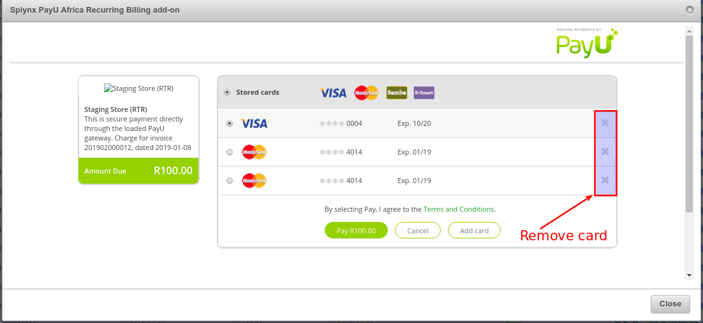
