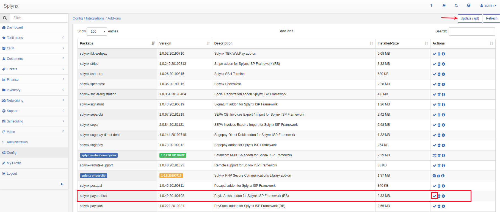
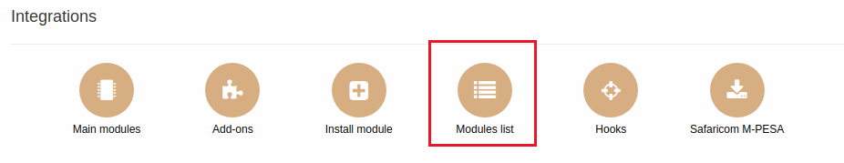
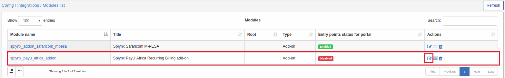
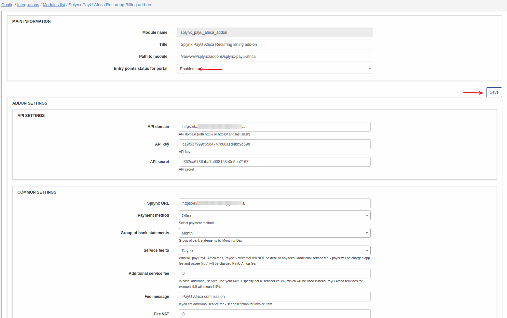
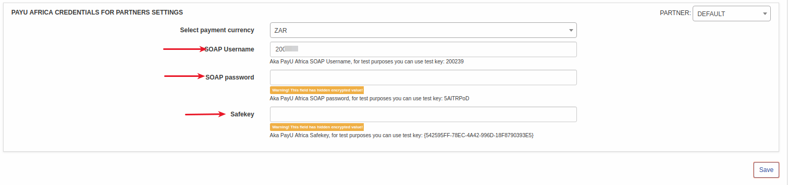
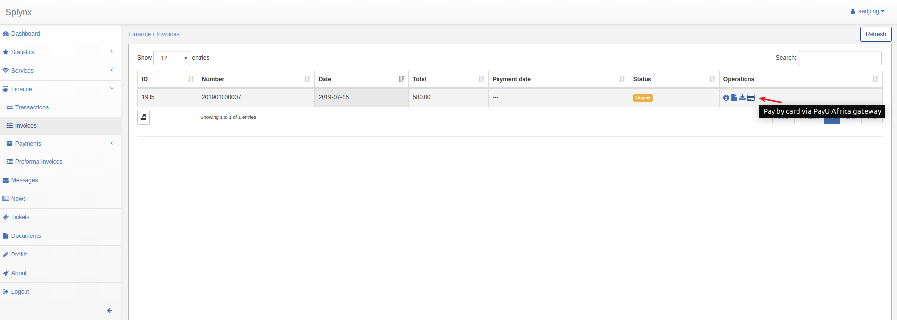
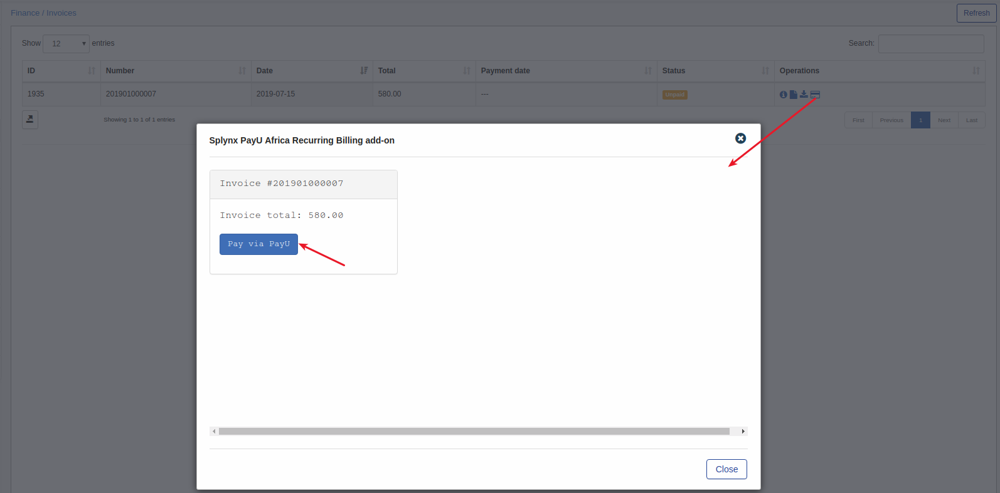
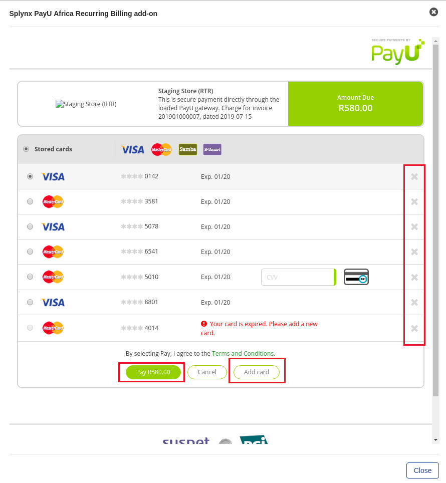

PayU Africa
===========

**PayU africa** is a Splynx add-on. It is used to pay via **PayU** Payment Gateway - [https://www.payu.co.za/](https://www.payu.co.za/)

To install PayU Africa addon use following commands:

```bash
apt-get update
apt-get install splynx-payu-africa
```
or you can install it from Web UI:

*Config -> Params -> Add-ons:*




You need a PayU account to start the integration. Registration page - [https://www.payu.co.za/enquiry-form](https://www.payu.co.za/enquiry-form)

PayU will provide you access to the Merchant Portal. At the Merchant Portal you will find: **Soap user name**, **SOAP Password** and **SafeKey**

After add-on installation you have to configure it under _Config / Integrations / Modules List_









* **Splynx URL** – URL of your server
* **Soap Username**, **Soap password**, **Safekey** – values from PayU’s Merchant Portal (look at the previous step)

Now customers can pay via PayU portal in _Finance / Invoices_







When a customer pays the invoice, the information about the card is saved to the system. Customers can look at their stored cards when they paying their invoices via *PayU Africa gateway*. Customers can add or remove their cards only during payment process.


