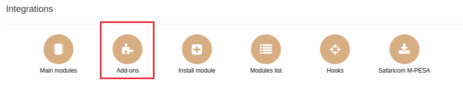
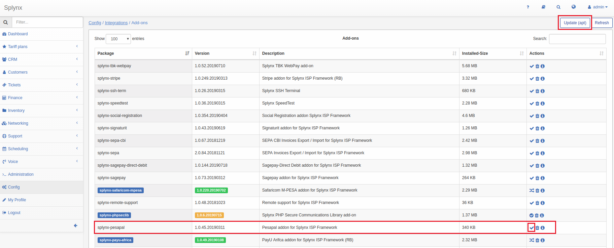
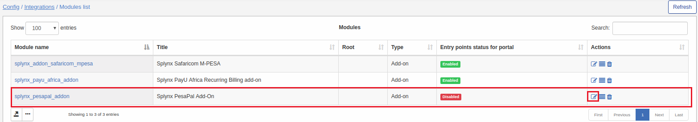
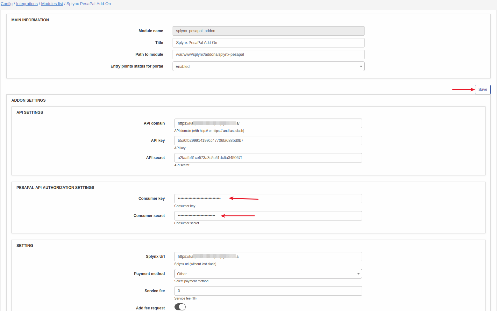
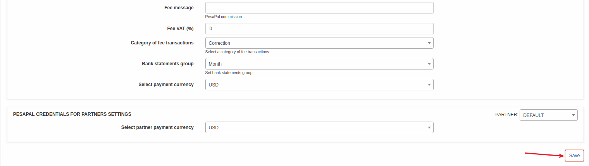
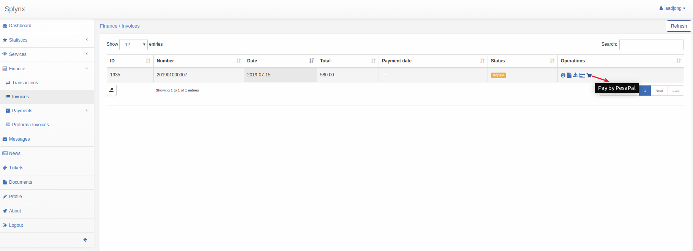
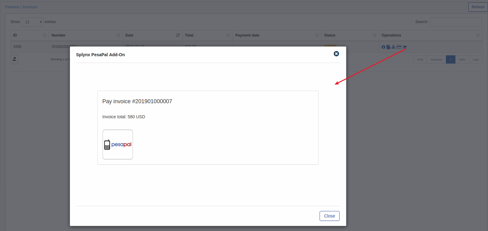
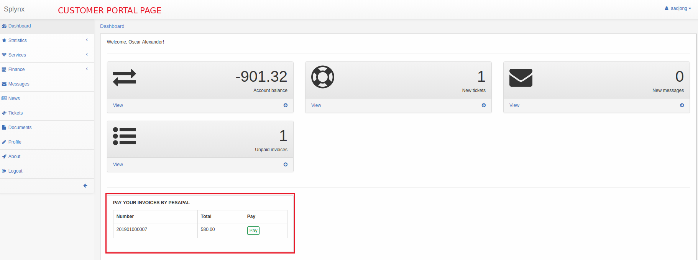

Pesapal is a Splynx add-on. It's used to synchronize customers, invoices and payments with Pesapal Payment Gateway - https://www.pesapal.com/.

To install Pesapal add-on use following commands:

```bash
apt-get update
apt-get install splynx-pesapal
```

or you can install it from Web UI:

*Config → Integrations → Add-ons:*





After installation you have to configure addon:

*Config → Integrations → Modules list:*








To get Consumer Key and Consumer Secret, you have to go to your PesaPal dashboard, press "Send" button and you will receive them on your email:


Now customers can pay their invoices using Pesapal system in Finance / Invoices:






If everything went well, you will see status of invoice as "Paid" (Portal and Admin).

To refill balance customers can use the link - “http://yoursplynxurl/pesapal”, where they have to enter registration details for the first time:


On Portal main page customers can also see the list of non-paid invoices and "Pay" button near each invoice:


