Pesapal
==========

Pesapal is a Splynx add-on used to synchronize customers, invoices and payments with the Pesapal Payment Gateway - https://www.pesapal.com/.

The add-on can be installed in two methods, via the CLI or the Web UI of your Splynx server.

To install the Pesapal add-on via CLI, the following commands can be used:

```bash
apt-get update
apt-get install splynx-pesapal
```

To install it via the Web UI:

Navigate to `Config → Integrations → Add-ons`:


Locate or search for the "splynx-pesapal" add-on and click on the install icon in the *Actions* column:

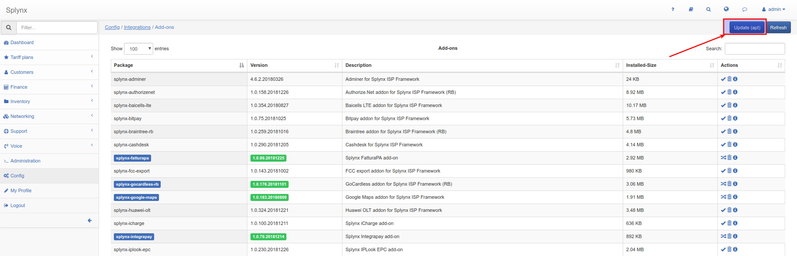

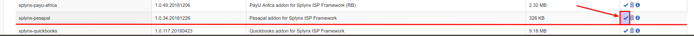

Click on the "OK, confirm" button to begin the installation process

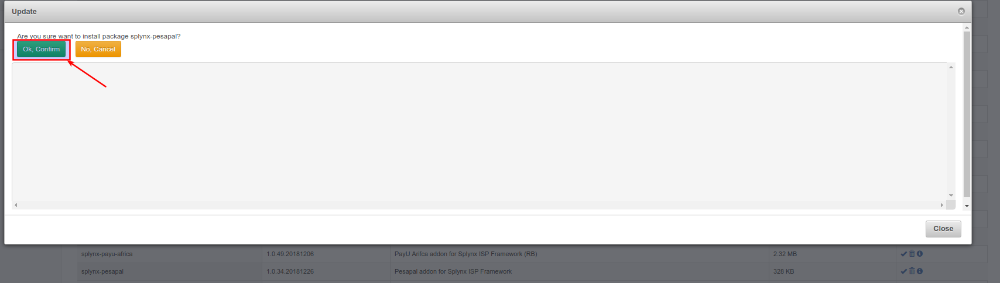

After the installation process has completed, you have to configure the addon:

Navigate to `Config → Integrations → Modules list`:


Locate or search for the "splynx-pesapal" add-on and click on the edit icon in the *Actions* column

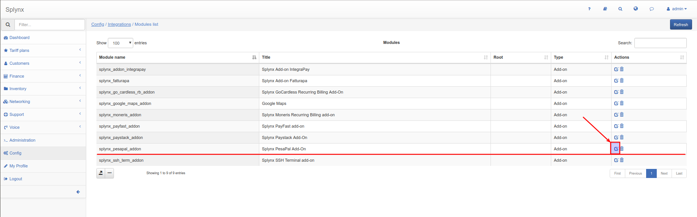

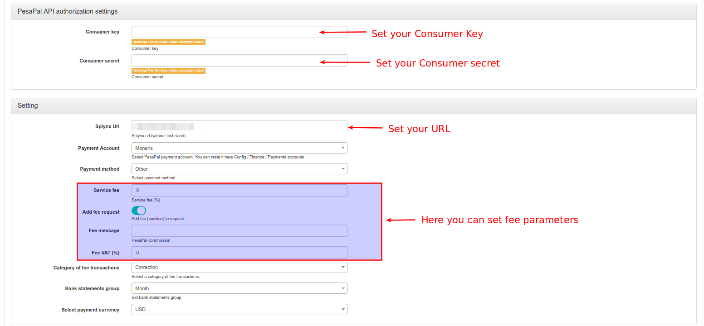

To obtain your Consumer Key and Consumer Secret, you have to log into your PesaPal dashboard, and press the "Send" button, you will receive the information on your email:

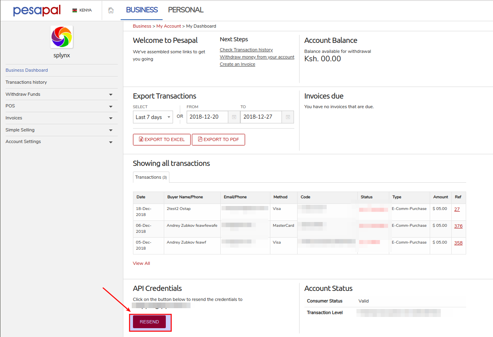

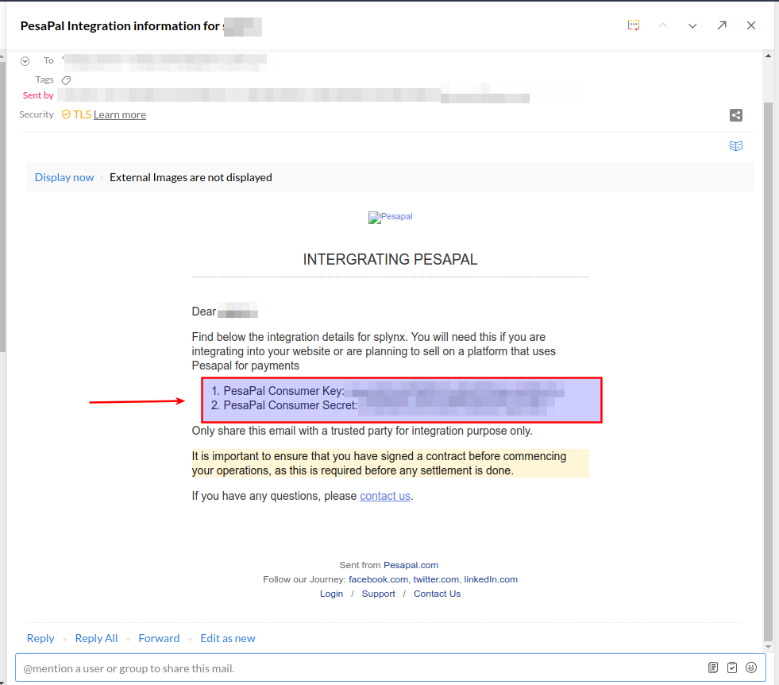

Once the configuration has been completed, customers can pay for their invoices using the Pesapal system in *Finance / Invoices*:

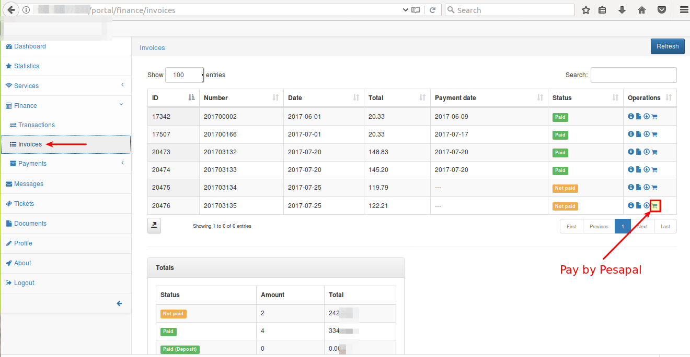

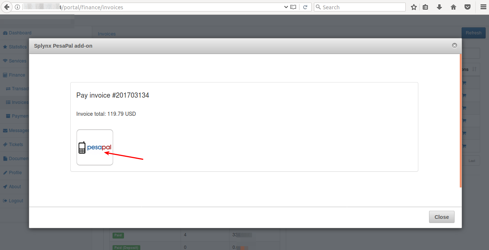


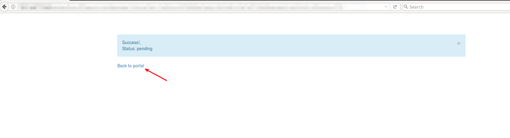

If everything went well, you will see the status of the invoice marked as "Paid" (in the customer and Admin portal).

To refill balances, customers can use the following link - “http://yoursplynxurl/pesapal”, where they have to enter their registration details for the first time:

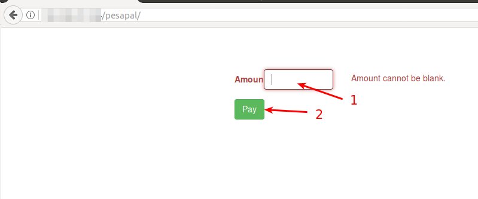

On the dashboard of the customer portal, customers can also see the list of un-paid invoices and a "Pay" button near each invoice:

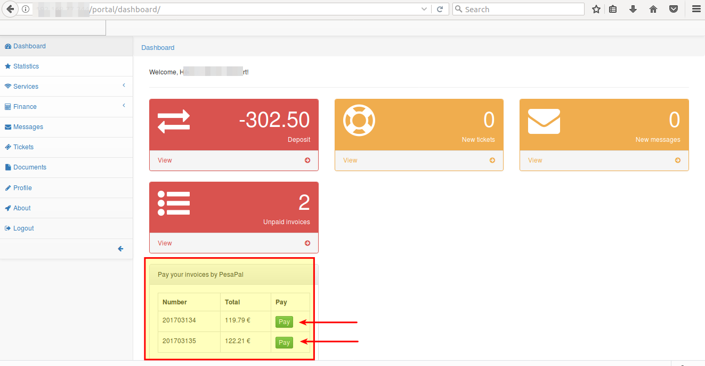
