SageOne
====================

**SageOne is a Splynx add-on. It is using for synchronization of finance operations between SageOne and Splynx**

**Integration described on video: https://www.youtube.com/watch?v=ctuNzm_qWgs**

*SageOne is NOT allow charge of all customers*

Install the add-on with commands:

```bash
apt update
apt install splynx-sageone
```

**or you can install it from Web UI:**

**Config → Integrations → Add-ons:**

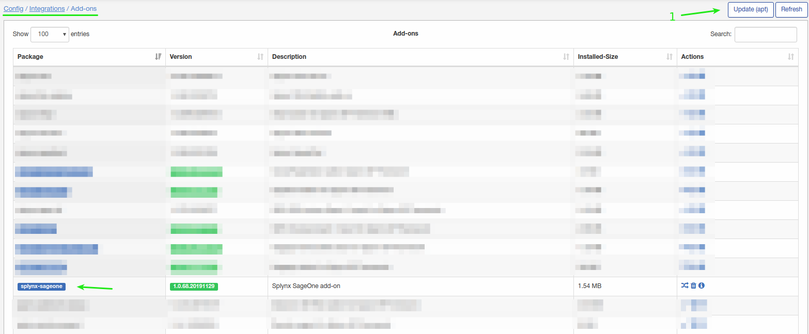
Press "Update(apt)" button first and then install SageOne.
On this screenshot an add-on already installed.

**After that you need create new SageOne account and configure your account.**

**We recommend to start with fresh SageOne account, if you have customers data there, we are not able to match customers in SageOne with customers in Splynx.**

Once new SageOne account created go to **Config/Integrations/Modules list** and press "Edit" button on *splynx_addon_sageone_accounting*:

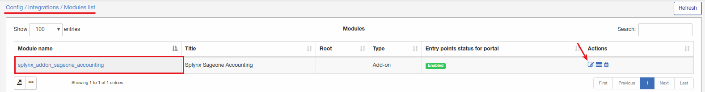

and specify your account details:

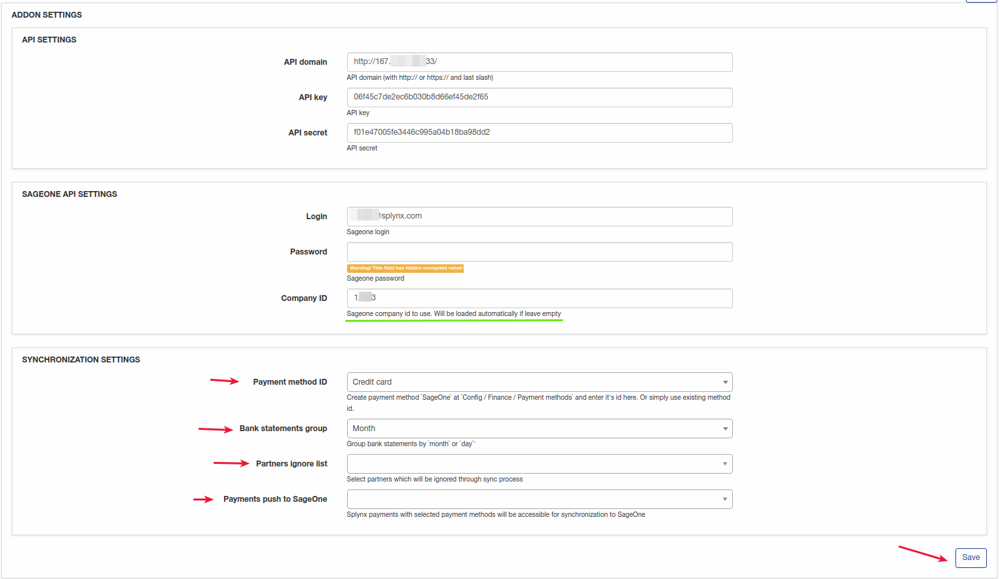
Here you have to specify your SageOne account login and password.
"Company ID" will be loaded automatically if leave empty but if you know your Company ID please insert it.

**Configure and map your accounting categories and bank accounts**

For categories configuration go to **Config/Finance/Accounting categories**

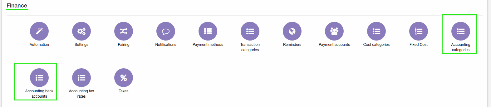

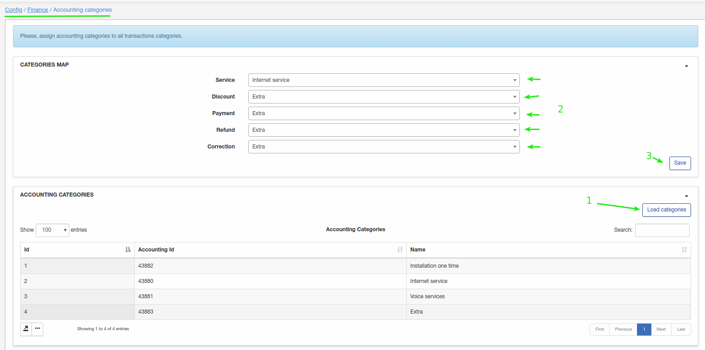
Press "Load categories" for loading categories from SageOne account.
On this screenshot we have only 4 categories so for services we selected "internet services" category, and for the rest - "Extra" category.
Don't forget to save configuration.

For payment synchronization you have to configure bank accounts:

For bank accounts configuration go to **Config/Finance/Accounting bank accounts**
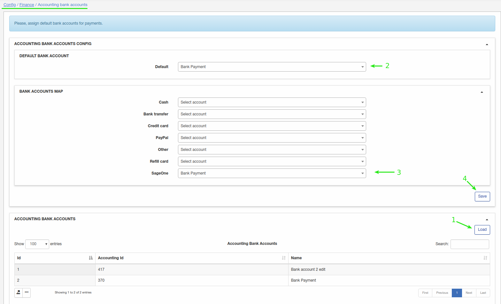
We have 2 bank accounts and we will use #2 "Bank Payment" as default account and specify it for SageOne payment method.


**Once add-on configured we can start working with SageOne.**

Go to **Config/Integrations/Splynx Sageone Accounting** and push your customers to SageOne.
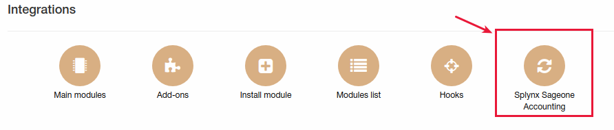

We have only 3 customers and by pressing **Export customers to SageOne** we will synchronize our customers with SageOne account.

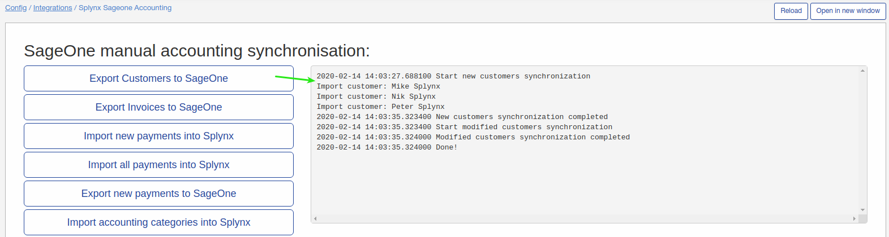

Now you can login to your SageOne account to ensure that customers were synchronized:
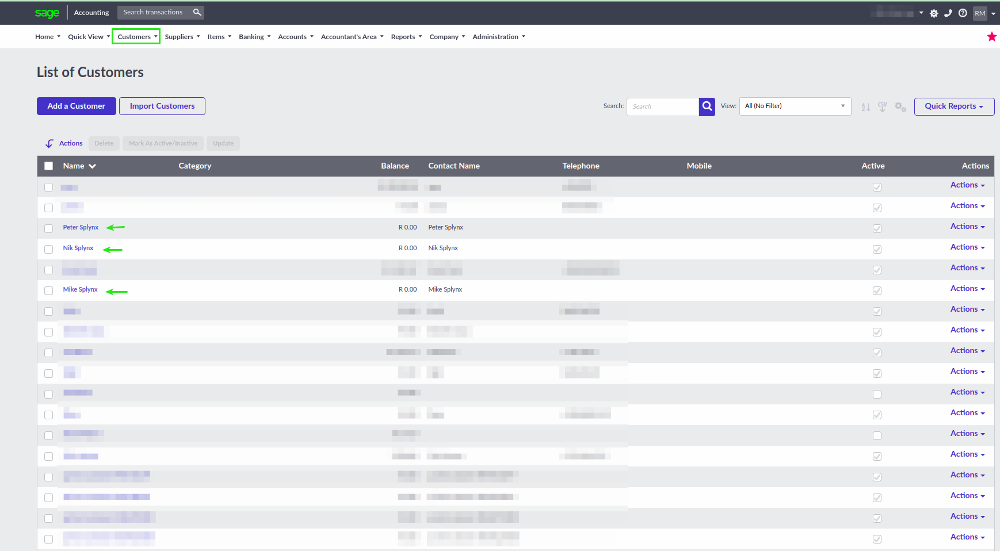

You can check SageOne synchronization logs in **Administration/Logs/Accounting integrations**:
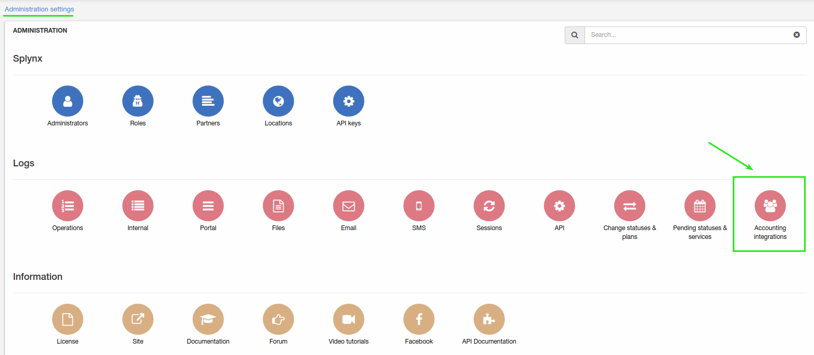
Here you can check statuses of all synchronized customers, payments, invoices.

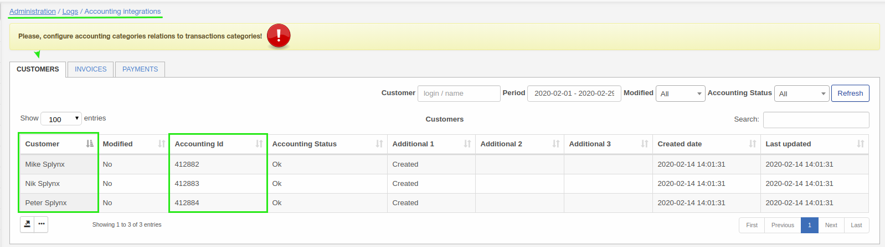
As you can see on *Customers* tab there are 3 entries for 3 synced customers. Every synchronized customer, invoice, payment will have "Accounting ID". If this value is empty - item wasn't synchronized with Sageone. In this case you can run manual synchronization or wait until next scheduled synchronization.
On this screenshot you can see warning about categories configuration because this screenshot was made before mapping categories in *Config/Finance/Accounting categories*

Once customers synchronized we can create some invoice and push it to SageOne.
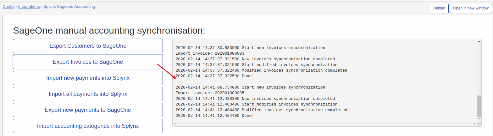
As you can see from a screenshot invoice was synchronized.

In logs you can check synchronized invoices too:
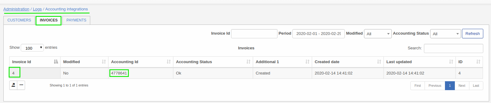

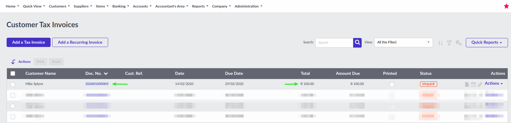
On SageOne we can also check this UNPAID invoice.

Once invoice was PAID, Splynx will import new payments(bank account must be configured for payments synchronization) automatically.
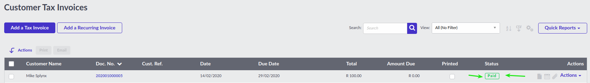

Or you can force payments synchronization here:
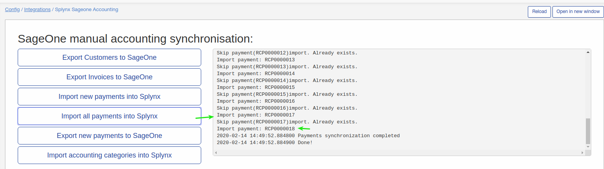

**NOTE! To make invoice status "paid" in Splynx after payment synchronization - "Allow pay invoices from account balance" option must be enabled for a customer**
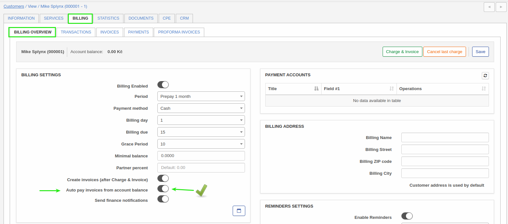

Now you can check logs of synced payments:
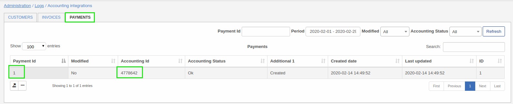

Now we can check invoice status:
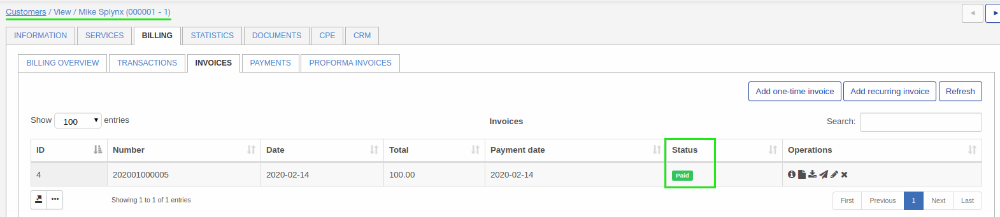

Transaction was created:
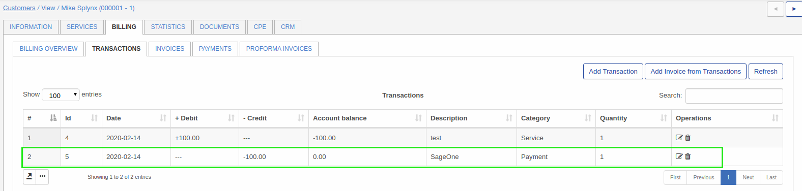

Payment:
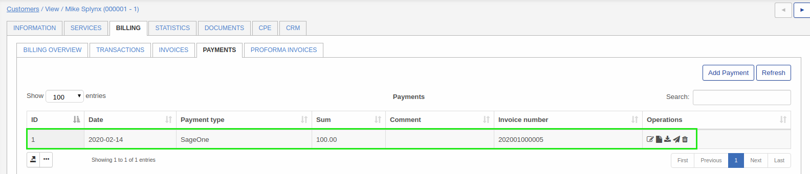


**Some examples of errors what can happen**

*Scenario*

An invoice was synchronized earlier, deleted in Splynx(for example invoice was incorrect and you have deleted it and create a new once with the same number) and you are trying to push invoices into SageOne:

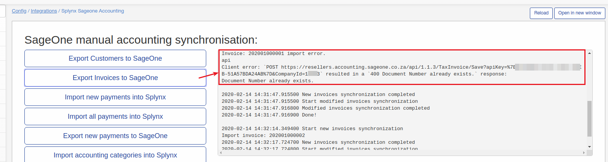

How to fix: remove an invoice from SageOne account or if you can't remove it from SageOne re-create invoice in Splynx with new invoice number.
