SagePay Direct debit
====================

**SagePay Direct debit is a Splynx add-on. It used to customers be able to pay their invoices by https://sagepay.co.za/**

*SagePay Direct debit also allows to charge all customers by using *Direct debit order*

Install the add-on with commands:

```bash
apt update
apt install splynx-sagepay-direct-debit
```

**or you can install it from Web UI:**

**Config → Integrations → Add-ons:**


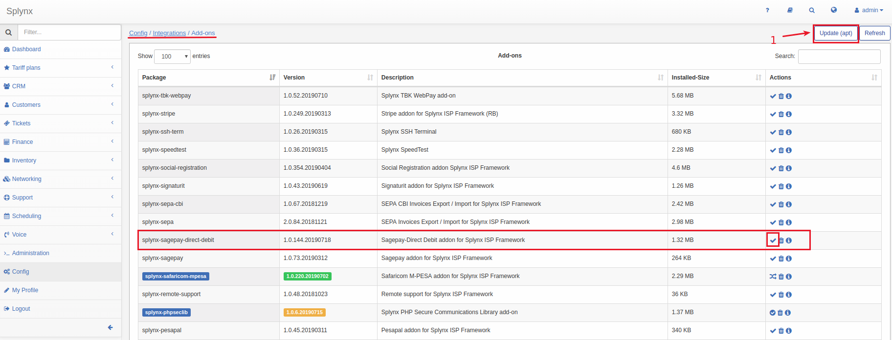


**After that you need to registrate on **[*https://sagepay.co.za/*](https://sagepay.co.za/)** . and configure your account.**


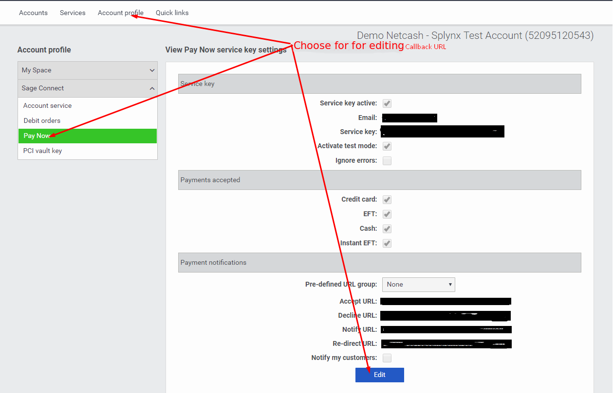

While you are configuring your "Sagepay" account you should to paste your Splynx URL (https://your_domain_name/sagepay/result) to the *Payment notifications* as on the screenshot:

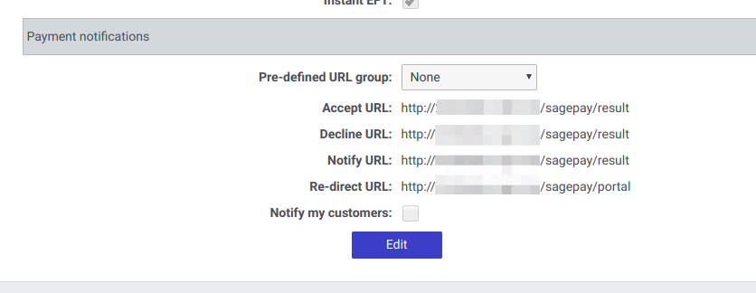

After installation and registration you have to configure parameters:

Config → Integrations → Modules list:


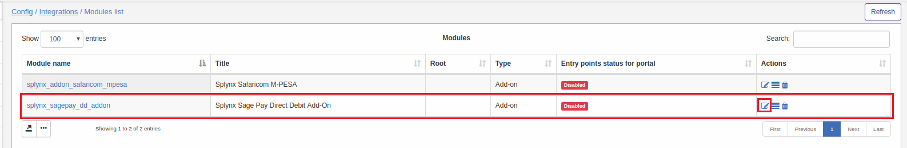

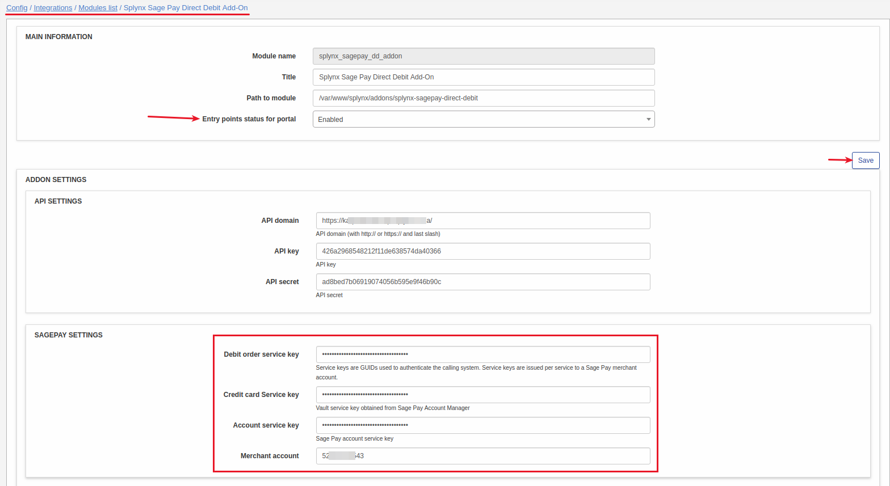
****Servicice key - this key need only when customers use their own credit cards to pay.****
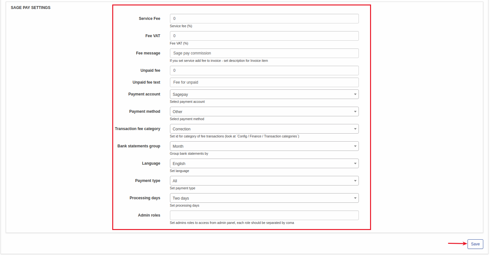

You can also set fee for customers and Set admins roles to access from admin panel.

After installation SegaPay Direct Debit, customers will see new pay window on their Dashboard and new pay button on their invoices.


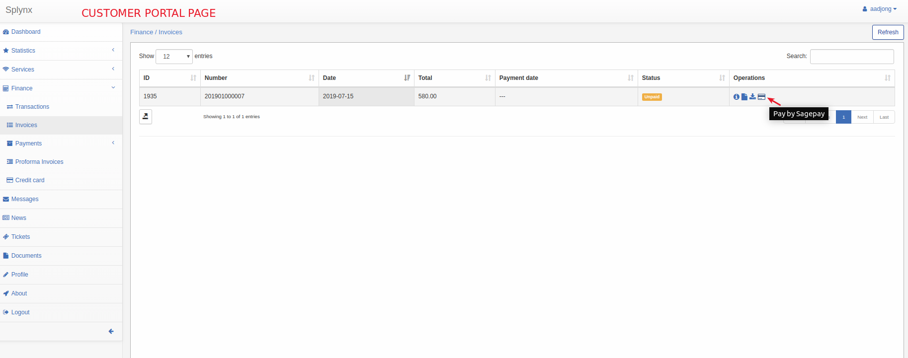

After pressing those buttons customers will see payment window where they have to set their Credit card or Bank account depending on how they want to pay their invoices:

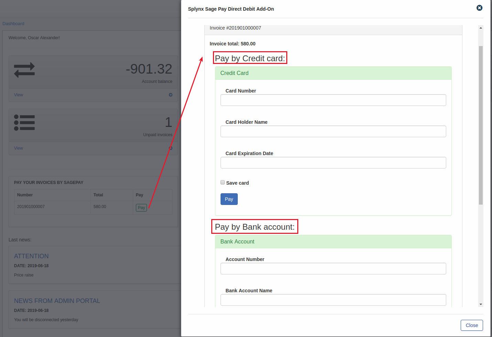

or they can set their credit card or bank account in *Finance -> Credit Card* to use it all the time when they will make payments:

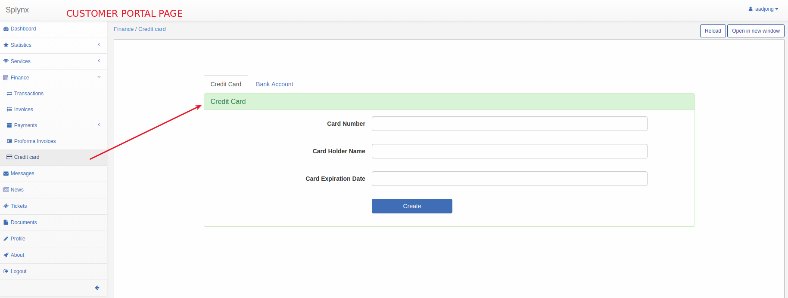

You can also charge all customers using with few clicks! Go to: Finance → Invoices, set period and click "Charge" as on the screenshot:


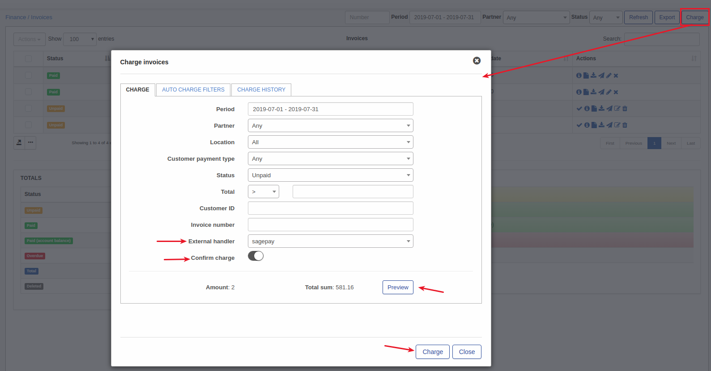


After that splynx will create and send debit batch file with payment details to the [*https://sagepay.co.za/*](https://sagepay.co.za/) after what SegaPay procces this file. (The Statement API runs everyday at 00h15 and checks all transactions for the previous day)

Then Splynx send a request once per day to SagePay by ****cron**** and sage pay will return you payment status what you can view Payments status by *“Sage Pay check payments”* in the *finance* menu:

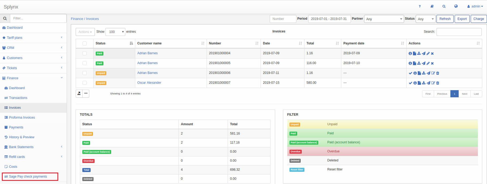

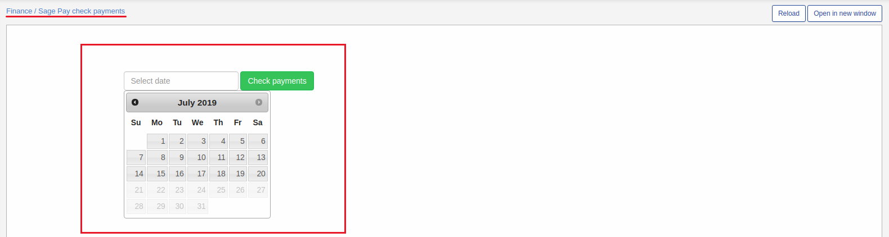
