SagePay
====================

**SagePay Direct debit is a Splynx add-on. It used to customers be able to pay their invoices by https://sagepay.co.za/**

Install the add-on with commands:

```bash
apt update
apt install splynx-sagepay
```

**or you can install it from Web UI:**

**Config → Integrations → Add-ons:**

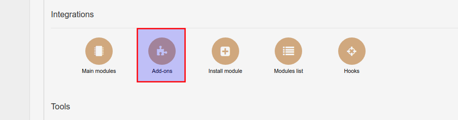

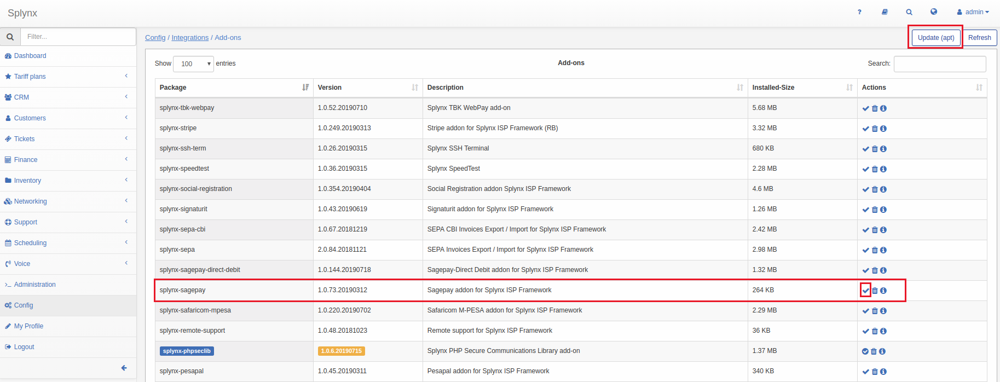

**After that you need to registrate on **[*https://sagepay.co.za/*](https://sagepay.co.za/)**  **and configure your account.**

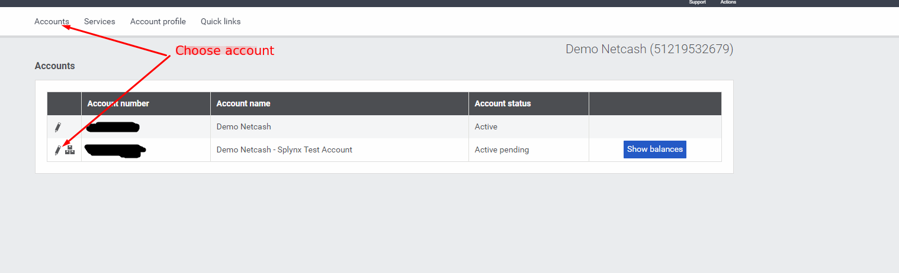

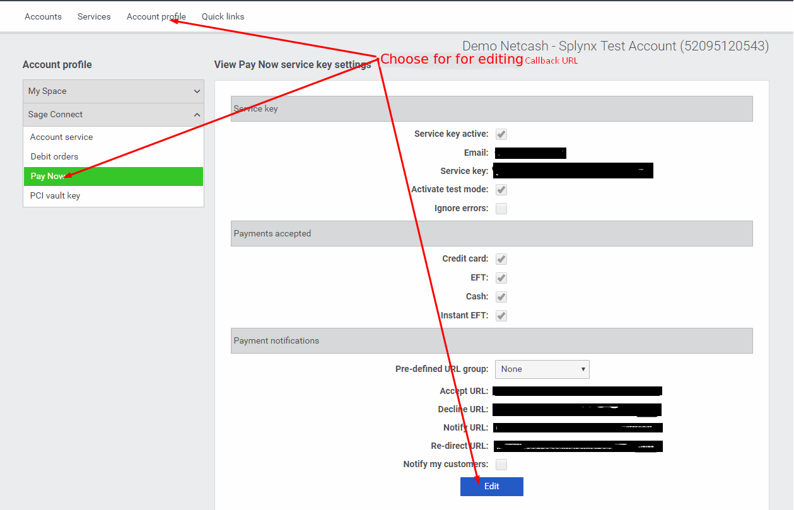

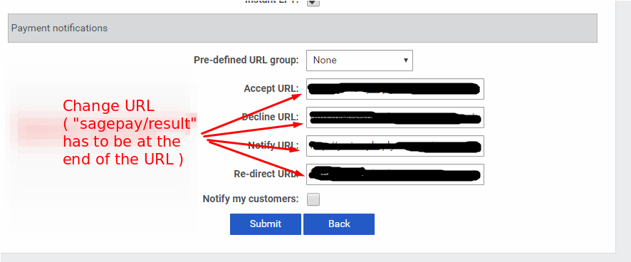

After installation and registration you have to configure add-on params:

Config → Integrations → Modules list:

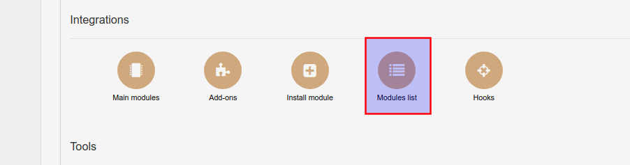

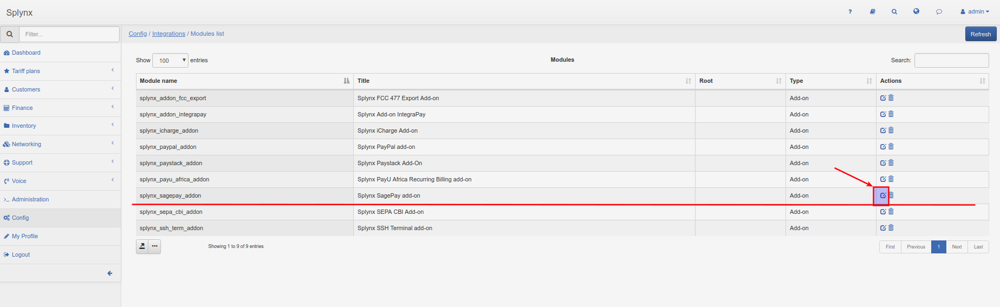

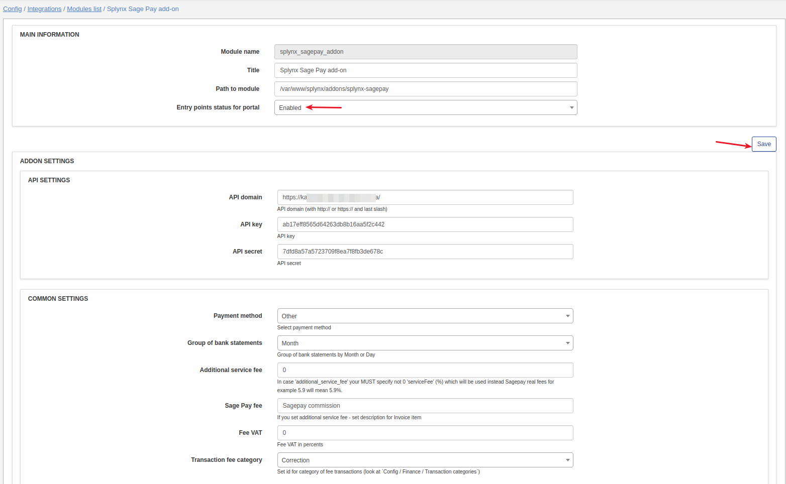


**Entry point status for portal** means enable SagePay widget for customer portal.
**Service key** and **Software vendor key** provided by SagePay.
After installation SagePay, customers will see a new pay button on their invoices.

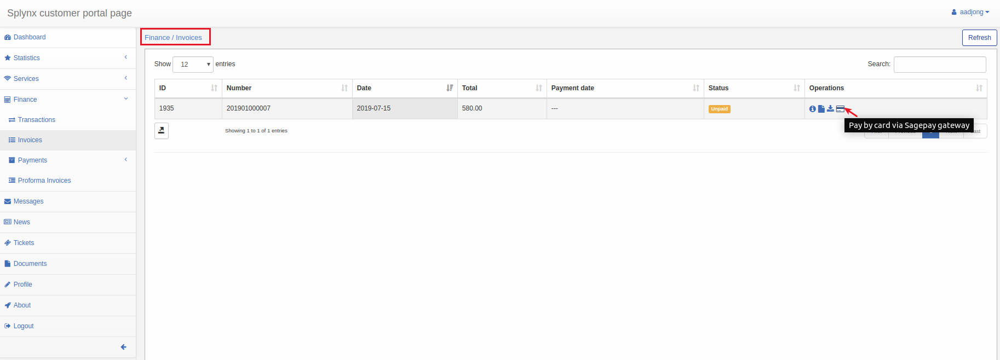

After pressing those buttons customers will see payment window where they have to confirm payment:

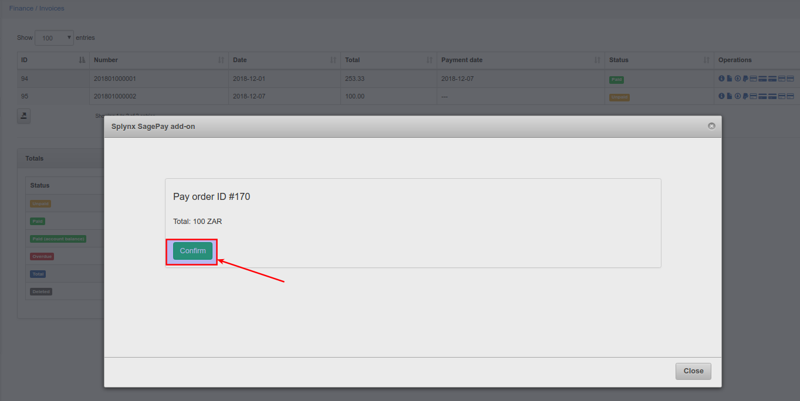

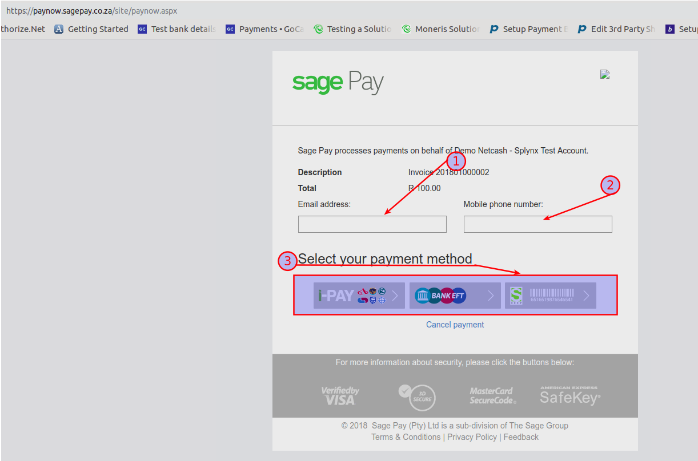


If everything went well, you will see status of invoice as "Paid" (portal and admin).

Also if in SagePay module settings entry points(widgets) enabled you will see this widget on customer portal:
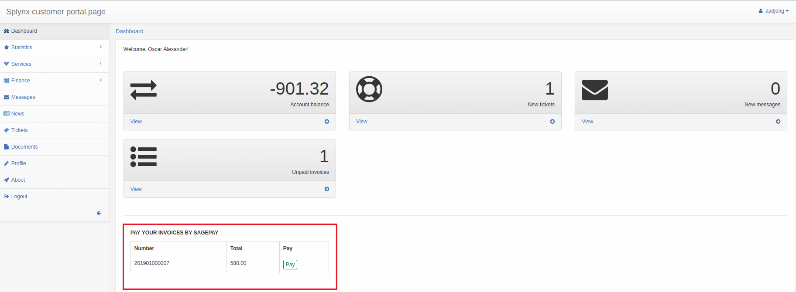
