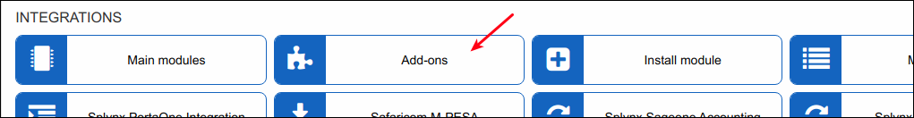
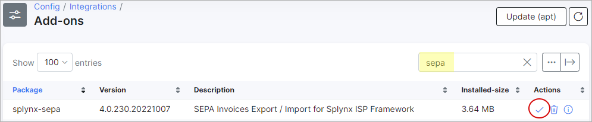
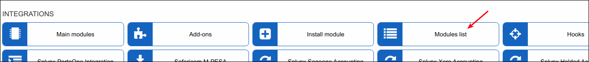
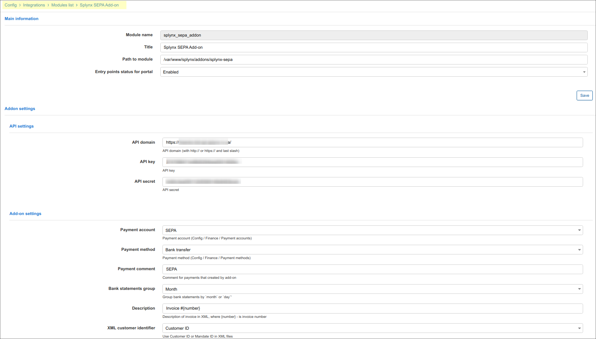
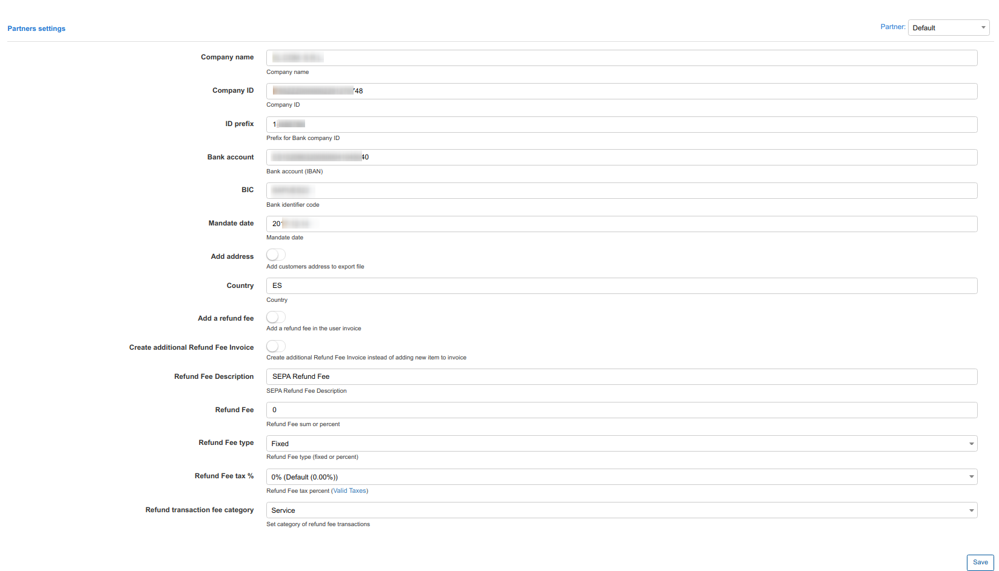
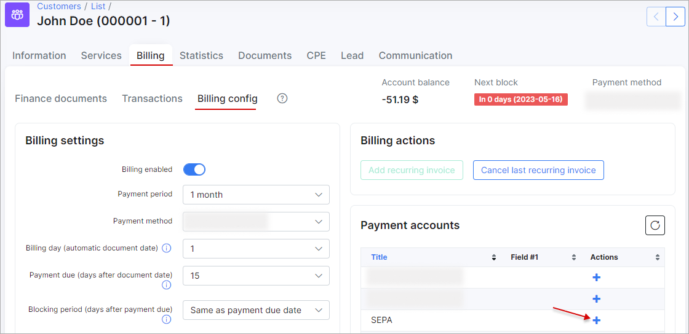
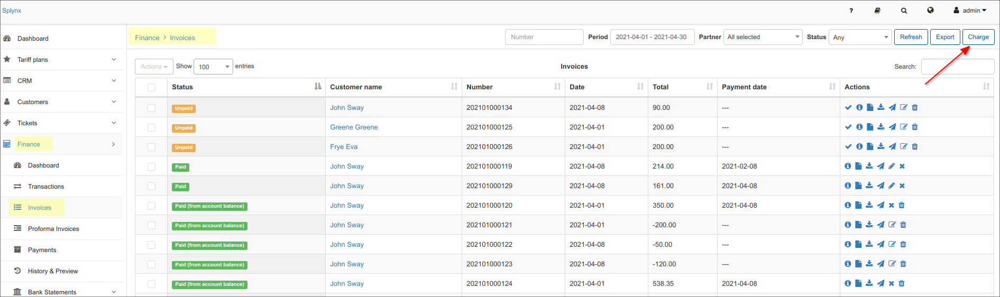
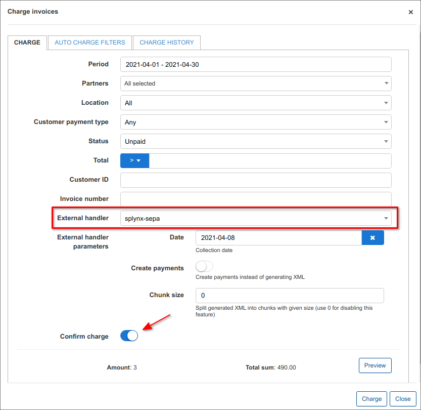
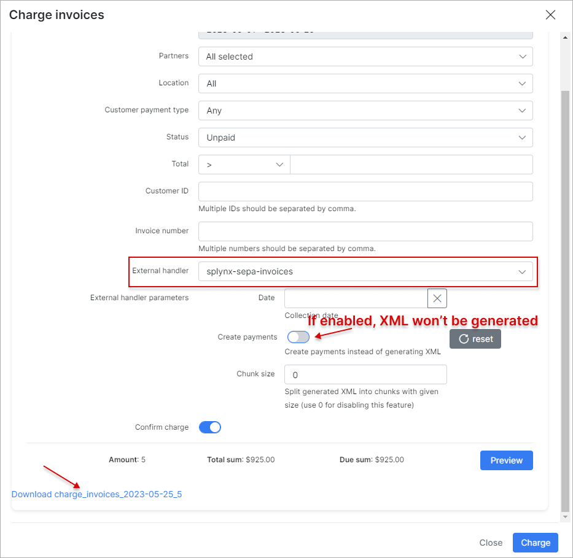
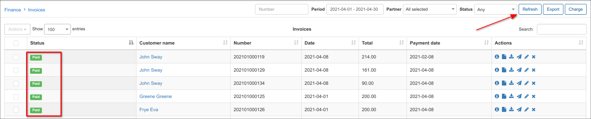

SEPA debit orders
=================

SEPA is a European standard for bank payments. You can install the SEPA add-on and charge your customer via Direct debit orders.

The add-on can be installed in two methods, via the CLI or the Web UI of your Splynx server.

**1\. SEPA Installation**

To install the SEPA add-on via CLI, the following commands can be used:

```bash
apt-get update
apt-get install splynx-sepa
```

To install it via the Web UI:

Navigate to `Config → Integrations → Addons`:



Locate or search for the "splynx-sepa" add-on and click on the install icon in the *Actions* column, you will be presented with a window to confirm or cancel the installation, click on confirm to begin the installation process:



After the installation process has completed, you have to configure the add-on.

**2\. Configuration**

Navigate to `Config→Integrations→Modules list→`



Locate or search for the "splynx-pesapal" add-on and click on the edit icon in the *Actions* column and fill in provided fields





where: ID prefix - is the bank contact ID prefix : ES12500 example (before company VAT ID)

**Customer’s IBAN** can be set in the customer profile (see below)



**3\. Generate the XML file for the bank.**

Navigate to _Finance/Invoces/_ and click on the _Charge_ button




After clicking "Charge" you will see a download xml document link.

**4\. Mark invoices as paid**



Check invoices



**5\. SEPA - process the return file from the bank with non-payers**

Sometimes customers does not have funds on their bank accounts. In that case, the Bank sends you an XML file back with returns. It will contain data about customers which the Bank was not able to charge. You can import this file to Splynx as well, and then paid invoices of non-payers will become unpaid again, so you can charge them next month and include the fee for a failed charge.

The handler to choose is SEPA XML returns:


