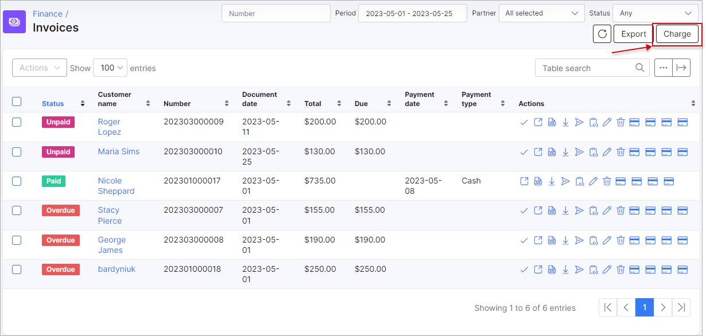

SEPA debit orders
=================

SEPA is a European standard for bank payments. You can install SEPA add-on and charge your customer via Direct debit orders.

**1\. SEPA Installation**

The Installation is pretty simple:

```bash
apt-get update
apt-get install splynx-sepa
```

or In Splynx you can select _Config → Integrations → Addons_


find _splynx-sepa_ and click install

**2\. Configuration**

Open Config→Integrations→Modules list→Splynx SEPA Add-on and fill in selected fields


where: ID prefix - it's bank contact ID prefix : ES12500 example (before company VAT ID)

**Customer’s IBAN** can be set in the customer profile (see below)


**3\. Generate the XML file for the bank.**

Open _Finance/Invoces/_ and click on the _Charge_ button



After clicking "Charge" you will see download xml document link.

**4\. Mark invoices as paid**


Check invoices


**5\. SEPA - process the return file from bank with non-payers**

Sometimes customer doesn't have funds on his bank account. In that case Bank sends you XML file back with returns. It will contain data about customers Bank was not able to charge. You can import this file to Splynx as well, and then paid invoices of non-payers will become unpaid again. So you can charge them next month and include the fee for failed charge.

The handler to choose is SEPA XML returns:


