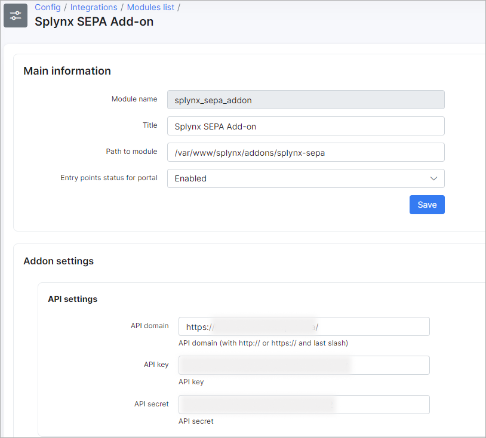

SEPA debit orders
=================

SEPA is a European standard for bank payments. You can install SEPA add-on and charge your customer via Direct debit orders.

**1\. SEPA Installation**

The Installation is pretty simple:

```bash
apt-get update
apt-get install splynx-sepa
```

or In Splynx you can select _Config → Integrations → Addons_


find _splynx-sepa_ and click install


**2\. Configuration**

Open Config→Integrations→Modules list→Splynx SEPA Add-on and fill in selected fields



where: ID prefix - it's bank contact ID prefix : ES12500 example (before company VAT ID)

**Customer’s IBAN** can be set in the customer profile (see below)


**3\. Generate the XML file for the bank.**

Open _Finance/Invoces/_ and click on the _Charge_ button


By opening a second tab _Export history_ you can see all errors in generation or download ready XML files.

In this example we have an error:


By clicking on icon _Download_ we can get an error description file and open it in Notepad:


In our example it says one of our customers has empty IBAN in his information tab. After fixing it and re-submitting the export we will find the correct status in Export history:


SEPA XML file is ready for downloading and sending to Bank for further processing and charging subscribers:


The line `<ReqdColltnDt> 2017-06-01</ReqdColltnDt>` says when Bank should charge the customer. By default we put there the date of XML generation. It can be changed in XML file before sending.

**4\. Mark invoices as paid**


My file contains “_Creating payment for invoice 201801000001: ok!_”

Check invoices


**5\. SEPA - process the return file from bank with non-payers**

Sometimes customer doesn't have funds on his bank account. In that case Bank sends you XML file back with returns. It will contain data about customers Bank was not able to charge. You can import this file to Splynx as well, and then paid invoices of non-payers will become unpaid again. So you can charge them next month and include the fee for failed charge.

The handler to choose is SEPA XML returns:

