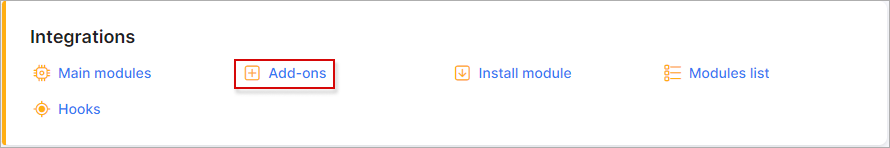
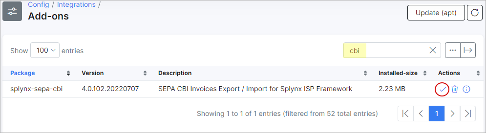
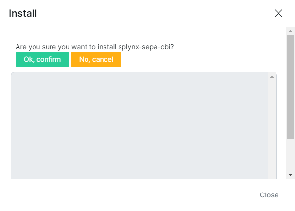
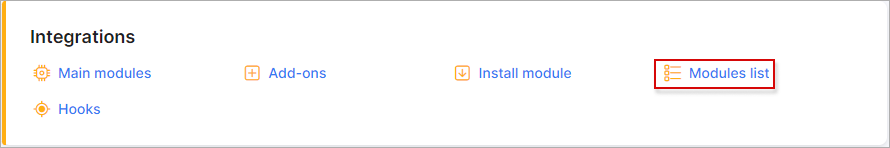
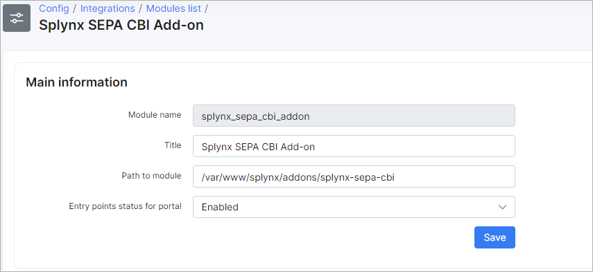
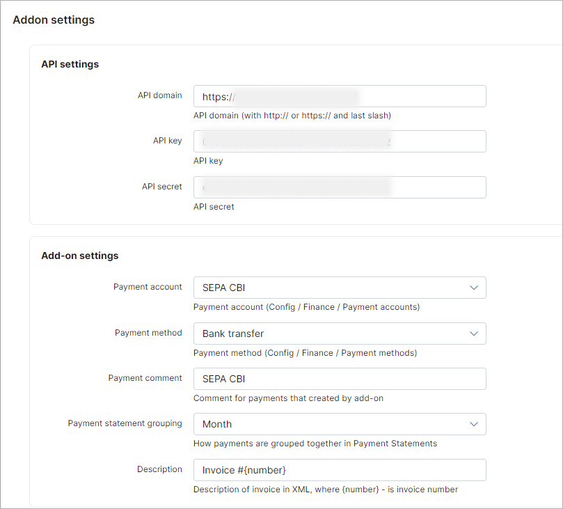
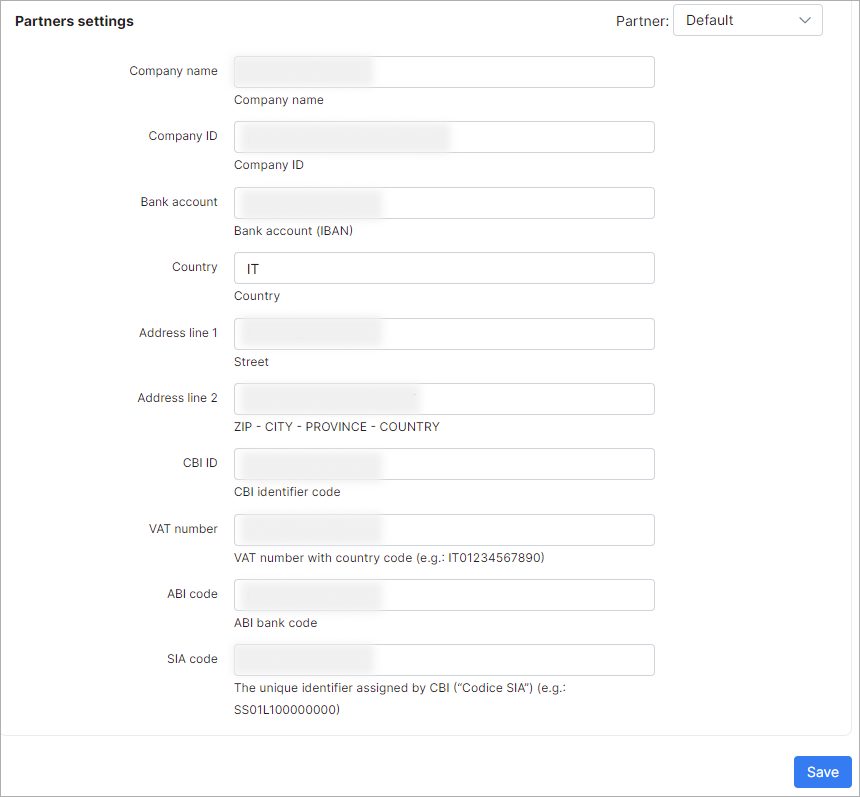

SEPA CBI
=======================

The *SEPA CBI* add-on generates SEPA Credit Transfer requests in the XML format standardized by CBI and accepted by Italian banks.

## Installation

The add-on can be installed in two methods: via the CLI or the Web UI of your Splynx server.

To install the SEPA CBI add-on via CLI, the following commands can be used:

```bash
apt-get update
apt-get install splynx-sepa-cbi
```

To install it via the Web UI:

Navigate to `Config → Integrations → Add-ons`:



Locate or search for the "splynx-sepa-cbi" add-on and click on the *Install* icon in the *Actions* column: 



You will be presented with a window to confirm or cancel the installation. Click on the `OK, confirm` button to begin the installation process:



After the installation process has completed, you have to configure the add-on.

## Configuration

Navigate to `Config → Integrations → Modules list`:



Locate or search for the "splynx_sepa_cbi_addon" and click on the *Edit* <icon class="image-icon"></icon> icon in the *Actions* column and fill in the provided fields:





