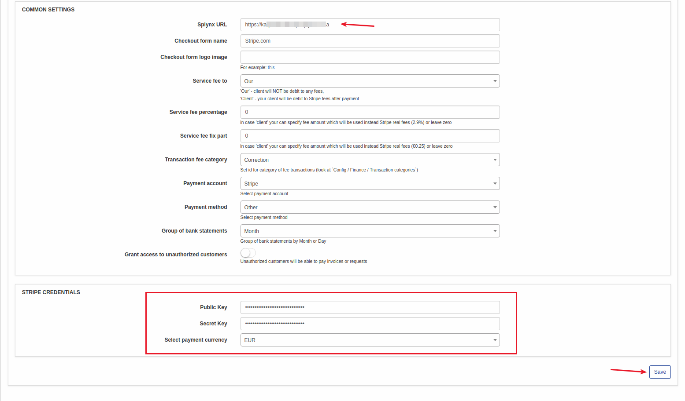
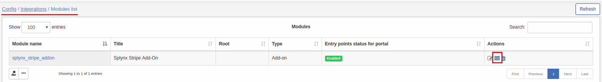
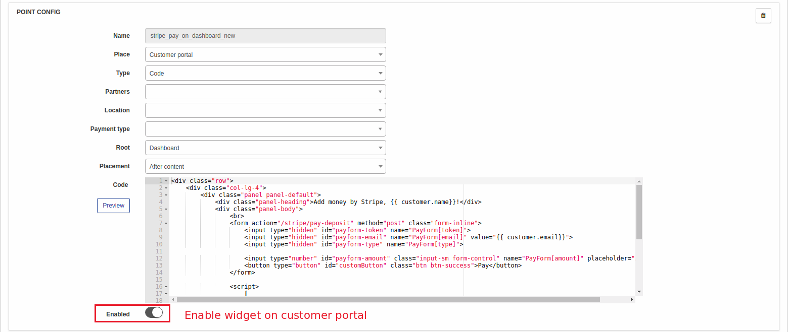
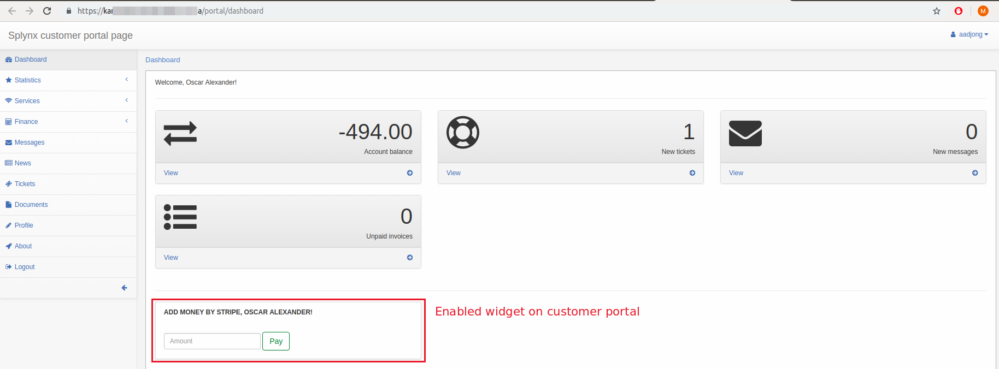
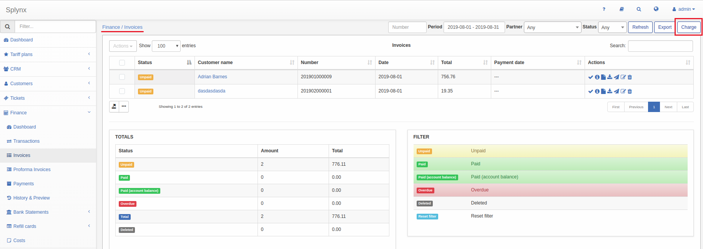

Stripe online payments
======================

Stripe is a Splynx add-on. It's used to synchronize customers, invoices and payments with *Stripe payment gateway* - [https://stripe.com](https://stripe.com).

To install Stripe add-on use next commands:


```bash
apt-get update
apt-get install splynx-stripe
```
or you can install it from Web UI:

Config → Integrations → Add-ons:


After installation you have to configure params in Config → Modules List → Stripe → Edit:


You have to set your Splynx URL, Public Key and Secret Key:




Then customers have to add a credit card:


After customer registered a credit card he/she will see this page:


Now customers can pay their invoices using [stripe.com](https://stripe.com) system in *Finance / Invoices*:


If everything went well, you will see status of invoice as *"Paid"* (in portal and in admin pages):

Also customer can add some money to account balance from the portal dashboard. To enable this feature go to Config → Modules List → Stripe → Edit entry points:




After that customer will see Stripe widget on a portal page:



Besides that, you can charge all invoices, using one button! Go to *Finance → Invoices*, set the period and click "Charge" as on a screenshot:




