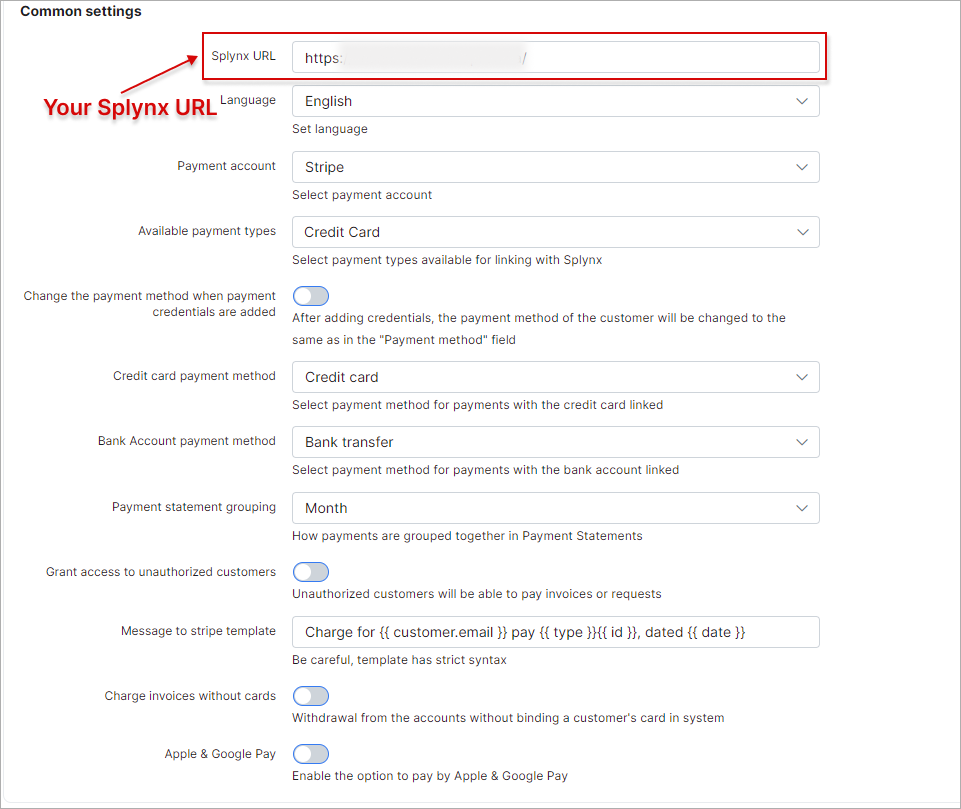

Stripe online payments
======================

Stripe is a Splynx add-on  used to synchronize customers, invoices and payments with the *Stripe payment gateway* - [https://stripe.com](https://stripe.com).

The add-on can be installed in two methods, via the CLI or the Web UI of your Splynx server.

To install the Stripe add-on via CLI the following commands can be used:


```bash
apt-get update
apt-get install splynx-stripe
```
To install it via the Web UI:

Navigate to `Config → Integrations → Add-ons`:


Locate or search for the "splynx-stripe" add-on and click on the install icon in the *Actions* column, you will be presented with a window to confirm or cancel the installation, click on confirm to begin the installation process:


After the installation process has completed, you have to configure the parameters in *Config → Modules List*


Locate or search for the "splynx-stripe" add-on and click on the edit icon in the *Actions* column


You have to Set your Splynx URL, Company Name, Public Key and Secret Key:



Customers the have to add a credit card in the customer portal:


Once the configuration is completed, customers can pay for their invoices using the [stripe.com](https://stripe.com) system in *Finance / Invoices*:


If everything went well, you will see the status of the invoice marked as *"Paid"* (in the customer and admin portal):


Additionally, you can charge all customers using one button! Navigate to *Finance → Invoices*, set the period and click on "Charge" as depicted below:


