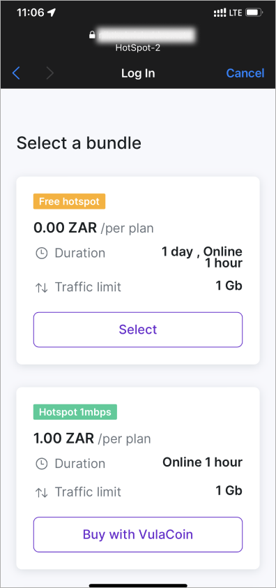
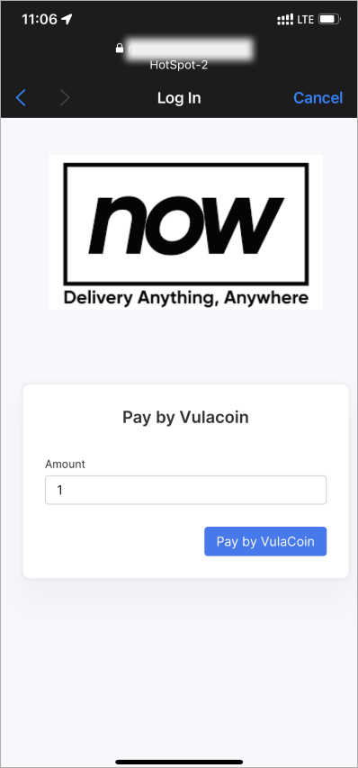
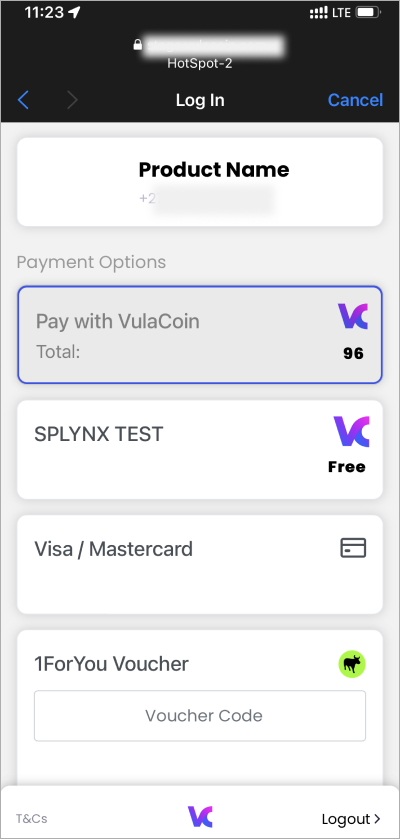
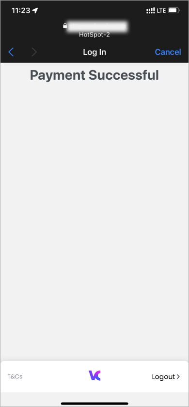
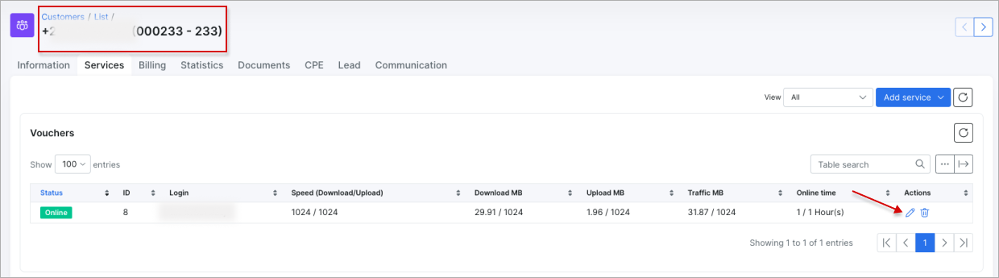
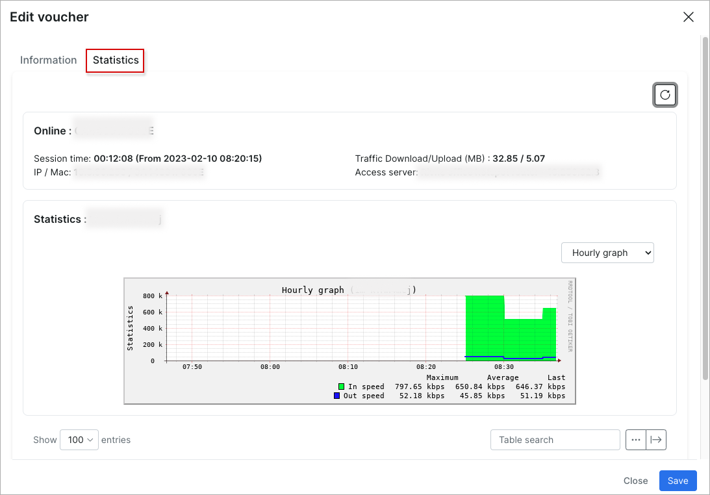

VulaCoin
==================

VulaCoin is a Splynx add-on which allows to purchase vouchers in HotSpot add-on via the VulaCoin payment gateway - https://www.vulacoin.com/.

The add-on can work with various credit cards and bank accounts, payment details can be added or selected during the payment process.


## Installation

The add-on can be installed in two methods, via the **CLI** or the **Web UI** of your Splynx server.

To install the **VulaCoin** add-on via **CLI**, the following commands can be used:

```
apt-get update
apt-get install splynx-vulacoin
```

To install it via the **Web UI**:

Navigate to `Config → Integrations → Add-ons`:


Locate or search for the `splynx-vulacoin` add-on and click on the **Install** icon in the *Actions* column:


Click on the **OK, confirm** button to begin the installation process:


## Configuration

After the installation process has completed, you have to configure add-on - navigate to `Config → Integrations → Modules list`:


Locate or search for the `splynx_vulacoin_addon` add-on and click on the
<icon class="image-icon"></icon> (**Edit**) icon in the *Actions* column:


**Main information & API settings**

Make sure that **Entry points** option is **enabled**. Note that changes are not saved until you click **Save**.

The configuration of add-on **Entry points** can be found in `Config → Integrations → Modules list`, near the `splynx_vulacoin_addon` module item in *Actions* column, click on the <icon class="image-icon"></icon> (*Edit entry points*) icon. More information about *Modules list* can be found [here](configuration/integrations/modules_list/modules_list.md).


**Vulacoin credentials & Merchant details**

The add-on credentials can be obtained from your [VulaCoin](https://stage.vulacoin.com/admin/login) account.


**Common settings**


## Purchase of HotSpot vouchers

Before the purchase, you might find it useful to read the following articles on the related topics: [HotSpot](addons_modules/hotspot_addon/hotspot_addon.md), [Prepaid vouchers](customer_management/prepaid_vouchers/prepaid_vouchers.md) and [Vouchers (configuration)](configuration/main_configuration/vouchers/vouchers.md).

Log in to HotSpot on your mobile, select a bundle and click on `Buy with VulaCoin`:



Enter the *Amount*, then click the `Pay by Vulacoin` button:



Choose payments options:



Then a message should appear whether the payment is successful:



__________________________________________________________

Once a voucher is in use, it is possible to view the statistics in *Customer's Services* tab, cost of usage and detailed information of the voucher:





## Required Permissions
  
For the payment system to work properly, Splynx needs to have access to some external services. Therefore, these hosts should not be blocked by firewall rules:
  
<details style="font-size: 15px; margin-bottom: 5px;">
<summary><b>Allowed URLs</b></summary>
<div markdown="1">

```
vulacoin.com
*.vulacoin.com
api.ravepay.co
*.bankserv.co.za
*.cardinalcommerce.com
*.capitecbank.co.za
oppwa.com
*.absa.co.za
*.africanbank.co.za
*.bidvestbank.co.za
*.fnb.co.za
*.investec.com
*.nedbank.co.za
*.sasfin.co.za
*.standardbank.co.za
*.ubank.co.za
3dsecureprd.fnb.co.za
acs.nedsecure.co.za
*.bankserv.co.za
*.ctpe.net
ctpe.net
ppipe.net
*.ppipe.net
*.capitecbank.co.za
secure.stitch.money
eu-prod.oppwa.com
  
```
</div>
</details>