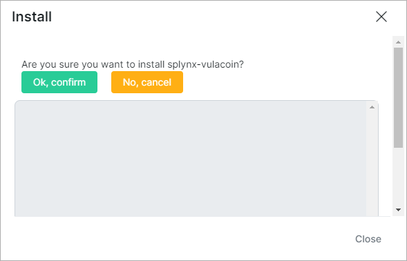
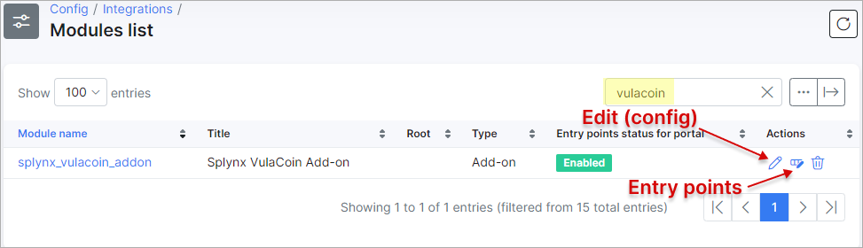
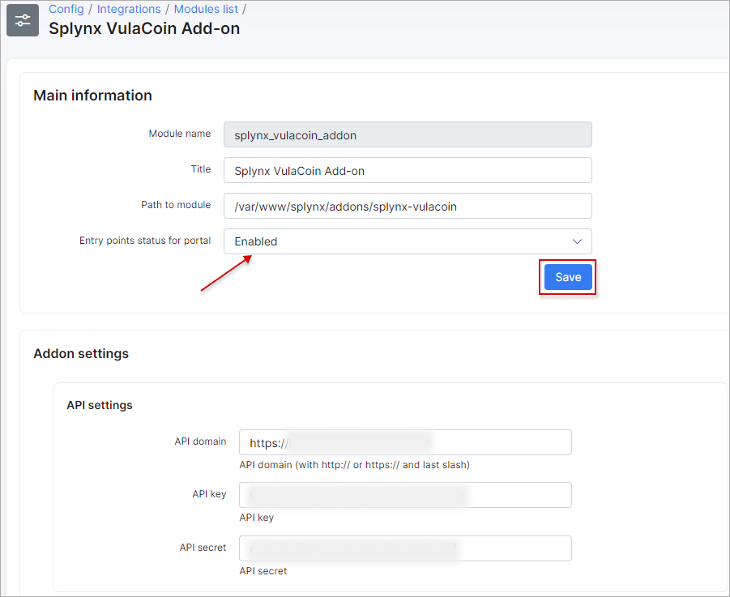

VulaCoin
==================


VulaCoin is a Splynx add-on which allows refilling of customer balance and paying invoices via the VulaCoin payment gateway - https://www.vulacoin.com/.

The add-on can work with various credit cards and bank accounts, payment details can be added or selected during the payment process.


### Add-on installation

The add-on can be installed in two methods, via the **CLI** or the **Web UI** of your Splynx server.

To install the **VulaCoin** add-on via **CLI**, the following commands can be used:

```
apt-get update
apt-get install splynx-vulacoin
```

To install it via the **Web UI**:

Navigate to `Config → Integrations → Add-ons`:


Locate or search for the `splynx-vulacoin` add-on and click on the **Install** icon in the *Actions* column:


Click on the **OK, confirm** button to begin the installation process:




### Add-on settings

After the installation process has completed, you have to configure add-on, navigate to `Config → Integrations → Modules list`:


Locate or search for the `splynx-vulacoin` add-on and click on the
<icon class="image-icon"></icon> (**Edit**) icon in the *Actions* column:



**Main information & API settings**

Make sure that **Entry points** option is **enabled**. Note that changes are not saved until you click **Save**.

The configuration of add-on **Entry points** can be found in `Config → Integrations → Modules list`, near the `splynx_vulacoin_addon` module item in *Actions* column, click on the <icon class="image-icon"></icon> (*Edit entry points*) icon. More information about *Modules list* can be found [here](configuration/integrations/modules_list/modules_list.md).



**Vulacoin credentials & Merchant details**

The add-on credentials can be obtain from your [VulaCoin](https://stage.vulacoin.com/admin/login) account.


**Common settings**


### Invoice payment

Once the configuration has been completed, a customer can navigate to their [Portal](customer_portal/customer_portal.md) and pay for their (proforma) invoices using the *VulaCoin* icon under `Finance → (Proforma) Invoices` or using the corresponding widget (entry point) on the Dashboard.

In addition, a customer can add money to their account balance from the Dashboard page or use the following link - ```https://<splynx_domain_address>/vulacoin```.


To pay with **EFT** means to use the electronic funds transfer or direct deposit, in other words, it's a digital movement of money from one bank account to another. The following banks are supported:


If everything goes well, you will see the status of invoice marked as `Paid` (on the customer and admin portals):


In case of problems during the payment, navigate to `Administration → Logs → Vulacoin Logs` to check the error message, e.g.:


### Direct payments

Using the payments links is the simplest way to accept payments made with credit card or bank account. This feature is available in the *VulaCoin* add-on to pay *Invoices* and *Proforma Invoices*. This provides convenience and simplicity for your customers, so the amount of on-time payments will increase.

For example, you can add a payment link to the e-mail with the (proforma) invoice, as a result, the customer can make payment quickly by clicking onto such link instead of logging in to their *Portal* page.


To create a direct payment link, please use the patterns below:

**To pay the Invoice:**

<details style="font-size: 15px; margin-bottom: 5px;">
<summary><b>by invoice ID</b></summary>
<div markdown="1">

```
https://<splynx_domain_address>/vulacoin/direct-pay-invoice-by-id?item_id=<Invoice_id>

```
</div>
</details>

<details style="font-size: 15px; margin-bottom: 5px;">
<summary><b>by invoice number</b></summary>
<div markdown="1">

```
https://<splynx_domain_address>/vulacoin/direct-pay-invoice?item_id=<Invoice_number>

```
</div>
</details>

<br>

**To pay the Proforma Invoice:**

<details style="font-size: 15px; margin-bottom: 5px;">
<summary><b>by proforma invoice ID</b></summary>
<div markdown="1">

```
https://<splynx_domain_address>/vulacoin/direct-pay-proforma-by-id?item_id=<proforma_id>

```
</div>
</details>

<details style="font-size: 15px; margin-bottom: 5px;">
<summary><b>by proforma invoice number</b></summary>
<div markdown="1">

```
https://<splynx_domain_address>/vulacoin/direct-pay-proforma?item_id=<proforma_number>

```
</div>
</details>
