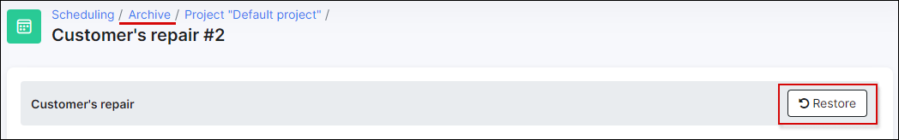
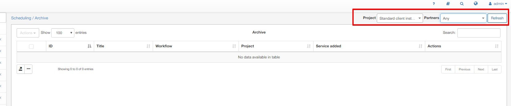

Archive
======

Completed tasks can be moved to Archive from the boards or by using the **Actions** button in task window. It is a convenient method of keeping a history of tasks as well as a reference to restore any archived tasks.

You can always restore tasks from the archive in case of a necessity. Simply click on the **Restore** button in the specific task window.

The list of archived tasks can be filtered by partner or project.

