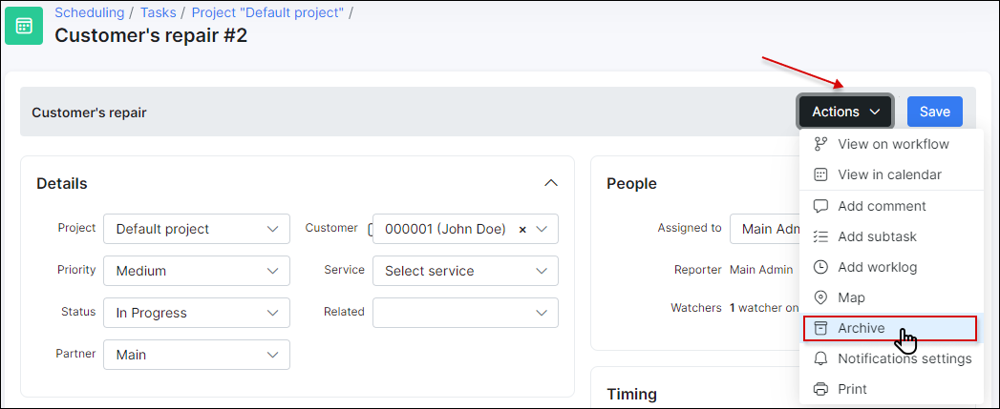
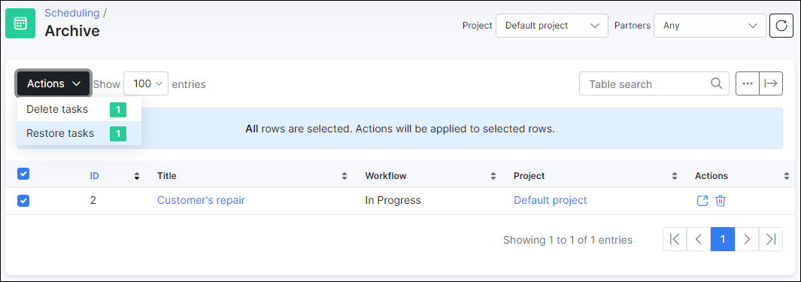
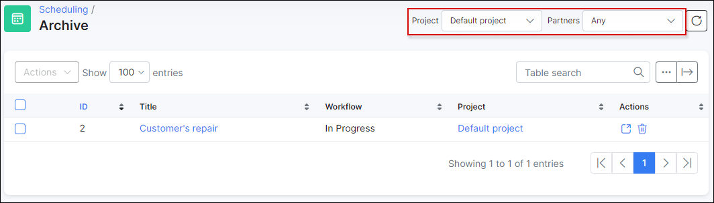

Archive
======
### Add to the archive

Completed tasks can be moved to *Archive* from the [**Workflow board**](scheduling/workflow/workflow.md) or by using ``Actions`` button in the task window. It is a convenient method of keeping history of tasks as well as a reference to restore any archived tasks.

**********************************************************************
### Restore from the archive

You can always restore tasks from the archive in case of a necessity. Simply click on ``Restore`` button in the specific task window.

Or use the mass restore for tasks by using ``Actions`` button in the archive list:

The list of archived tasks can be filtered by *Project* or *Partners*:

