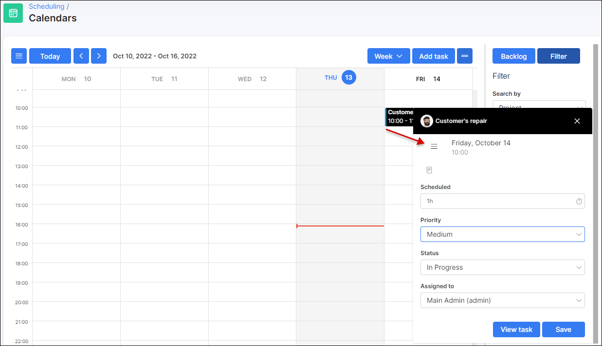

Calendars
=====

This is a calendar displaying all the project tasks and the relevant dates it was created, is due for or was completed.

The calendar view can be set to display the whole month, week or day. By default the current time pointer line and period withing 4 hours before and withing 4 hours after the current time is showing. Also, it's possible to show/hide weekends on the scheduling calendar, creation a task (event) without a tied project, set estimated time of the task, use default/custom checklist template, add the attachments, additional fields etc.
The filter on the left allows you to check the specific project or team tasks. Moreover, you can set custom colors for different tasks to conveniently distinguish one from the other.

Furthermore, it is possible to sync calendar in Splynx with your Google calendar. After that you will be able to edit tasks bidirectionally. Simply click on the task (event) and choose the option needed in the pop-up window.

Please note that it's necessary to connect Google account first in `My Profile → SCHEDULING` and pair the calendar. For more information please read our [Scheduling](my_profile/scheduling/scheduling.md) tutorial page.
